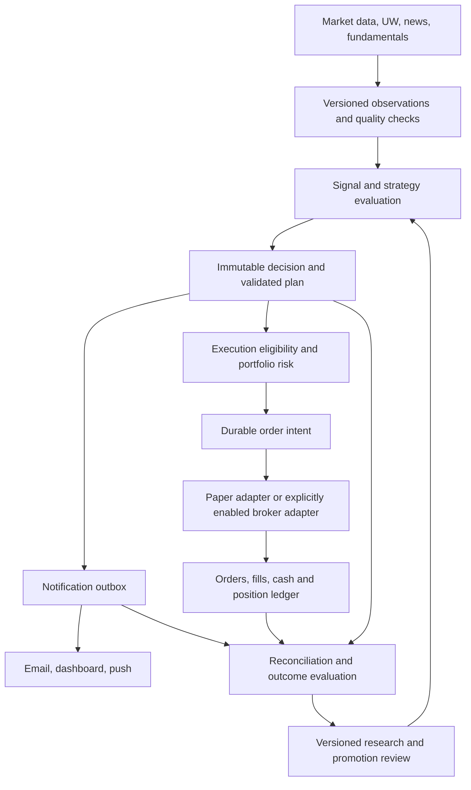

# Roadmap: reliable signals and alerts for automated stock and options trading

**Date:** September 28, 2026, America/Los_Angeles. **Status:** proposed implementation design; no trading authorization or production configuration changes.

**Objective:** make every trading decision traceable to valid data, every executable plan internally consistent, every order recoverable, and every promoted strategy supported by forward results after costs. Reliable delivery and predictive usefulness are separate requirements. Neither a green test suite nor a high candidate hit rate proves that an automated strategy earns money.

**Core design decision: automation consumes an immutable, validated decision record. Email is a human-readable view of that record.** SMTP delivery, email wording, or an LLM's free-form text must never determine whether an order executes.

## 1. Starting point and scope

The platform already has signal generation, horizon-specific models, UW adapters, alert renderers, paper portfolios, outcome tables, option-chain history and broker adapters. This roadmap strengthens their contracts and connects their evidence; it does not require replacing the platform or immediately adding another model.

At planning time the local checkout is `174192f9`, following implementation `0ec2ceba` and documentation `258a61b1`. The [latest remediation report](audits/2026-09-28-email-followup-remediation.md) describes fixes for EF-01–EF-05, including the signal exception path, price retry handling, technical delivery state and unknown flow sides. This planning pass read that report but did **not** independently recertify those fixes or production deployment. The earlier [full email audit](audits/2026-09-28-email-alert-system-audit.md) and [follow-up](audits/2026-09-28-email-remediation-followup-review.md) remain historical findings at their stated commits, not automatic assertions about current code.

Architectural gaps explicitly retained in the remediation are the transactional outbox and lease ownership, immutable event identity and distinct freshness limits, candidate-versus-delivered-versus-executed outcomes, and freshness of the actual decision inputs. The reported 69 consumed transitions remain a separate recovery task.

Use the existing [broker lifecycle scope](audits/2026-09-18-a01-a03-broker-lifecycle-scoping.md) and [expanded review](audits/2026-09-18-uw-and-broker-report-review.md) as acceptance requirements to reverify, not as proof that every old defect still exists. Broker order correctness is a prerequisite for automated trading even when signal quality improves.

Initial scope: one liquid US stock strategy in shadow/paper operation. Add options as independently validated strategies, then additional horizons and markets. Keep existing research/observation alerts available with accurate labels. HK strategies require their own calendars, currencies, lot rules, data and broker capability checks before activation.

## 2. Define what “trustworthy” means

| Dimension | Question | Evidence required |
|---|---|---|
| Data correctness | Was this observation available and valid at decision time? | Source identity, event/receipt times, quote/bar provenance, finality and quality checks |
| Semantic correctness | Does the alert accurately describe the evidence? | Typed event, units, measured versus inferred fields, deterministic rendering tests |
| Operational reliability | Is each event delivered or explicitly accounted for? | Durable delivery state, attempts, acceptance/failure records and backlog monitoring |
| Predictive usefulness | Does the strategy add information beyond a baseline? | Time-separated validation, calibration and incremental UW experiments |
| Economic usefulness | Does following the plan make money after realistic costs? | Executable paper fills, cash ledger, net expectancy, drawdown and capacity analysis |
| Execution safety | Can the broker state be recovered after failures? | Durable intent, fill-driven accounting, reconciliation and tested stop controls |

Do not compress these dimensions into one “trust score.” A high prediction score cannot override missing prices, invalid geometry, unknown broker state or disabled trading permission.

### Product labels

| Class | Meaning | Automation eligibility |
|---|---|---|
| Observation | A reported print, price crossing, news item or unusual activity; inference is labeled | Never opens a position by itself |
| Watch setup | Evidence meets a research rule; confirmation or entry condition is pending | Shadow evaluation only |
| Validated trade plan | Exact instrument, entry/exit rules, risk, data validity and expiry are present | Eligible for paper execution after account-level gates |
| Risk/exit event | A position-related condition requiring evaluation | Routed to the position/risk engine with its own policy |
| Operational notice | Data, delivery, broker or system problem | Can suspend new entries; cannot silently fabricate a trade |

Represent market direction separately from portfolio action. `SELL` may mean reduce a long position; it is not authorization to open a short position. Actions must explicitly say `OPEN_LONG`, `REDUCE_LONG`, `CLOSE_LONG`, or a separately enabled short/option action.

## 3. Target architecture



Persist a decision and its notification jobs in one database transaction. For eligible automation, persist an execution request referencing that decision, then recheck expiry, account state and risk immediately before submission. Notification and execution consumers operate independently: failed SMTP must not prevent a necessary exit or trigger another order.

Begin with modules and durable tables inside the current services. Extract separate workers where isolation is needed; do not split everything into new services before establishing contracts.

### Ownership in the existing repository

| Component | Planned responsibility |
|---|---|
| `services/market-data/.../scheduler.py` | Scheduling and orchestration; move decision, delivery and execution state changes into tested modules incrementally |
| `services/market-data/.../email_service.py` | Render typed immutable payloads; return structured transport results |
| `shared/common/alert_prefs.py` | Registry and notification eligibility policy; keep trading authorization separate |
| `shared/db/models.py` and migrations | Event, decision, delivery, execution and evaluation schemas with constraints |
| `services/signal-engine` | Versioned signals with input lineage, direction, horizon and calibrated estimates where validated |
| `services/ml-prediction` | Point-in-time features, label availability, time-separated evaluation and promotion evidence |
| `services/decision-engine` | Deterministic setup/plan eligibility, reasons and vetoes |
| `paper_trading_engine.py`, `options_income_engine.py` | Consume the same validated plans and account for simulated fills/settlement truthfully |
| `services/market-data/.../broker` | Broker-specific capabilities, submission, status, fills and reconciliation |
| Frontend | Separate signal evidence, delivery state, paper results and broker position truth |

The existing `TradePlan` is a mutable Kanban card. Preserve that UI workflow, but reference an immutable execution-plan revision; editing notes or moving a card must not retroactively change the plan used by a trade.

## 4. Minimum durable data model

Names below are proposed. Reuse existing entities only where their semantics match; do not overload `last_signal`, `triggered` or `last_sent_at` as a general event ledger.

| Entity | Essential fields and constraints |
|---|---|
| `market_observation` | Provider/event ID, instrument/contract ID, event time, receipt time, revision, payload hash, source reference, quality flags. Unique provider identity/revision; retain corrections without silently rewriting old decisions. |
| `signal_decision` | Decision ID, strategy/model/config versions, instrument, direction, exact horizon and unit, as-of/expiry times, input snapshot references, all gate results, status and rejection reasons. Immutable once published. |
| `trade_plan_revision` | Decision ID, instrument or legs, explicit action, confirmation/entry rule, entry limit, stop/invalidation, targets, time exit, sizing policy, risk assumptions, validity interval and content hash. |
| `notification_delivery` | Decision/event ID, user, channel, template version, immutable payload, eligibility result, status, attempts, next attempt, provider ID and timestamps. Unique event/user/channel/template-purpose key. |
| `execution_intent` | Plan revision, execution mode, account/portfolio, action sequence, quantity, reserved cash/risk, stable client ID, lifecycle state. Unique account/plan/action-sequence key; scale-ins need explicit new sequences. |
| `order_attempt` / `broker_order_event` | Intent, broker order ID, request fingerprint, submission time, response/unknown outcome, replacements and monotonically reconciled order events. |
| `fill` / `cash_event` | Broker execution ID or simulated execution ID, quantity, price, fees, currency and event time. Unique fill identity; append compensating corrections rather than silently editing economics. |
| `evaluation_outcome` | Decision/strategy version, cohort kind, horizon unit, entry/exit rule and timestamps, costs, return, maturity/status, missingness reason and evaluation version. |
| `strategy_release` | Evidence manifest, frozen configuration, approved instruments/regimes, gates passed, owner, approval, rollback target and activation scope. |

Maintain referential links from source event to decision to plan to notification/order/fill/outcome. Use UTC instants plus exchange-session identifiers; record currency, price units, share/contract quantity and contract multiplier explicitly.

If a provider supplies no stable event ID, use a documented fingerprint with collision detection and mark identity confidence. Never treat the option contract symbol alone as an event ID: the same contract can trade repeatedly.

Historical unknown delivery stays `legacy_delivery_unknown`, not `delivered`. If compatibility fields were stamped to stop retries, retain that migration fact and exclude those stamps from measured delivery success.

## 5. Phased implementation plan

Effort ranges assume two backend engineers with part-time quantitative research and QA/operations support. They are planning estimates, not delivery promises. Workstreams can overlap after their data contracts stabilize. Evidence collection and long-horizon maturity determine promotion dates.

| Phase | Indicative effort | Deliverables | Exit gate |
|---|---|---|---|
| P0 — Reverify and establish the baseline | 2–4 engineering days | Closure matrix for recent fixes; behavioral reproductions; inventory of every emitter; explicit sandbox/live modes; current readiness dashboard | No unresolved blocking fault on enabled paths; no live execution enabled by this work |
| P1 — Durable events and delivery | 1–2 weeks | Typed event/plan schemas, transactional outbox, central recipient policy, delivery worker, historical migration and replay tools | Failure/restart tests preserve events; no eligibility bypass; expired and failed messages remain accounted for |
| P2 — Input validity and plan correctness | 1–2 weeks | Point-in-time snapshots, per-input freshness, UW identity/coverage, strict plan validator, read-only provenance UI | Every executable candidate passes all hard validity gates; invalid candidates carry reasons and create no order intent |
| P3 — Strategy evaluation and UW experiments | 2–3 weeks to build; ongoing evidence collection | Event replay, chronological evaluation, baselines, strategy registry, calibration reports and cost-aware outcome cohorts | One frozen strategy meets research gates on untouched data; others remain research-only |
| P4 — Forward paper automation | 2–3 weeks engineering, then sufficient market exposure | Shared paper/live execution contract, realistic simulator, partial fills, immutable trade ledger and reconciliation | Forward paper gate in section 10; operational drills and portfolio controls pass |
| P5 — Broker sandbox and limited live pilot | 1–2 weeks integration plus observation | Adapter capability tests, submission-unknown recovery, full lifecycle, account reconciliation, emergency runbooks | Sandbox acceptance first; separate explicit approval of broker, account, instruments, risk limits and live activation |
| P6 — Controlled expansion | Ongoing | Additional independent strategies, options families, horizons and markets | Each expansion independently passes evidence and operational gates; no inherited approval from another strategy |

### P0: establish what is actually fixed

Run whole-job tests with a fake transport in an isolated interpreter where suite-wide mocks do not hide real imports or SQL. Use real PostgreSQL integration tests for migrations, transaction rollback, uniqueness and concurrent workers. Require schema readiness before enabling a worker that depends on it.

Capture the version reviewed, tests run, actual rendered payloads and limitations. Verify normal sends, failed optional enrichment, first-recipient failure, mixed success/failure, recurring and one-shot technical alerts, delayed quotes, same-day earnings and opt-out changes. Keep original defect witnesses as historical evidence; add desired-behavior regression tests.

Prepare a read-only manifest and preview for the reported 69 lost transitions. Recovery should be an explicitly reviewed incident digest, not a bulk reset of signal state. It is independent of strategy promotion and must not place orders.

### P1: reliable delivery without coupling it to trading

Notification lifecycle:

```text
PENDING -> CLAIMED -> PROVIDER_ACCEPTED
              |-> RETRY_WAIT -> CLAIMED
              |-> FAILED_PERMANENT / EXPIRED / SUPPRESSED
PROVIDER_ACCEPTED -> DELIVERED / BOUNCED / UNKNOWN (when provider evidence exists)
```

Acceptance by SMTP/SES is not inbox delivery. Some providers cannot supply delivery confirmation; retain unknown rather than invent success. On a crash after provider acceptance but before persistence, duplicate email risk may remain unless the provider supports idempotency; label submission uncertainty and apply a bounded recovery policy.

Use database job claiming and unique ownership tokens, with lease expiry and checked release. Do not promise exactly-once external delivery. Aim for durable at-least-once processing, deduplicated application effects and explicit uncertain states.

Central notification eligibility takes user ID and type, enforces active status and saved preference, and rechecks before dispatch. Unknown eligibility defers optional mail. Document essential-message exceptions. Email unsubscribe does not disable existing position protection, and enabling email does not authorize trading. Trading permission is independently scoped to user/account/strategy/mode.

Payloads distinguish event-time observed price from a separately timestamped current quote. Retry preserves the original condition, indicator units and trigger time. Use data appropriate to the event; never substitute a threshold or analyst target for an observed price.

### P2: data and plan gates

Every input must expose `event_at`, `received_at`, `as_of`, provider, quality and revision. Validate event order, duplicates/corrections, exchange calendars, corporate actions, adjusted versus raw prices, currency, contract multipliers and session finality. Unknown data must remain unknown; missing bid premium is not measured zero.

Proposed starting freshness budgets below are **engineering trial settings**, not measured optimal trading thresholds. Verify feed entitlement, timestamp semantics and attainable latency before activation; revise by strategy and recorded measurements.

| Data/use | Starting paper policy |
|---|---|
| Intraday actionable UW event | Event age ≤120 seconds at decision; older events can remain observations, not a new intraday entry trigger |
| Underlying quote immediately before order | Quote age ≤5 seconds during regular hours; reject crossed/invalid quotes and missing session provenance |
| Option quotes immediately before order | Each required leg ≤5 seconds old; enforce a maximum inter-leg timestamp skew and strategy-specific spread/size limits |
| Daily swing input bars | Latest completed expected session; incomplete current daily bars cannot impersonate finalized history |
| Stored signal | Must reference the required input session/version and remain inside the strategy's decision TTL; a fresh price does not refresh an old signal |
| Earnings/news | Use publication and receipt times separately, exact event timing where known, and a strategy-specific blackout; uncertain timing blocks strategies requiring an event-free holding window |
| Fundamentals/OI | Preserve publication/reporting date. Do not present slowly updated values as real-time measurements. |

If the actual UW or quote feed cannot meet a budget, keep that strategy in watch/research mode or design a slower strategy and validate it separately. Do not silently relax a gate to produce more trades.

Plan validation checks positive finite prices, tick/lot precision, strategy geometry, each entry alternative's reward/risk, net costs, stop semantics, maximum holding time, event exposure and expiry. Target must lie beyond the selected long entry, including a breakout entry. Short and multi-leg strategies require their own validators. Store a rejection reason for every failed gate.

An LLM can summarize existing evidence or propose a research hypothesis. It cannot create missing facts, assign unsupported win probabilities, modify validated prices or risk limits, or approve its own executable plan. Validate all generated structured output against deterministic contracts.

## 6. Research program for better signals

### Start with bounded, falsifiable strategies

| Research family | Hypothesis to test | Baseline/control | Initial execution scope |
|---|---|---|---|
| Liquid-stock trend pullback | A confirmed pullback in an established trend has favorable net expectancy under specified regime/volatility conditions | Same setup without UW; simple trend rule; exposure-matched benchmark | First shadow/paper candidate, long stocks only |
| UW-confirmed breakout | Fresh, sufficiently classified directional flow adds predictive value after an underlying price/volume confirmation | Identical breakout without flow; time/regime-matched controls | Shadow first; avoid selecting only the visually strongest winners |
| Off-exchange activity confirmation | Repeated large prints add useful context near an independently measured level | Same price/volume setup without off-exchange input | Observation/watch until incremental value is demonstrated |
| Directional options | A validated stock setup remains profitable with a specified option or defined-risk spread after spread, theta and volatility effects | Same stock exposure and no-UW version | Separate paper approval and contract-level outcomes |
| Options income | A defined collateral, event and assignment policy earns adequate risk-adjusted return | Cash/exposure-matched alternatives, including underlying ownership where appropriate | Separate paper cohort; assignment and expiry are part of the strategy |

These are experiments, not assertions of profitable strategies. Do not launch all families at once or choose thresholds after inspecting the final holdout.

For UW, preserve opening/closing and multi-leg flags where the entitled feed actually provides them; unavailable flags are unknown. Separate classified-premium coverage from within-classified side imbalance. OI/gamma assumptions and quote-side inference must be identified as assumptions. Flow is corroboration, not a substitute for price, risk or execution evidence.

### Horizon and label contract

Retain the platform's SHORT/SWING/LONG/GROWTH vocabulary but publish the exact label definition and holding policy for each strategy version. Existing bar-based model labels and calendar-day diagnostic outcomes are different targets. Never relabel one as the other.

Each label stores its actual target bar/session, earliest availability time and observed exit/evaluation time. Fit only on labels available before the evaluation boundary. Use point-in-time fundamentals, news and universe membership; include delistings and corporate actions. Missing historical option quotes mean the option strategy cannot be validated from stock bars alone.

LONG and GROWTH releases must wait for enough mature forward outcomes. Five-day proxy results cannot approve a 30–90-day or longer holding strategy. Open positions remain marked, included in drawdown and reported as unresolved; do not evaluate only winners that happened to close early.

### Validation protocol

1. Register hypothesis, universe, horizon, entry/exit rules, cost model, risk constraints and bounded threshold search before evaluating results.
2. Use chronological walk-forward folds. Purge overlapping label information using actual availability and apply an appropriate embargo; reject an invalid evaluation rather than merely logging it.
3. Keep calibration, early stopping, threshold selection and final promotion evidence separate. Track every tried configuration to expose multiple-testing risk.
4. Compare with the current incumbent on the same untouched period and execution assumptions. If it cannot be rescored, keep the candidate in shadow or follow an explicit cold-start policy; do not compare unrelated historical AUCs.
5. Report results by direction, strategy, horizon, liquidity, event exposure and market regime. Cluster uncertainty by sessions/time blocks and account for correlated symbols/contracts; repeated prints are not independent trades.
6. Run ablations: base strategy, base+UW, base+news and other additions. Require evidence of incremental value before paying the complexity and latency cost of another filter.
7. Freeze the selected version for its forward trial. Material threshold, model or execution changes start a new evidence cohort and require reapproval.

### Metrics that answer the user's question

| Layer | Required metrics |
|---|---|
| Predictions | Defined-target directional accuracy; Brier/log loss and reliability plots if emitting probabilities; coverage and abstention; sample/maturity counts |
| Decisions | Gate pass/reject counts, missing-data rate, setup-to-entry conversion, stale/cancelled plans, horizon/regime mix |
| Economic results | Net expectancy/trade, net return on a consistent capital basis, average gain/loss, drawdown, tail loss, turnover, holding time, slippage and capacity |
| Options | Contract/leg P&L, spread and fees, Greeks/volatility context, assignment/exercise outcomes, collateral use and underlying inventory after assignment |
| Operations | Decision age, processing latency, failed/expired notifications, duplicate effects, unresolved orders and broker-ledger discrepancies |

For trade-level net outcomes, `expectancy = win_fraction × mean_net_win − loss_fraction × mean_net_loss_magnitude`, with breakeven outcomes retained in the denominator. If reporting gross wins/losses, subtract costs explicitly and only once. A high win rate with large occasional losses can still have negative expectancy.

Do not label a composite ranking score as a probability. Any probability must name the event and horizon, calibration version and supporting cohort. A displayed interval should be an actual uncertainty estimate, not `1 / sqrt(n)` presented as a measured AUC standard error.

## 7. Separate candidate, notification and trade outcomes

Maintain four explicitly named cohorts:

1. **Candidate cohort:** all detected events, including rejected setups; useful for research and selection-bias diagnosis.
2. **Eligible-plan cohort:** frozen rules and execution gates passed; useful for strategy opportunity measurement.
3. **Notification cohort:** what each recipient was actually sent, with timing and delivery evidence; useful for evaluating human-facing service quality.
4. **Execution cohort:** paper or broker orders and fills, including rejects, cancels, partial fills, unfilled orders and open positions; useful for economic performance.

Automated-trading eligibility must not require successful email delivery. Link these cohorts by decision ID without conflating their denominators. Report the funnel and reasons for attrition. A favorable candidate move is not an executed trade return.

Use the existing independent `SignalOutcomeHorizon` design where appropriate for independently matured diagnostics. Keep legacy primary-maturity-selected outcomes labeled historical; do not blend them silently into new promotion evidence.

## 8. Stock and options execution design

### One lifecycle for all callers

```text
CREATED -> VALIDATED -> RESERVED -> SUBMITTING
SUBMITTING -> ACCEPTED / REJECTED / SUBMISSION_UNKNOWN
ACCEPTED -> PARTIALLY_FILLED -> FILLED
ACCEPTED/PARTIALLY_FILLED -> CANCEL_REQUESTED -> CANCELLED
ACCEPTED/PARTIALLY_FILLED -> EXPIRED
```

Fill events can arrive during cancellation or replacement. Preserve executed quantity regardless of later terminal status. `SUBMISSION_UNKNOWN` requires lookup and reconciliation before resubmission. A cancel request is not a confirmed cancellation; accepted is not filled.

Persist intent and stable client identity before the network call. Track every replacement and attempt under that intent. Deduplicate broker executions, reserve buying power atomically, reconcile positions/cash/open orders at startup and periodically, and block new exposure when account truth is uncertain. No universal broker “exactly once” guarantee is assumed.

All paths—automatic entry/exit, partial exits, scale-ins, conditional orders, manual close and liquidation—use this lifecycle. Update broker-backed position quantity and cash from confirmed fills and explicit settlement events. A local paper close must not make an actual broker position disappear from the UI.

Alpaca documents client order identifiers, order-status lookup, streamed updates and buying-power effects of pending orders. This supports the adapter design, but does not establish identical capabilities for E*TRADE or another broker. Verify each selected broker's order types, option permissions, multi-leg support, client-ID behavior and recovery APIs before enabling that capability. [Alpaca order documentation](https://docs.alpaca.markets/us/docs/orders-at-alpaca).

### Paper fills must be economically honest

Use the same decision, plan, risk and order-intent contracts for simulator and broker sandbox. Only the execution adapter changes. Persist simulator version and assumptions.

Model quote-side entry/exit, spread, fees, latency, size constraints, partial fills and unfilled limits. A bar touching a limit does not prove an executable fill. If both stop and target occur within the same bar without ordering evidence, use finer data or a documented conservative assumption. Mark open exposure conservatively and retain stale-mark evidence; a stale or missing mark does not erase risk.

Replay faults: worker restart after submission, duplicate/out-of-order fill messages, timeout after acceptance, partial fill followed by cancellation, expired credentials, provider outage, gap through stop and missing expiry data. Confirm both order state and cash/position results.

### Options-specific requirements

An options plan must contain exact contract identifiers, expiry/session, put/call, strike, multiplier, leg sides/ratios, debit/credit limit, liquidity evidence, maximum loss/profit assumptions, break-even, time exit, underlying invalidation, event exposure and assignment/exercise policy.

Option returns depend on time and implied volatility as well as the underlying; directional stock accuracy cannot approve an option strategy. [OIC options pricing](https://www.optionseducation.org/optionsoverview/options-pricing).

Start with separately tested long-premium strategies; enable defined-risk spreads only after the broker adapter supports their lifecycle and partial-leg risk is addressed. Cash-secured puts and covered calls remain separate releases: puts can create stock inventory; covered calls retain downside exposure in owned shares. Never equate collected premium with bounded risk. No naked short options or automatic 0DTE expansion in the initial scope.

Explicitly handle adjusted/nonstandard contracts, dividends and early assignment, buying-power changes, exercise cutoffs, expiry finality and underlying delivery. Where the simulator cannot model a contract feature, exclude that contract with a recorded reason rather than inventing economics.

## 9. Portfolio risk and operational controls

Proposed paper-trial settings below are conservative starting **policy choices**, not empirically optimal thresholds or approved live limits. Register them before the trial, measure their effects and require separate approval for any live account.

| Control | Starting trial policy |
|---|---|
| Risk per position | At most 0.25% of simulated equity in planned loss; stock stops are estimates and need separate gap stress limits |
| Aggregate planned open risk | At most 1% of simulated equity; include pending orders and correlated positions |
| Gross exposure | At most 100% for the initial unlevered stock trial; add symbol/sector concentration constraints |
| Session loss | At 1% equity loss, pause new entries and investigate; retain protective position management |
| Strategy drawdown | At 5% from high-water mark, suspend new entries pending review; include open marks and costs |
| Derivatives sizing | For long premium use full debit as maximum contractual loss; for defined-risk spreads use contract-level loss and fees; income strategies require full collateral and assignment/gap stress accounting |
| Missing account/quote state | No new exposure; reconcile and maintain a documented risk-reduction route |

Use the minimum size permitted by all risk, cash, concentration, liquidity and lot constraints. Round down; if fewer than one permitted share/contract/lot fits, skip. Do not enlarge a trade to make a strategy active. Stop losses are not guarantees against overnight gaps or illiquidity.

Risk decisions must be atomic with exposure reservations so two concurrent plans cannot each spend the same budget. Portfolio-level risk can reject a high-scoring signal. Correlated UW events must not create many nominally independent positions on the same thesis.

Provide separate controls to pause a strategy, block new orders, cancel pending entries and perform a supervised liquidation. “Kill switch” must state which action it performs. Preserve protective exits unless their execution itself is unsafe; reconnect/reconcile after an outage rather than blindly duplicating an exit. Risk-reduction orders still require known position quantity and explicit action semantics.

Use separate sandbox/live credentials and account allowlists; no fallback from one mode to another. Require audited capability changes, restricted service identities, secret isolation and explicit live activation. Account disablement blocks new trading but must initiate a documented process for remaining exposure rather than abandoning it.

## 10. Promotion gates and rollback

Promote **a strategy version × instrument scope × horizon × execution mode**, not the entire platform. Live enablement is a separate decision from merging code or deploying a worker.

### Gate A — Engineering correctness

- Zero known blocking defects on the enabled path; real-schema and whole-job tests pass.
- All executable plans have identity, provenance, unexpired inputs, valid geometry and deterministic rejection reasons.
- Fault injection produces no duplicate fills/accounting effects, lost accepted orders or silent discarded notifications. Every uncertain state is visible and recoverable.
- Account/risk limits, startup reconciliation, schema readiness and stop controls pass drills.

Zero failures in a test corpus is necessary but does not prove zero production failure probability. Retain monitoring and limited scope.

### Gate B — Research evidence

- Positive net expectancy on untouched time-separated data after realistic base costs, with a session/block-aware confidence interval and a prespecified benchmark comparison.
- For an enhancement claim, report the interval for incremental performance versus the same baseline, not just whether each version separately made money.
- Report sensitivity to worse spreads/slippage, delayed entry, different regimes and removal of the strongest symbol/session. Predefine stress scenarios rather than choosing easy ones after seeing results.
- Calibrated probabilities outperform a suitable base-rate forecast where probabilities are used; ranking-only models must not display probability claims.
- Document trials and selection. Reused holdouts are retired from promotion evidence.

### Gate C — Forward paper evidence

Proposed minimum screening floor: **60 market sessions and 100 completed trades per strategy release**, plus enough mature exposure for its holding horizon and no unresolved material accounting defects. These numbers are scheduling floors, not statistical proof. Correlation, turnover and variance may require substantially more data; long-horizon strategies may require many months.

Before a limited-live proposal, require a prespecified one-sided 95% lower confidence bound for mean net trade expectancy above zero using a defensible time-block analysis, acceptable risk/return against the stated benchmark, and drawdown within the approved trial budget. If the inference is unreliable because there are too few independent periods, keep collecting evidence; do not lower the standard until it passes. Track unrealized/open positions and realized outcomes together.

UW enrichment additionally needs forward evidence against a comparable no-UW control. Randomize eligible paper opportunities where feasible, or state the limits of a matched observational comparison. Do not select only trades actually emailed or retrospectively available winners.

### Gate D — Broker sandbox readiness

Exercise all supported lifecycle states, restart and reconnect recovery, partial fills, duplicate events, cancel/replace races, rejected orders and reconciliation differences. Require no unexplained position/cash discrepancy before starting new entries. Paper market simulation and broker sandbox behavior remain distinct evidence sources.

### Gate E — Limited live approval

Produce a concrete release packet: strategy/version, evidence, exact account/environment, instruments, order types, small explicit dollar/notional/risk caps, monitoring owner, stop/rollback procedure and known limitations. Obtain explicit authorization before enabling live trading. This document supplies no such authorization.

Begin with one strategy and constrained exposure. Compare actual fills and costs against paper assumptions before scaling. Increase only one major dimension at a time: size, universe, strategy family or market. Options require their own Gate B–E evidence.

### Pause/demotion conditions

Immediately block new entries for unknown broker exposure, missing critical provenance, invalid plan geometry, breached exposure limits or unverified schema. Operational SLO breaches trigger investigation and can demote a strategy to shadow. Statistical degradation needs a predefined monitoring rule and sufficient observations; avoid weekly threshold chasing on noise. Resume only with reconciled state and recorded corrective evidence.

## 11. Service objectives and observability

These are proposed initial SLOs for paper operation, to be measured and revised openly—not claims about current production:

| Measure | Initial target / response |
|---|---|
| Executable-plan provenance and validity | 100% required; a missing field blocks execution |
| Internal decision processing | For the intraday pilot, p95 ≤5 seconds after required inputs arrive; report provider lag separately |
| Notification provider acceptance | ≥99% within 5 minutes for eligible, unexpired notifications when the provider is healthy; separately report suppression, outages, permanent rejection and expiry |
| Unexpected loss/unknown event accounting | Zero silent loss; every event reaches a recorded state |
| Broker reconciliation | Startup before new entries, streaming updates where available, and a proposed 60-second polling backstop within broker limits |
| Portfolio discrepancy | Any unexplained quantity mismatch blocks new exposure for that account; cash differences use documented currency-specific rounding tolerances |
| Recovery drills | Before each execution release and after relevant lifecycle/schema changes |

Dashboard panels: source health; event→decision→eligible→order funnel; notification backlog and dead letters; stale-input rejects; strategy/version calibration; net results and open risk; broker positions/orders versus ledger; active stop controls and release approvals.

Keep provider health in the denominator of a separate all-events reliability report so an “excluding outages” SLO cannot conceal repeated outages. Alert an operator about a stopped signal pipeline even if the same email provider is unavailable; the dashboard/independent channel must show the failure.

## 12. Test strategy that avoids another audit-remediation loop

Use source/AST inventories to find uncovered paths, not as proof that behavior is correct. A helper appearing in code is not evidence that its result gates a sender.

Required behavioral suites:

- Every manageable type: opted-out/inactive user causes zero transport calls; active opted-in user can receive; a second sender for the same type cannot bypass policy.
- First recipient fails, second succeeds; badge/render/transport failures are isolated; retries never consume the market event or modify trading state.
- Original, delayed and recurring technical alerts preserve condition, values, units and event time; historical unknown delivery cannot masquerade as confirmed delivery.
- Same-day earnings, missing data, malformed values, nonfinite prices and per-entry plan geometry fail safely or render the correct state.
- UW duplicate IDs, revisions, out-of-order events, unknown premium side, low coverage, stale quotes and repeated contracts are handled explicitly.
- Trainer/replay tests prove target price and availability use the same actual future bar; test sparse sessions, holidays and deduplication.
- Database concurrency tests prove uniqueness, rollback, row locking, reservation and outbox behavior on PostgreSQL.
- Broker adapter contract tests and deterministic replay verify ledger economics, not just function calls or order IDs.

Run isolated subprocess integration tests where current service fixtures replace dependencies globally. Maintain a small failure-injection campaign that demonstrably turns each important behavioral test red, restores source, then returns green. Check collection counts and duplicate test names; “no tests collected” is a failed validation run.

## 13. Prioritized implementation backlog

Owner roles are proposed responsibilities, not assignments to named people. Each ticket produces code, acceptance evidence and an updated closure entry.

| ID | Priority / owner | Deliverable | Depends on |
|---|---|---|---|
| SR-01 | P0 / backend + QA | Reverify latest EA/EF repairs with complete jobs; publish closure matrix | None |
| SR-02 | P0 / architect + backend | Event/decision/plan schemas, units, IDs and execution-mode contract | SR-01 |
| SR-03 | P0 / backend | Notification outbox, worker ownership, eligibility and structured transport results | SR-02 |
| SR-04 | P0 / data engineer | Input snapshot/provenance and per-strategy freshness/finality gates | SR-02 |
| SR-05 | P0 / backend + quant | Deterministic stock/option plan validators and rejection ledger | SR-02, SR-04 |
| SR-06 | P1 / backend + QA | Migrate emitters in batches; payload parity, historical unknown state, incident recovery preview | SR-03, SR-05 |
| SR-07 | P1 / data + quant | Candidate/eligible/notification/execution outcome separation | SR-02, SR-04 |
| SR-08 | P1 / quant | Freeze first stock strategy, benchmark and UW ablation protocol | SR-05, SR-07 |
| SR-09 | P0 before execution / backend | Durable intents, fills, reservations and shared close/scale paths | SR-02, broker lifecycle revalidation |
| SR-10 | P1 / quant + backend | Cost-aware stock paper simulator, replay and forward trial | SR-08, SR-09 |
| SR-11 | P0 before broker mode / backend + operations | Adapter capability matrix, sandbox fault drills and reconciliation | SR-09 |
| SR-12 | P1 / quant + options engineer | Contract-level options paper strategy and assignment/expiry tests | SR-05, SR-07, SR-09 |
| SR-13 | P1 / frontend + operations | Evidence/health/risk dashboard, explicit account truth and stop controls | SR-03, SR-07, SR-09 |
| SR-14 | P0 before live / release owner | Gate A–E release packet and independently reviewed live activation | Applicable research, paper and sandbox evidence |

**First sprint recommendation:** SR-01–04 and the stock portion of SR-05. Finish reliable state and data contracts before tuning confidence thresholds. Start evidence capture early so subsequent engineering time also accumulates useful forward data.

## 14. Migration and rollout

Use additive, versioned migrations with required-schema readiness. Dual-write current decisions into the new ledger in shadow, compare existing versus new rendered payloads and reject reasons, and then switch one alert family at a time. Historical reconstruction must carry uncertainty; do not backfill invented quote times, fills or delivery success.

Use separate flags for ledger capture, new notification delivery, shadow evaluation, paper execution and live execution. Do not activate two senders or two executors for the same scope. Rollback disables the new consumer while retaining its immutable evidence and reconciling any accepted orders; rollback must not erase fills or replay completed trades.

Revisit [the older delivery design](DESIGN_ALERT_DELIVERY_CHANNELS_2026-07-10.md), whose “guaranteed-delivery” wording should be replaced during implementation with precise queue/acceptance/delivery semantics. Align the existing [model promotion design](DESIGN_MODEL_PROMOTION_GATES_2026-07-12.md) with actual availability, same-period comparison and forward release evidence. This planning change does not edit those historical documents or `CLAUDE.md`.

Operational control principles are consistent with FINRA's discussion of algorithmic development, testing and supervision; this is an engineering reference, not a determination of this application's regulatory obligations. [FINRA algorithmic trading](https://www.finra.org/rules-guidance/key-topics/algorithmic-trading).

## 15. Definition of completion

The initial roadmap is complete when one narrowly scoped strategy has a reproducible, versioned decision history; truthful alert rendering; durable delivery accounting; positive forward paper evidence under realistic costs; reconciled broker-sandbox execution; and a reviewable limited-live release packet. Producing more emails or raising a displayed confidence score does not satisfy that objective.

Broader automation proceeds one validated strategy at a time. The intended result is an auditable system that can show when it has enough evidence to act, when it should abstain, and exactly what happened afterward. Profitability remains an empirical outcome to demonstrate and monitor, not a property guaranteed by the architecture.
