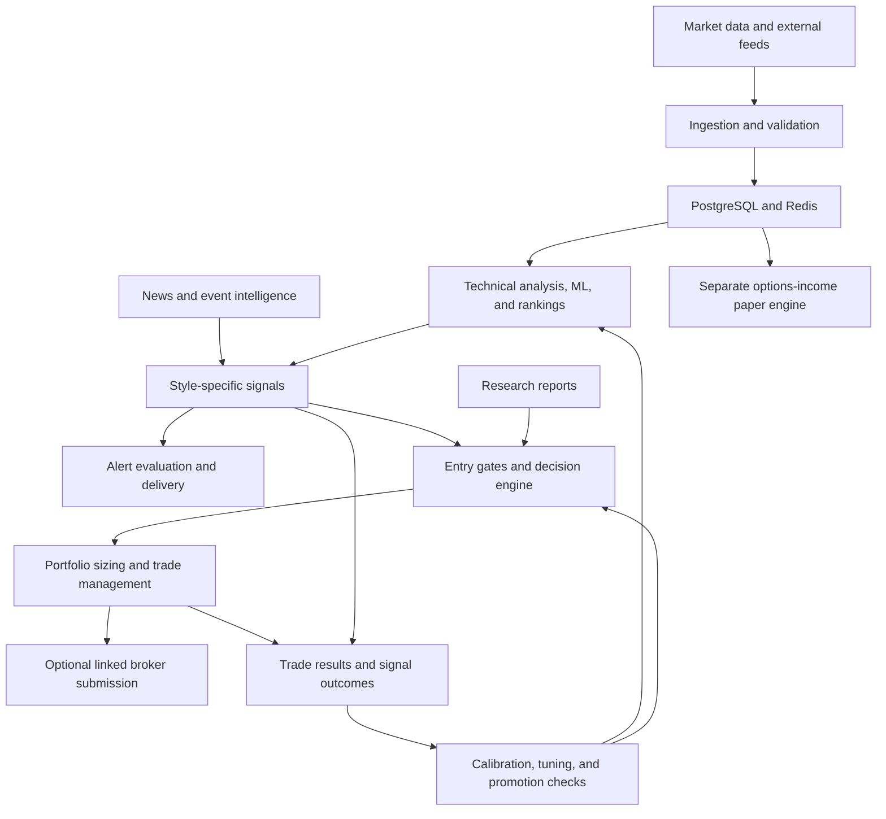

# StockAI — Codebase and Feature Review

**Review date:** 2026-09-16  
**Source baseline:** local checkout at `26a8159`  
**Scope:** project orientation, documentation review, and static code tracing

## 1. Summary

StockAI is an AI stock trading intelligence platform for US and Hong Kong equities,
with additional US options capabilities. It combines technical rules, trained machine
learning models, and optional LLM analysis. Its product surface covers discovery,
research, signals, alerts, trade decisions, portfolio management, execution integrations,
and outcome-based evaluation.

The code implements a substantial operating platform. Whether a particular feature is
enabled, receiving fresh data, deployed, or producing useful trading results is a
separate question from whether its implementation exists.

The main data and decision flow is:

This diagram describes logical dependencies. Services communicate through direct HTTP
calls and shared storage; it is not a queue-enforced processing pipeline.

## 2. Review method and limits

The review examined:

- [CLAUDE.md](../../.claude/CLAUDE.md), the README, core architecture and workflow
  documents, selected incident/feature notes, and recent September reviews.
- Service entry points, router declarations, gateway mappings, scheduler registrations,
  ORM models, and dependency/build configuration.
- Frontend navigation, API client calls, stock-detail features, and selected feature pages.
- Principal signal, ML, decision, paper-trading, broker, options-income, and backtest paths.
- Test inventory and selected regression tests to understand intended behavior.

**Evidence labels used below:**

- **Code observation:** present in the local source examined during this review.
- **Historical report:** stated in an existing dated document; not independently
  remeasured during this review.
- **Runtime unknown:** requires checking deployment, configuration, credentials,
  model artifacts, Redis, or the database.

This was not a line-by-line audit of every file, a security audit, or a verification of
trading performance. No application tests, builds, production queries, broker calls,
model training, or deployments were run. No application code was changed.

## 3. Repository inventory

These counts were measured from the local source before adding this report:

| Item | Count | Counting basis |
|---|---:|---|
| Python services | 12 | Service directories containing `src/` |
| Frontend page components | 66 | `pages/**/*.tsx`, excluding `_app` and `_document` |
| ORM table classes | 76 | Classes directly inheriting `Base` in `shared/db/models.py` |
| Backend test files | 467 | `services/*/tests/test_*.py` |
| Frontend test files | 14 | `frontend/src/**/*.test.ts` and `*.test.tsx` |
| Documentation files | 219 | Files under `docs/` before this report |

Test-file counts are not test-case counts or evidence that the tests currently pass.
ORM class counts do not establish which tables exist in a deployed database.

Main repository areas:

| Directory | Responsibility |
|---|---|
| `services/` | Python APIs, analysis, ingestion, trading, and background jobs |
| `frontend/` | Next.js application, charts, API client, and UI tests |
| `shared/` | ORM schema, sessions, configuration, auth helpers, calendars, indicators, Redis, logging |
| `docker/` | Compose deployment definition |
| `infra/terraform/` | AWS infrastructure definitions |
| `scripts/` | Deployment, drift checks, migrations, backup, and synchronization tooling |
| `docs/` | Reference documentation, designs, incidents, audits, and dated investigations |
| `Improvements/` | Proposed work and larger specifications; not proof of implementation |

## 4. Architecture and service ownership

The frontend uses Next.js 14, React 18, TypeScript, SWR, Zustand, Lightweight Charts,
and Plotly. Backend services use Python/FastAPI with shared SQLAlchemy models and
Pydantic configuration. Compose defines PostgreSQL 16 and Redis 7.

| Service | Port | Main responsibilities |
|---|---:|---|
| `api-gateway` | 8000 | Reverse proxy, authentication checks, aggregate overview, quote WebSocket relay |
| `market-data` | 8001 | Ingestion, quotes, stock APIs, alerts, scheduler, paper trading, brokers, conditional orders, options income |
| `technical-analysis` | 8002 | Indicators, patterns, trendlines, support/resistance, chart levels |
| `ml-prediction` | 8003 | Feature construction, training, inference, ensembles, tuning, validation, meta-model |
| `ranking-engine` | 8004 | K-Score, rankings, screening, sector rotation, score tuning |
| `signal-engine` | 8005 | Style-specific signals, outcome evaluation, analytics, calibration, watchdog |
| `strategy-engine` | 8006 | JSON rule DSL, saved strategies, single-asset backtests |
| `portfolio-optimizer` | 8007 | Allocation optimization, portfolio risk, VaR/CVaR, stress tests |
| `research-engine` | 8008 | Research reports, summaries, chat, quantitative/LLM analysis |
| `decision-engine` | 8009 | Entry hard rejects, scoring, explanations, sizing previews, optional LLM checks |
| `event-intelligence` | 8010 | Macro, earnings, insider/congress/institutional data, catalysts |
| `news-intelligence` | 8011 | News ingestion, classification, persistence, hot-news state |
| `frontend` | 3000 | User interface and frontend API forwarding |

Sources: [Compose](../../docker/docker-compose.yml),
[gateway routes](../../services/api-gateway/src/api/proxy.py),
[shared app factory](../../shared/common/service.py), and each service's `src/main.py`.

The services share a database/schema and call each other directly. In particular,
**market-data is also the main operational coordinator**. Its name understates its
ownership of trading, notifications, broker workflows, and tuning orchestration.

The frontend normally sends `/api/*` requests through Next.js forwarding to the
gateway. The Compose file binds the frontend and gateway to localhost host ports;
application backends remain internal. PostgreSQL also has a localhost-only host binding.

## 5. Feature map

### 5.1 Discovery and stock analysis

Implemented surfaces include dashboards, named watchlists, screeners, rankings,
opportunities, heatmaps, stock comparison, sector rotation, analyst data, and stock detail.

Stock detail integrates multiple timeframes, indicators, patterns, support/resistance,
fair-value gaps, volume profiles, chart drawings, fundamentals, financial statements,
dividends, institutional data, options, research, and all four signal styles.

Watchlists carry trading-style assignments, which also influence candidate selection
for the automated trading workflow. Weekly watchlist rotation has history and a revert
endpoint.

Sources: [navigation](../../frontend/src/pages/_app.tsx),
[stock detail](../../frontend/src/pages/stock/%5Bsymbol%5D.tsx),
[frontend API client](../../frontend/src/lib/api.ts),
[watchlist API](../../services/market-data/src/api/watchlist.py).

### 5.2 Data ingestion and quotes

The adapter priority list is **Unusual Whales → yfinance → Alpha Vantage → Polygon**.
Eligibility also depends on market, timeframe, and registered/configured adapters.
This supersedes older descriptions that present yfinance or Polygon as the universal
first choice. HK coverage still relies on yfinance in the reviewed paths.

Ingestion provides incremental loading, OHLCV validation, PostgreSQL/Parquet storage,
provider fallback, and conservative delisting detection. Validation includes special
handling for legitimate zero-volume HK sessions and extended-hours bars.

Live-price polling remains available. Alpaca US quote streaming is an additive
WebSocket overlay; the frontend preserves polling as a fallback.

Sources: [adapter registry](../../services/market-data/src/adapters/registry.py),
[ingestion](../../services/market-data/src/services/ingestion.py),
[quote hook](../../frontend/src/lib/useLiveQuotes.ts).

### 5.3 Signals, rankings, and ML

Signals combine four technical pillars—trend, momentum, volume, and structure—with
ML predictions and style-specific context. Context includes regime, weekly alignment,
relative strength, earnings, news, options, and data freshness. The output vocabulary is
BUY/HOLD/WAIT/SELL for SHORT, SWING, LONG, and GROWTH.

The normal ML request path tries the three-model ensemble, then the two-model ensemble,
then XGBoost. If no usable prediction is available, signal generation can use TA alone.
The three-model ensemble's nominal weights in code are XGBoost 0.30, LightGBM 0.45,
and Random Forest 0.25, renormalized over the selected models.

Training includes:

- Per-symbol/style artifacts and horizon-specific labels.
- Price, volatility, volume, weekly, sector, macro, fundamental, options, and historical
  signal-outcome features.
- Chronological train/early-stop/calibration/test partitions and time-series CV with gaps.
- Probability calibration, feature importance, model metrics, and weak-model suppression.
- Fundamental/options snapshot inputs, Optuna tuning, feature ablation, and a cross-symbol
  meta-model.

These mechanisms exist in code; their presence does not establish predictive edge or
that every historical input is free from bias.

Sources: [signal generator](../../services/signal-engine/src/generators/signals.py),
[feature builder](../../services/ml-prediction/src/features/builder.py),
[trainer](../../services/ml-prediction/src/training/trainer.py),
[K-Score](../../services/ranking-engine/src/scoring/kscore.py).

### 5.4 Research, news, and events

The research service combines quantitative scoring and upstream data with Claude or
DeepSeek analysis, exposes cached report summaries and chat, and has database-backed
report persistence.

News ingestion includes PR Newswire, Business Wire, SEC EDGAR, and optional Alpaca
streaming. Sources share a persistence/classification path. Material-news state is
published in Redis and consumed by signal generation.

Event intelligence covers macro calendars/releases, earnings and forecasts, insider
transactions, congress trades, institutional holdings, SEC filings, cross-asset data,
CAPE valuation, and catalyst scores. Scheduled summaries include premarket, morning,
post-open, flow, and portfolio digests. Theme and trade-coach summaries use measured
inputs with optional LLM-written explanations.

The follow-up tracker review also confirmed an optional earnings-transcript path:
market-data retrieves transcript statements, and event-intelligence adds selected
excerpts to its earnings-impact prompt to produce management-tone commentary. This
supersedes blanket historical claims that no transcript integration exists. Actual
availability depends on provider entitlement and quarter coverage; the code handles
unavailable transcripts without inventing text.

Sources: [research API](../../services/research-engine/src/api/routes.py),
[news scheduler](../../services/news-intelligence/src/scheduler.py),
[news storage](../../services/news-intelligence/src/services/storage.py),
[event API](../../services/event-intelligence/src/api/routes.py).

### 5.5 Alerts and options intelligence

The scheduler contains distinct detectors for price/technical conditions, conviction
signals, volume anomalies, classic short squeezes, squeeze ignition, prebreakouts,
gamma unwind, options flow, dark-pool prints, earnings, macro reactions, and drawdowns.
Several alert families have separate outcome tables and forward-return evaluators.

Options features include chains, expiration summaries, unusual activity, flow scanners,
market tide, gamma exposure, dark-pool prints, pressure/squeeze scores, and game plans
containing protective-put and covered-call candidates. Data availability and meaning
vary by source; chain-derived activity and observed options prints are distinct inputs.

Sources: [scheduler](../../services/market-data/src/services/scheduler.py),
[stock/options API](../../services/market-data/src/api/routes.py),
[Unusual Whales integration](../../services/market-data/src/services/unusual_whales.py).

### 5.6 Trade decisions, execution, and portfolios

A stored BUY signal is a candidate, not an execution instruction. Portfolio-wide and
candidate-level checks apply before opening a position. They include market hours,
regime, freshness, earnings, risk/reward, entry quality, concentration, correlation,
available cash, loss limits, and open-risk limits.

The decision engine is authoritative by default. A local `_should_enter()` scorer
provides a fallback, and comparison logging tracks disagreement. Optional LLM scoring
and adversarial risk analysis require their configuration flags. The decision service's
sizing preview and the actual trade-opening implementation have separate responsibilities.

Position management includes hard stops, targets, breakeven/trailing stops, partial
exits, signal/momentum exits, holding-period exits, and delisting handling. Equity curves,
decision logs, postmortems, CSV exports, Kelly estimates, and performance attribution
support review.

**Correction to the initial broad description:** the stock trading workflow is not
necessarily simulation-only. Authorized linked E*Trade or Alpaca adapters can submit
orders and reconcile fills. Sandbox/paper variants also exist. Fidelity's adapter
provides manual instructions and simulated bookkeeping. The examined automatic broker
entry path skips HK symbols. No broker configuration or account was inspected.

Conditional orders support AND/OR combinations of price, RSI, volume ratio, signal,
position P&L, and time triggers. Actions include buy, partial/full sale, tightening a
stop, closing a position, or alerting. They are single-step and same-symbol; BUY actions
reuse the normal entry gates.

Separate user-facing tools provide manual positions/cash, a trade board, and a journal.
Portfolio optimization includes mean-variance, risk parity, hierarchical risk parity,
and K-Score-informed allocation. Risk tools include historical VaR/CVaR and stress tests.

Sources: [paper engine](../../services/market-data/src/services/paper_trading_engine.py),
[decision API](../../services/decision-engine/src/api/routes.py),
[broker registry](../../services/market-data/src/services/broker/__init__.py),
[conditional orders](../../services/market-data/src/services/conditional_orders.py),
[allocation methods](../../services/portfolio-optimizer/src/optimizers/methods.py),
[portfolio risk](../../services/portfolio-optimizer/src/api/risk.py).

### 5.7 Options-income engine

This is a separate implemented paper-trading subsystem, with its own portfolios,
positions, equity curves, API, page, and guide. The screener and autonomous entry path
share candidate-ranking logic.

- Strategies: synthetic covered-call buy-writes and cash-secured puts.
- Inputs: archived EOD option chains plus current underlying-price checks.
- Selection: delta/DTE/liquidity filters, earnings exclusion, minimum OTM cushion,
  a yield/cushion/liquidity quality score, and leveraged-product penalties.
- Portfolio controls: collateral reservation and per-position concentration limits.
- Lifecycle: settlement at expiry; assigned/remaining shares are liquidated in the model.
  Rolling and persistent assigned-stock inventory are not modeled.
- UI: candidates, top picks, positions, equity, chain staleness, and assignment-risk displays.

The quality score is a ranking heuristic, not a calibrated success probability. Current
underlying checks do not turn archived premiums/deltas into live option quotes.

Sources: [income engine](../../services/market-data/src/services/options_income_engine.py),
[income API](../../services/market-data/src/api/options_income.py),
[income page](../../frontend/src/pages/options-income.tsx),
[September feature report](../features/options-income-engine.md).

## 6. Distinct scores and experimental modes

| Concept | Role | Important distinction |
|---|---|---|
| K-Score | Stock ranking across six factors | Not a trade approval or win probability |
| Fused bullish probability | Input to style-specific signal decisions | Combines TA and ML with contextual adjustments |
| Signal confidence | `round(abs(fused - 0.5) * 200, 2)` | Distance from neutral, not observed historical accuracy |
| Frontend confluence | UI composite of signal/ranking/analyst inputs | Separate from the backend entry gate |
| Decision score/verdict | Entry qualification and explanation | Subject to hard rejects, config, and sizing checks |
| Options-income quality score | Candidate ordering | Heuristic, without an established outcome track record in the latest notes |

Sources: [signal generator](../../services/signal-engine/src/generators/signals.py),
[frontend confluence](../../frontend/src/lib/confluence.ts),
[decision scorer](../../services/decision-engine/src/api/core/scorer.py).

The position-scaling classifier and thesis-persistence gate are implemented, but the
scaling mode defaults to **off** and the examined integration supports **shadow
evaluation**, not autonomous execution of that classifier's add recommendations. This
is distinct from other scale-in/scale-out logic already in the trading engine.

The “RL agent” is an offline, Ridge-regression-based return model trained on entered
trades. It has no observed WAIT-action outcomes; it should not be described as a fully
observed reinforcement-learning trading environment.

An HMM regime overlay also exists alongside rule-based regime classification. Its
availability depends on successful fitting/artifact state; it is not a replacement for
all rule-based regime checks.

## 7. Evaluation and backtesting boundaries

The repository contains several different evaluation tools:

| Tool | What it evaluates | Boundary |
|---|---|---|
| Strategy DSL backtester | Single-asset entry/exit rules with next-bar fills and costs | Does not reproduce the full portfolio engine's sizing/protective-exit behavior |
| Entry-gate harness | Historical candidates under alternative gate settings | Reconstruction and scorer scope matter |
| Portfolio backtester | Shared capital across historical signals/outcomes | Explicitly approximate; not a faithful replay of every live decision |
| Exit harness | Calls the real position-monitoring function with historical inputs | Replay validity differs by style/window; controls must pass |
| LEAPS replay | Contract selection and later repricing using archived quotes | Requires actual contract coverage; not synthetic option pricing |
| Multi-tranche/scaling tools | Tranche state, labels, classifier training, shadow outcomes | Research/shadow scope differs from executed trades |

Sources: [strategy backtester](../../services/strategy-engine/src/backtest/engine.py),
[gate harness](../../services/market-data/src/backtest/gate_harness.py),
[portfolio backtester](../../services/market-data/src/backtest/portfolio_backtest.py),
[exit harness](../../services/market-data/src/backtest/exit_harness.py),
[LEAPS replay](../../services/market-data/src/backtest/leaps_backtest.py).

Signal outcome evaluation uses frozen `first_buy_sell_*` state rather than relying only
on the mutable latest daily signal. Multi-window outcomes and actual `PaperTrade`
results answer different questions: signal direction versus the combined effects of
entry selection, sizing, and exits.

Weekly orchestration includes model tuning, signal/TA/conviction calibration, style and
strategy tuning, K-Score tuning, entry-factor and risk/reward calibration, and RL training.
Other jobs evaluate outcomes and model/scaling state. Each mechanism's write path and
promotion rules must be checked individually; “self-tuning” is not one uniform policy.

## 8. Operational and architectural observations

1. **Runtime configuration is part of the system.** Redis feature flags and calibrated
   overrides, portfolio JSON configuration, credentials, and model artifacts determine
   effective behavior. Source defaults alone cannot establish production settings.
2. **Roles and tiers are separate.** ADMIN/USER controls administrative permissions;
   BASIC/ADVANCED controls selected product features. Frontend visibility, page guards,
   and backend authorization are separate enforcement layers.
3. **Scheduling is distributed across three services.** Static scanning found 77
   `add_job` call sites in market-data, 18 in event-intelligence, and 3 in news-intelligence.
   These are registration-site counts, not live job counts: loops and conditional
   registration can change runtime totals. Streaming tasks are additional.
4. **Large modules concentrate responsibilities.** At the reviewed baseline,
   `scheduler.py` has 14,125 lines, `paper_trading_engine.py` 6,937, and the stock-detail
   page 4,743. This is a coupling/maintenance observation, not a newly proven defect.
5. **Schema evolution uses multiple paths.** Alembic migrations coexist with SQL scripts
   and startup `_run_migrations()` logic in `shared/db/session.py`. A model declaration
   alone does not prove an existing deployed schema has been updated.
6. **Regression coverage includes integration boundaries.** Examples include gateway
   route coverage, navigation guard parity, broker fills, conditional-order locks,
   options settlement math, and trading/backtest behavior. This review inspected test
   sources but did not establish passing status or coverage percentages.
7. **Deployment and source can diverge.** Existing incident notes document temporary
   container-copy hotfixes reverting on recreation. The repository contains deployment
   drift tooling; it was not run against production during this review.

Sources: [admin feature flags](../../services/market-data/src/api/admin.py),
[auth helpers](../../frontend/src/lib/auth.ts),
[DB initialization](../../shared/db/session.py),
[CI workflow](../../.github/workflows/test.yml),
[deployment drift notes](../incidents/docker-deploy-staleness.md).

## 9. Historical findings and documentation reconciliation

The following are **existing reports**, not newly measured production findings:

- The [September 15 gap analysis](../2026-09-15/MASTER_PROMPT_GAP_ANALYSIS.md) reported
  119 closed paper trades, a 31.9% win rate, approximately −$7,786 aggregate P&L, and
  a 0.67 profit factor. These figures are a dated snapshot with aggregation/currency
  assumptions that this review did not revalidate.
- [Path to Profitability](../2026-09-15/PATH_TO_PROFITABILITY.md) reported weak
  discrimination across confidence buckets and insufficient clean resolved outcomes
  for the proposed confidence-feedback change. Its sample counts and projected dates
  need remeasurement before action.
- The same report's later updates reject the SWING stop-width sweep because replay
  exit behavior failed its control. A recent GROWTH subset reproduced aggregate returns
  closely, but that limited result does not validate all styles, periods, or exit paths.
- **Later tracker update:** `T398-SWING-STOPWIDTH-AB` records the implementation of
  per-portfolio stop/ATR overrides and creation of a forward A/B portfolio. The override
  kwargs and production call-site wiring were verified in code during the follow-up
  review. Portfolio 891 and its reported 7.5% versus 5.5% comparison are tracker-reported
  production state, not independently verified here. The earlier replay failure still
  stands; forward experimentation is now recorded as started, not merely proposed.
- [Options-income notes](../features/options-income-engine.md) describe selection fixes,
  stale-chain handling, and an engine with no resolved track record at that point.
- [Scheduler incident notes](../incidents/scheduler-misfire-data-gaps.md) describe missed
  captures despite a last-run `ok` status and longer grace windows for selected jobs.

Documentation conflicts encountered during orientation:

| Older description | Reconciliation from code/later notes |
|---|---|
| Smaller service/page/test inventories | Use the measured local inventory above |
| Five-factor K-Score | Current implementation includes relative strength as a sixth factor |
| Two-model ML descriptions | Normal signal path first attempts the three-model ensemble |
| Forward-return tracking listed as missing | Outcome columns and multi-window evaluation exist |
| Walk-forward functionality broadly described as deferred | ML validation and several tuning/replay tools exist; full execution fidelity remains a separate issue |
| Options-income engine described as future work | Implemented in the latest code and September 15/16 feature notes |
| Margin/liquidation capability asserted in planning summaries | Reviewed stock simulation centers on cash, shares, and risk limits; broker buying-power fields do not establish a complete margin/liquidation simulator |
| “Paper platform” interpreted as never sending real orders | Linked broker submission paths exist |

Historical reviews also contain hypotheses, rejected experiments, and later corrections.
Read the latest update within a document, then confirm the relevant executable path.
Do not carry forward claims that a score proves profitability or that options premium
selling eliminates exposure to underlying-price moves.

## 10. Entry points for future work

| Task area | Start here |
|---|---|
| New API or missing route | Service `src/main.py`, router, gateway `_ROUTES`, frontend `api.ts` |
| Ingestion/provider issue | Adapter registry, ingestion, refresh jobs, data-quality checks |
| Signal behavior | `signal-engine/src/generators/signals.py`, style profiles, active overrides |
| Model quality | Feature builder, trainer, tuner, EV gate, persisted metrics/artifacts |
| Unexpected entry/blocked trade | Decision hard rejects/scorer, portfolio config resolver, scan loop, decision logs |
| Exit or P&L behavior | `_monitor_positions()`, trade-opening/accounting paths, broker reconciliation |
| Options-income selection | `rank_income_candidates()`, chain freshness, current-price checks, portfolio limits |
| Historical experiments | Select the correct harness and verify its control/fidelity first |
| UI access | Navigation, page guard, backend dependency, role/tier semantics |
| Production discrepancy | Deployed revision, image/source drift, schema, Redis/config, data freshness |

This report records project understanding and observed boundaries. It does not declare
new defects fixed, authorize configuration changes, or certify deployment health or
trading performance.

## 11. Improvements tracker follow-up

**Reviewed 2026-09-16:**
[improvements.tsx](../../frontend/src/pages/improvements.tsx) and
[status merge helper](../../frontend/src/lib/improvementStatuses.ts).

The complete `ITEMS` array and tier labels were indexed using the TypeScript parser,
including `as const` expressions. The review then examined open entries, major completed
milestones, recent updates, status-rendering logic, and selected implementation paths.
This is a summary of the tracker, not an independent re-audit of all its historical claims.

### 11.1 Status inventory and how to interpret it

| Declared source status | Entry count |
|---|---:|
| `done` | 1,719 |
| `todo`, including entries without a default | 24 |
| `in-progress` | 2 |
| **Total rows** | **1,745** |

The rows span 380 distinct tier numbers, from 1 through 381. There are 1,744 unique IDs:
`aud-c2-calibrator-leakage` appears twice, in tiers 10 and 12, both marked done. Counts
above are array rows, not distinct shipped features or independently verified fixes.

The tracker is a historical ledger as well as a work queue:

- `what` often records the original defect; `fix` and `implementedNote` may contain
  later corrections, narrowed scope, or a decision to remove a misleading subsystem.
- A `done` entry can mean a review or scoping decision is complete, not that every
  capability in its original proposal shipped. The testing-framework entry explicitly
  retains integration/E2E gaps despite being marked done.
- A `todo` entry can be deferred, rejected as specified, superseded, or deliberately
  retained as a process reminder. It is not necessarily an approved implementation task.
- Tier labels and titles can themselves be stale. Some retain “roadmap” or “not built”
  wording while later notes and code record implementation.

**Source defaults are not browser status.** The page stores manual status changes in
`localStorage` under `stockai:improvements:v2`. The merge helper forces source `done`
values over cached statuses but does not seed source `in-progress` values. Rendering
falls back to `todo` when a status is absent. Consequently, the two declared in-progress
entries need saved browser state to display as in progress. No browser state was read.

The repeated ID also means its two rows share one status key. These are static tracker
observations; no tracker behavior or IDs were changed in this review.

### 11.2 Completed-work themes

The history shows successive layers of implementation and hardening:

| Theme | Work recorded in completed entries |
|---|---|
| Signal and ML foundations | Probability calibration, closed-bar training, adjusted-price handling, richer features, ensemble models, outcome-informed training, weak-model suppression |
| Analytical quality | Sector-relative fundamentals, RSI/K-Score corrections, relative strength, risk metrics, model and factor diagnostics |
| Trading controls | Market-hours checks, gate/default reconciliation, protective exits, cost-basis and partial-exit accounting, risk limits, broker fill handling |
| Architecture | Shared helpers, service extractions, canonical parameter endpoints, scorer comparison logging, backend/frontend route wiring |
| Product workflow | Research, watchlists, chart tools, trade board/journal, conditional orders, goals, portfolio reporting, role/tier gates |
| Operational reliability | API cost controls, rate-limit handling, stale-data checks, scheduler observability, deployment drift checks, disk/build safeguards |
| Evaluation discipline | Frozen first-actionable signal state, forward outcomes, promotion histories, replay controls, fix-effectiveness reporting, regression tests |

Recent milestones add context that the older reference docs lack:

- **Tiers 320–324:** market-pressure components, feature-ablation scaffolding, options
  game plans, Basic/Advanced access, congress/dark-pool integration, and Options Flow UI.
- **Tiers 325–331:** domain audits covering signal evaluation, decisions, paper trading,
  model training, squeeze alerts, and options; fixes include frozen signal state,
  dead-recall suppression, and direction-aware outcome handling.
- **Tiers 332–341:** options-plan surfacing, expected moves, IV rank, Greeks, max pain,
  options-pressure data, earnings-move history, transcript tone, seasonality, insider
  trading-plan enrichment, and GEX/short-interest integration.
- **Tiers 357–369:** replay dashboards, archived option chains, model-age visibility,
  ingestion/ranking/gate audits, and provider-priority changes.
- **Tiers 370–380:** earnings-direction output, consolidated digests, scheduled option
  capture, LEAPS replay and rolling strategies, dark-pool side displays, deployment
  tooling, contract/calendar handling, and backtester cost/look-ahead tests.
- **Tier 381:** options-income engine and selection fixes, scheduler grace changes,
  gateway route regression coverage, and the SWING stop-width A/B capability.

These are tracker-recorded milestones. “Completed” does not independently establish
current deployment, data availability, model quality, or profitability.

### 11.3 The two declared in-progress entries

| Entry | Recorded progress | Remaining boundary |
|---|---|---|
| `T232-DL-REGIME5X` | Decision-engine now consumes market-data's regime; later work added US-fetch debounce | Signal-engine retains its separately calibrated vocabulary, and HMM remains an overlay. Further unification requires a deliberate design and validation pass. Older module paths/counts in the entry should not be taken literally. |
| `T241-POSITION-SCALING-DESIGN` | All six design phases recorded complete: event mining, model, thesis gate, shadow wiring, comparison reporting, and drift monitoring | Classifier-driven real order placement remains deferred. The tracker reports shadow mode enabled on production portfolios; local defaults remain off, and live configuration was not checked. |

### 11.4 The 24 source to-do entries

Grouped below to preserve every open ID without treating overlapping records as
independent projects. Historical priority/severity is not a fresh triage recommendation.

| Entry ID(s) | Recorded work or decision | Interpretation after this review |
|---|---|---|
| `wsz-analyst-accuracy-weighting` | Weight analyst targets by their historical accuracy | Proposed feature; current fulfillment not re-audited |
| `T230-FUNDAMENTALS-EARNINGS-TRANSCRIPT`, `IF-03-EARNINGS-CALL-NLP` | Transcript ingestion and qualitative earnings analysis | Older missing-feature claims partly superseded by tier 338 `AUD-TRANSCRIPT`; code now fetches excerpts and feeds management-tone analysis. Full original scope and provider access remain separate questions. |
| `T232-DL-DUALSCORER`, `T232-DL-DUALSCORER-DEBT` | Reconcile primary/fallback scoring and pipeline ownership | Overlapping architectural-debt entries; numerical counts and specific missing gates need a fresh diff because later fixes closed some differences |
| `T217-LSTM-EVALUATION`, `T217-SVM-EVALUATION` | Alternative model evaluations | Recorded as evaluated and deferred; not promises to replace the current ensemble |
| `T217-DEEPAR-EVALUATION` | Probabilistic sequence forecasting | Preliminary assessment, not an implemented default model path |
| `T171-PAID-API-EVALUATION` | Evaluate additional data/broker providers | Historical analysis; subsequent integrations supersede parts of its proposed sequence |
| `AUD288-DEDICATED-DIP-SELL-ALERTS-DEFERRED` | Dedicated dip-buy / sell-high alerts | Deferred product distinction; overlaps existing pullback-informed signals and alert subscriptions |
| `IF-08-ALTERNATIVE-DATA` | Additional alternative-data sources | Deferred on data/cost/value grounds; distinct from existing insider/options/filing data |
| `IF-09-MARKET-MICROSTRUCTURE` | Depth-of-book/microstructure analysis | Deferred data/horizon question. Later dark-pool and quote integrations do not by themselves supply full L2 depth. |
| `AUD295-RRBAND-MAXCAP-UNJUSTIFIED-BY-DATA` | Proposed maximum risk/reward cap | Explicit non-action: evidence was judged insufficient; not a confirmed missing safety fix |
| `PAID-DATA-FMP-UNUSUALWHALES-COSTBENEFIT-DEFERRED` | Earlier subscription cost/benefit decision | Historical; UW integration now exists. Old prices/access assumptions must not be treated as current. |
| `MPE-08` | Portfolio margin engine as specified | Rejected because the internal simulation lacks the required margin-account model; broker buying power is a separate concept |
| `MPE-09` | Make profit factor the primary objective across promotion gates | Deferred behavior change requiring comparison with existing objectives |
| `MPE-10` | Expand to an eight-cell feature-group ablation grid | Deferred pending smaller-study evidence and sufficient historical data; original margin group was rejected |
| `TOKEN-04` | Target unusually large tool outputs | Workflow/cost hygiene, not a trading feature; broad filtering explicitly discouraged |
| `AUD-SIGNAL4-MEANINGLESSCONFIDENCE` | Feed empirical calibration into confidence | Deferred pending trustworthy resolved outcomes; historical inversion claims need current remeasurement |
| `AUD-SIGNAL5-COMPRESSIONCAPOVERRIDE` | Measure whether the compression cap undoes valid risk reductions | Open design/experiment item; no cap change or new effect-size measurement made here |
| `AUD-SIGNAL6-STALEWINRATECOMMENTS` | Refresh stale statistics used in comments | Documentation debt; no historical percentage should be assumed current |
| `AUD-SIGNAL7-NOBENCHMARKEVAL` | Benchmark-relative signal outcome evaluation | Specific outcome-scoring gap in the tracker; distinct from portfolio benchmark charts and other analytics |
| `AUD-ING-POLYGONKEY-INLOGS` | Previously reported API-key exposure through URL logging | Tracker records credential rotation/header work as unresolved. This review inspected no credentials/logs and performed no rotation. |
| `AUD-GATES-WRONGPATH-PATTERN` | Ensure gate fixes reach the authoritative path | Standing process reminder; its old “breakout_ref unfixed” detail is superseded by the current DE code |

### 11.5 Corrections this follow-up adds

1. **SWING forward testing has progressed beyond a proposal.** Source supports isolated
   per-portfolio stop overrides, and the tracker records an A/B portfolio. Outcome
   superiority remains unproven; retrospective replay limitations are unchanged.
2. **Transcript analysis is partly implemented.** The older open entries cannot justify
   rebuilding it from scratch. Provider entitlement and full proposal coverage need
   checking first; the code's provider-tier comments are not a current subscription quote.
3. **Shadow scaling is built but not promoted to classifier-driven execution.** Its
   in-progress status reflects that boundary, not absence of the modeling pipeline.
4. **The open queue needs interpretation before action.** It mixes current debt,
   experiments awaiting data, rejected proposals, superseded descriptions, and process
   reminders. Nothing in this follow-up changes those statuses or authorizes fixes.
