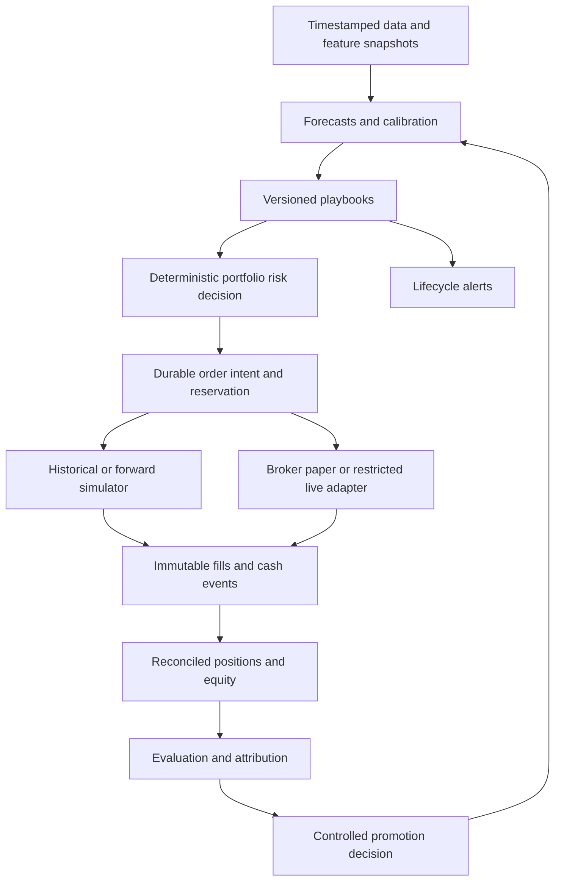

# StockAI system audit and path to validated automated trading

**Completed:** 2026-09-17; investigation began 2026-09-16.  
**Source:** initial checkout `26a8159`; original audit through `985d12e`; production follow-up and T400 changes through `cb00e42` reviewed.  
**Requested outcome:** market forecasts, useful AI signals and alerts with executable playbooks, profitable stock and options strategies, trustworthy paper trading, and staged real automation.  
**Deliverable:** audit and implementation recommendations. No trading rules, broker settings, credentials, application code, or deployment were changed by this audit.

**Latest status:** the user subsequently authorized read-only production access. The [production verification audit](2026-09-17-production-verification-audit.md) records the September 17 production snapshot and reconciles fixes made by separate work. A04's core liability omission, A05's earlier-close substitution, and A13's shell failure masking have been patched; A14's research fixtures have changed. A newly reproduced settlement-counter regression, **A17**, needs attention before options expiry. Earlier findings/probes below retain their original baseline unless marked otherwise.

## 1. Assessment and recommended direction

StockAI already has a substantial research and trading platform: market ingestion, technical analysis, tree-model ensembles, rankings, news and event intelligence, research reports, decision gates, paper portfolios, broker adapters, and options analysis. The next investment should concentrate on **measurement integrity, demonstrable strategy value, and execution correctness**.

The reviewed implementation does **not yet justify unattended real trading**. This is a release-readiness assessment based on identifiable order-lifecycle and accounting gaps, not a claim that an actual broker account has suffered a loss. The later read-only snapshot found only an unauthorized sandbox connection and no broker order IDs in stored trades; external broker account state was not queried. See the [production verification audit](2026-09-17-production-verification-audit.md) for the verified configuration and remaining limits.

Three conclusions drive the plan:

1. **Signal strength is not a measured probability of making money.** The displayed confidence is distance from a neutral fused score. ML classification accuracy, trade win rate, and portfolio return describe different outcomes. They need separate labels and evaluations.
2. **Some paper results and backtests are not yet suitable for promotion decisions.** The original options liability and settlement-date defects have received T400 fixes, with a remaining settlement regression and valuation limitations documented in the [production verification audit](2026-09-17-production-verification-audit.md). Stock exit replay still has unbounded data reads, and the options weight study does not reproduce all live selection constraints.
3. **A broker connection is already an execution path.** The paper engine can submit real orders to a linked account. Simulated positions and broker fills are not sufficiently separated, especially for partial exits, pending orders, rejection, and retries.

The recommended sequence is:

**Trustworthy accounting and data → reproducible evaluation → a small set of validated playbooks → forward paper evaluation → broker-paper lifecycle validation → restricted live stocks → separately qualified live options.**

The platform should be able to say “no qualified trade” and keep capital idle. Predicting every turning point or achieving a particular return is not an engineering guarantee. “Buy low, sell high” becomes useful when defined as a testable entry setup, risk budget, invalidation condition, and exit policy.

## 2. Evidence, scope, and limitations

This audit builds on the [codebase and feature review](2026-09-16-codebase-and-feature-review.md). It covers the main paths across all 12 services, the frontend, shared persistence, scheduling, tests, deployment configuration, and the improvements tracker. Deep tracing focused on the paths that determine recommendations, simulated profit, and real orders. It is not a line-by-line proof of the entire repository or a penetration test.

Evidence is distinguished throughout:

| Label | Meaning |
|---|---|
| **Observed** | Directly inspected source behavior in this checkout |
| **Reproduced** | Executed source functions with isolated fake dependencies or a small deterministic probe; no external orders or database mutations |
| **Historical** | A dated project report or source comment; its production measurements were not repeated |
| **Proposed** | Recommended design, threshold, experiment, or acceptance condition |
| **Unknown** | Requires deployed configuration, actual artifacts, database records, infrastructure, or broker evidence |

The initial review baseline was `26a8159`. While work was in progress, other changes introduced an options-income backtest, weight derivation, weights of **25% yield / 75% cushion / 0% liquidity**, and chain-capture restart recovery. Those changes through `985d12e` were inspected. The earlier orientation document describes its own older baseline, including the former 40/40/20 weights.

The original audit used no production queries. The subsequent user-authorized follow-up used database-enforced read-only queries, selected Redis reads, container status and source hashes, described in the [production verification audit](2026-09-17-production-verification-audit.md). No live broker API calls, model retraining, dependency installation, infrastructure changes, or deployments were performed by this audit. Tests used the installed local environment. Many tests mock database and service dependencies; a pass does not establish transaction safety or production readiness.

### Historical performance is motivation, not fresh evidence

The [September 15 gap analysis](../2026-09-15/MASTER_PROMPT_GAP_ANALYSIS.md) reports 119 closed paper trades, a 31.9% win rate, approximately −$7,786 aggregate P&L, and a 0.67 profit factor. Currency conversion and aggregation were not independently verified here. Do not present these as today's performance or aggregate USD and HKD without conversion.

[Path to Profitability](../2026-09-15/PATH_TO_PROFITABILITY.md) reports weak confidence separation, insufficient clean outcomes for a proposed calibration change, and a failed SWING exit-replay control. Its later GROWTH reproduction covers a narrow sample and does not validate every exit path. Its projected data-readiness dates require fresh counts.

The improvements tracker records that the SWING stop-width forward A/B experiment has subsequently been started. The per-portfolio overrides and call-site wiring exist. The later production follow-up confirmed portfolio 891 and its overrides, but it had no trades yet. Evaluate that experiment rather than launching an overlapping duplicate.

The new [options-income notes](../features/options-income-engine.md) and source comments report a historical weight-study improvement from 2.33% to 3.16% mean return on collateral and 65.9% to 69.0% wins on their held-out slice. These are **reported contract-study results**, not audited portfolio returns or forward paper results. Findings A08–A09 explain why stronger promotion evidence is still needed.

## 3. Whole-platform coverage and priorities

| Domain | Existing foundation | Priority improvement |
|---|---|---|
| Data ingestion | Provider fallback, validation, US/HK coverage, quote overlays, archived chains | Timestamped availability, market-calendar completeness, corporate-action consistency, explicit freshness contracts |
| Market intelligence | Regime logic, breadth/pressure, sector rotation, macro and event context | Separate current-state classification from forward forecasts; test each horizon and market |
| ML prediction | XGBoost/LightGBM/random forest, chronological splits, calibration, feature engineering, walk-forward tools | Label alignment, full point-in-time provenance, independent promotion windows, effective sample size |
| Signals and rankings | Four trading styles, multi-factor K-score, fusion, contextual adjustments | Distinguish scores from calibrated probabilities; remove double counting only after controlled ablation |
| Decision engine | Hard rejects, scoring, sizing, comparisons, optional LLM/risk-agent contributions | One versioned decision contract shared by alerts, preview, replay, and execution |
| Research/news/events | Quantitative scoring, cached LLM analysis, event and sentiment enrichment | Evidence freshness, structured extraction, tested missing-data semantics, attribution of incremental benefit |
| Alerts/playbooks | Multiple alert families, delivery channels, conditional actions, outcome tracking | One immutable playbook lifecycle; price/TTL invalidation; delivery and fill-aware evaluation |
| Stock paper trading | Position management, stops, scale-outs, risk gates, decision logs | Event-level replay parity, complete cash/fee accounting, separation from broker execution |
| Options | Chain analysis, game plans, LEAPS replay, CC/CSP income engine and new backtests | Mark liabilities, reliable settlement, capital-constrained replay, executable quotes, assignment lifecycle |
| Brokers | E*Trade/Alpaca adapters, account checks, entry-fill polling, position synchronization | Durable intents, idempotency, every-fill reconciliation, live mode controls, protective orders |
| Portfolio/risk | Allocation, concentration/correlation checks, optimizer, VaR/CVaR/stress tools | Actual consolidated exposures, FX, options Greeks, pending-order reservations and portfolio risk budgets |
| Operations/security | Auth, permissions, service tokens, health/job reporting, deployment tooling | CI failure propagation, tested migrations, immutable deployment, business-level health and recovery drills |
| Frontend | Broad analytical and operational UI | Clear mode/data age/calibration labels; one auditable route from alert to trade to outcome |

## 4. Prioritized findings and concrete remedies

**Severity convention:** P0 is a blocker for unattended real execution; P1 blocks trustworthy performance evaluation or controlled promotion; P2 improves reliability, usability, or maintenance. Severity does not imply a confirmed production incident.

### A01 — P0: simulated fills and real broker orders share an incomplete lifecycle

**Observed and reproduced.** In [paper_trading_engine.py](../../services/market-data/src/services/paper_trading_engine.py), `_open_trade` creates an open simulated trade before `_place_broker_entry`. The latter retains the simulated trade when the broker order fails or buying power is insufficient. If `get_account()` raises, the code continues toward order submission. An isolated probe confirmed that an account-check exception still reaches `place_order`.

The same functions submit `int(trade.shares)` but retain the simulated share quantity for bookkeeping. That is a mismatch whenever the simulated quantity is fractional. Immediate fill handling uses the average price without rebuilding the position from `filled_qty`.

**Impact:** a portfolio can represent a fill that did not happen, a different quantity from the broker, or an entry approved without fresh account checks. A later exit may act on that incorrect state.

**Solution:** introduce explicit `RESEARCH`, `SIMULATED`, `BROKER_PAPER`, and `LIVE` execution modes with separate ledgers. A live order must move through a durable order state machine. Only confirmed fills create actual holdings and cash movements. Fail closed for **new exposure** when mandatory account/risk state is unavailable. Preserve a separately controlled path for verified risk-reducing exits.

**Acceptance:** rejected, timed-out, and partially filled entries never become fully filled holdings; integer/fractional quantity policy is consistent end to end; changing mode cannot convert a simulated position into a live one; unavailable buying power cannot submit a new live entry.

### A02 — P0: exit orders and partial exits can diverge from real holdings

**Observed and reproduced.** `_monitor_positions` marks a trade closed and credits simulated sale proceeds before `_place_broker_exit`. The exit function logs the broker exit-order ID but does not persist it. It reconciles only an immediately fully filled exit. `poll_broker_order_fills` selects **open trades with pending entry orders**; it is not a general exit-order reconciler. An isolated pending-exit probe stored only the old entry ID after submitting the sell.

The scale-out branches reduce `trade.shares` and credit cash without broker submission in those branches. For example, a simulated 33-share scale-out from 100 shares leaves 67 in the ledger while the broker may still hold 100. The subsequent final sell is sized from the reduced ledger. Position synchronization into the separate user-position surface does not complete the missing order lifecycle.

**Solution:** route entry, scale-in, partial take-profit, full exit, manual close, conditional close, cancellation, and replacement through the same order/fill ledger. Keep a position open for actual remaining quantity until fills prove otherwise. Reconcile rejected/cancelled/expired orders, not just successful fills.

**Acceptance:** exercise pending exits, partial fills, duplicate fill notifications, rejected sells, process restarts, scale-outs and manual intervention against a broker fake and broker paper. Holdings, cash, realized P&L and outstanding orders must agree after each event. Do not silently label a failed live exit “closed.”

### A03 — P0: durable order identity and crash recovery are missing from the reviewed route

**Observed.** `_open_trade` flushes the database row, then calls the broker before the enclosing transaction is durably committed. [E*Trade's adapter](../../services/market-data/src/services/broker/etrade_broker.py) creates a new UUID-derived `clientOrderId` on each call. [Alpaca's adapter](../../services/market-data/src/services/broker/alpaca_broker.py) does not supply a durable application client-order ID in its submission payload. The [interface](../../services/market-data/src/services/broker/interface.py) does not accept an application order-intent ID.

**Impact:** a broker can accept an order while the local transaction or response fails. A retry may represent a second order, and rollback cannot undo the first broker submission. This is a crash-window risk, not a claim that duplication has occurred.

**Solution:** commit an intent and outbox record together; submit using a stable identity; reconcile an uncertain submission before retrying; record each fill uniquely. Adapt to each broker's actual lookup and identity semantics. Aim for one economic execution under retries, not an unsupported claim of exactly-once networking. Alpaca documents client IDs and retrieval by client ID. [Alpaca order documentation](https://docs.alpaca.markets/us/docs/working-with-orders).

The reviewed engine route submits market orders; support for stop order types in the adapter alone does not establish protective-order placement. Add broker-native protection where supported, reconcile protective quantities after every partial fill, and test cancellation races. Stops still do not guarantee a fill price during gaps.

**Acceptance:** kill the worker before submission, after acceptance but before response, and before local acknowledgement. Restart must discover the existing order rather than double-submit. An application outage must leave a documented and tested protection/recovery path.

### A04 — P1: options equity omits the short-option liability

**Update:** the core omission described below was patched by T400. Production's latest snapshot includes a liability deduction. Quote freshness and fallback mark limitations remain; see the [options valuation follow-up](2026-09-17-production-verification-audit.md#3-options-status-and-fixes-now-present). This finding describes the original baseline.

**Observed and reproduced.** In [options_income_engine.py](../../services/market-data/src/services/options_income_engine.py), `open_income_positions` adds collected premium to cash. `_snapshot_income_equity_curve` adds underlying market value for covered calls or reserved cash for puts, but does not deduct the value of the outstanding short option.

| Isolated entry example, before fees | Snapshot result | Economic starting equity |
|---|---:|---:|
| $10,000 account; buy 100 shares at $100 and sell a call for $200 | $10,200 | Approximately $10,000 at the assumed transaction marks |
| $10,000 account; reserve $9,000 for a put and collect $150 | $10,150 | Approximately $10,000 at the assumed transaction marks |

The precise liquidation equity depends on the bid/ask mark and costs, but collecting premium is not an immediate gain equal to the entire premium. The liability remains outstanding. Later short-put losses are also hidden from this curve until settlement.

**Solution:** account separately for cash, restricted cash, stock value, long-option value and short-option liability. Mark signed option quantities at a documented fair/liquidation convention; show stale marks explicitly. Do not count collateral twice. Separate realized P&L, unrealized P&L, and premium cash receipts.

**Acceptance:** opening a short option does not manufacture equity; a rising liability reduces equity before expiry; close/assignment accounting reconciles to the cash ledger and broker statement. Historical curves built with the old formula must be corrected or labelled unsuitable for drawdown/performance comparisons.

### A05 — P1: missing expiry data can settle a contract at an earlier close

**Update:** T400 now requires the expected settlement session in the engine and backtest. The updated engine introduced the separate counter regression A17; see the [production verification audit](2026-09-17-production-verification-audit.md). This finding describes the original baseline.

**Observed and reproduced.** `_closing_price_on_or_before` accepts any daily close within seven days before expiry. `settle_expired_positions` permanently closes the position using that value. The new [options backtest](../../services/market-data/src/backtest/options_income_backtest.py) similarly uses `_close_on_or_before` for settlement.

A deterministic probe requested Friday 2026-09-18 with only Thursday's $101 close and received Thursday's value. For a $100 short put, a real Friday close of $90 would reverse the economic outcome relative to using $101. This example illustrates the defect; it is not a measured historical trade.

**Solution:** resolve the expected settlement session using the contract and exchange calendar. Require that session's valid settlement input. If it is missing, retain `PENDING_SETTLEMENT` and retry. Distinguish a legitimate holiday/session adjustment from missing data. Real accounts must consume broker exercise/assignment events; an expiry-close approximation is only a documented paper model.

**Acceptance:** missing expiry-session data never silently substitutes the previous session; exact-at-strike, holiday, corrected-price, and delayed-assignment scenarios have explicit behavior.

### A06 — P1: archived option bids are treated as current fills

**Observed.** `rank_income_candidates` accepts archived chains up to five calendar days old, combines their `nbbo_bid` and Greeks with a current underlying price, and supplies that premium to entry accounting. The routine correctly checks several selection constraints, but those checks cannot make an old quote executable. The daily scheduling also differs from an intraday execution model.

**Solution:** separate research candidates from executable orders. Require timestamped, synchronized underlying and option quotes, valid non-crossed bid/ask, a spread budget, appropriate size/liquidity checks, and a strategy-specific freshness limit before a simulated executable fill or broker order. Use a new quote on the next eligible session if the candidate was generated after hours. Record non-fills and adverse selection.

**Acceptance:** stale bid + fresh stock price cannot create a supposedly current fill; stale-data rejections are counted; paper and live share eligibility logic while retaining different fill providers. Open interest alone is not an execution-liquidity guarantee.

### A07 — P1: options run-step has no observed portfolio serialization

**Observed risk; concurrency not reproduced against PostgreSQL.** `run_options_income_step`, `open_income_positions`, and `settle_expired_positions` have read/check/write sequences without a portfolio row lock or durable idempotency boundary. The scheduler and the [admin run-step endpoint](../../services/market-data/src/api/options_income.py) can invoke the same routine. A per-day entry count handles sequential repeats, not two invocations reading the same old count and cash.

**Solution:** serialize mutation per portfolio using a database transaction and row lock or equivalent durable mechanism; include a unique operation key and cash reservation. Keep slow provider calls outside the locked section. Roll back failed transactions before reusing the session; use independent transaction scopes per portfolio.

**Acceptance:** simultaneous scheduler/admin triggers produce no duplicate economic entry, overspent cash, lost balance update, or repeated settlement. A failure in one portfolio does not leave the next portfolio using an aborted transaction.

### A08 — P1: new options backtest/weight evaluation does not match live capital and selection constraints

**Observed and reproduced in part.** [options_income_backtest.py](../../services/market-data/src/backtest/options_income_backtest.py) evaluates selected contracts on recurring dates without a portfolio cash balance, overlapping-position state, or the live concentration/per-symbol checks. Its summed P&L and average contract return are not a capital-constrained portfolio return.

[options_income_weights.py](../../services/market-data/src/backtest/options_income_weights.py) appropriately requests all eligible contracts to avoid pre-filtering by old weights. However, `_evaluate` directly takes the top N contracts per date without restoring the live best-per-symbol/strategy reduction or portfolio symbol cap. A source-function probe selected three contracts for the same symbol; the live default permits one open position per symbol. Weekly entries can also overlap for 14–45 DTE contracts.

**Solution:** retain the current tool as a clearly named contract-selection study. Add a portfolio replay that uses the same selection reduction, cash reservations, symbol limits, maximum positions, minimum yield, scheduling, and settlement state as `open_income_positions`. Then rerun incumbent versus candidate weights on identical feasible trades and execution assumptions.

**Acceptance:** counterexamples with several attractive strikes on one symbol, occupied symbols, insufficient cash, and overlapping expiries produce the same admissible orders in replay and paper. Report return on total account equity, drawdown, utilization, rejected candidates, and costs alongside contract statistics.

### A09 — P1: chronological options splitting does not purge overlapping outcomes

**Observed.** `derive_quality_weights` partitions by entry date alone. A training contract entered before the boundary can expire during the test period, so its outcome was unavailable at the boundary when the proposed weights would have been chosen. Many contracts also share underlying, date and expiry. A pool of 50,787 contract rows, as reported in the source comments, is not 50,787 independent strategy decisions.

The options selector's earnings query filters report dates but has no observed “known as of decision time” predicate. Today's corrected earnings calendar is not necessarily the calendar that was available historically. Using a date-bounded chain is valuable but does not establish point-in-time validity for every input or same-day quote availability.

**Solution:** require every training label to have matured before each training cutoff; purge overlapping label intervals and use appropriate embargoes. Store availability/version timestamps for events and chains. Group uncertainty estimates by time and underlying; use nested chronological selection and a fresh untouched forward window. A fixed 0.10 percentage-point improvement margin is a business threshold, not a statistical significance test.

**Acceptance:** no training outcome or feature becomes available after its cutoff; estimates include dependence-aware uncertainty and costs; selection survives multiple time windows and regime slices. Preserve the existing weights' provenance and validate them in shadow before treating reported uplift as a live edge. This audit did not change the weights.

### A10 — P1: stock exit replay still has unbounded reads

**Observed.** `_monitor_positions(..., as_of=...)` in [paper_trading_engine.py](../../services/market-data/src/services/paper_trading_engine.py) bounds some signal, ranking and ATR reads. Its RSI query uses latest signals ordered by `sig.ts DESC` without `as_of` or a style constraint. Its `sig_reasons` query for double-top logic similarly retrieves the latest row without an `as_of` bound. The OBV path also warrants a complete cutoff audit.

**Impact:** a historical exit decision can use later information despite an `as_of` argument and point-in-time comments. Existing partial fixes are useful; they are not proof of whole-function replay fidelity.

**Solution:** pass one explicit evaluation context with decision timestamp, availability cutoff, market session and data repository through every dependency. No replay function may read wall-clock “latest” data, live providers, or current-only Redis configuration. Version runtime flags and parameters with the decision.

**Acceptance:** append future rows and alter current Redis/provider data; all earlier replay decisions remain identical. Reproduce entry/exit reason, quantity, partial exits, timing and cash events—not only total return on a small aggregate sample.

### A11 — P1: confidence and fused probability overstate what has been calibrated

**Observed.** [signals.py](../../services/signal-engine/src/generators/signals.py) computes `confidence = round(abs(fused - 0.5) * 200, 2)`. For example, `fused=0.8` produces confidence 60; neither number alone establishes a 60% or 80% profitable-trade probability. The model trainer has calibration machinery, but the final signal also receives technical, contextual and heuristic adjustments.

**Solution:** expose separate `signal_strength`, `direction_probability`, `target_before_stop_probability`, expected net return, and calibration support. Recalibrate the final quantity for its declared target using independent matured outcomes. Until enough support exists, display “uncalibrated score” or “insufficient evidence.” Keep BUY and SELL target definitions separate.

Use reliability diagrams with bin counts, Brier/log loss and discrimination metrics together. A better Brier score alone does not isolate calibration improvement. Calibration must use data independent of model fitting. [scikit-learn calibration documentation](https://scikit-learn.org/stable/modules/calibration.html).

**Acceptance:** every displayed probability has a defined outcome/horizon, out-of-sample reliability evidence, sample count and version. Missing or sparse regime/style buckets do not inherit unjustified certainty.

### A12 — P1: evidence layers, risk gates, and outcome definitions need one contract

**Observed architecture boundary.** Signals combine overlapping technical/momentum/ML inputs; K-score and decision scores can reuse related information. The signal compression cap can restore same-direction score magnitude after preceding adjustments, although its sign-flip guard and later weekly gate already prevent specific older failures. This is a policy requiring ablation, not proof that every risk filter is bypassed.

The decision service, local fallback, preview sizing, paper sizing, alerts, signal outcomes and trade outcomes represent related but different questions. Frozen first-actionable daily signal fields are a useful existing control; they do not preserve every intraday recommendation revision or every trade-specific execution outcome.

**Solution:** introduce a versioned `DecisionContext` and immutable playbook/decision snapshots. Separate mandatory vetoes from forecast adjustments and position sizing. Record raw inputs, contributions, fallback/degradation, risk decisions, action, and model/config versions. Keep forward signal labels separate from realized trade outcomes, with explicit links rather than overwriting their meanings.

**Acceptance:** the same context gives compatible preview, alert, replay and execution decisions; hard vetoes cannot be undone by score restoration or LLM text; paired ablations quantify whether each added layer improves net performance or only reduces coverage.

### A13 — P1: CI can hide an earlier backend failure

**Update:** T400 fixes the outer shell's failure propagation. Release-branch coverage and the remaining CI recommendations still need verification. The reproduction below applies to the original recipe.

**Observed and reproduced.** The [Makefile](../../Makefile) runs each service's tests in a subshell inside a shell loop. An `exit 1` exits that subshell; the outer loop continues. A successful last service can leave the recipe successful. A two-iteration reproduction with statuses 1 then 0 returned overall status 0.

[test.yml](../../.github/workflows/test.yml) triggers on `main` and `dev`, whereas [CLAUDE.md](../../.claude/CLAUDE.md) describes deployment from `prod`. This workflow therefore does not directly cover pushes/PRs targeting `prod`; other external protections were not inspected. It also does not explicitly install api-gateway requirements in its service dependency loop, although the test target includes that service.

**Solution:** propagate any failure to the parent shell or use a CI service matrix with independent environments and explicit exit status. Require checks on the actual release branch and pin the tested artifact. Upload JUnit results, not just pytest's cache. Treat unexpected “no tests collected” as a coverage failure for a known suite.

**Acceptance:** deliberately fail a test in the first service and verify the whole required check fails. A production release cannot bypass the intended checks. Distinct dependency sets must not pass only because another service supplied them.

### A14 — P1: local verification is incomplete and research expectations disagree

**Update:** T400 revises the research fixtures. See the [follow-up test results](2026-09-17-production-verification-audit.md#5-follow-up-test-results-and-interpretation); the original results below remain an audit history, not the latest research test verdict.

**Measured.** Eight backend service suites completed successfully. Research-engine completed with three failures and 76 passes. API gateway, decision engine and event intelligence reached the audit's 240-second per-service timeout and have no complete verdict. Detailed results appear in section 12.

Research failures are specific: an empty fundamental dictionary expects score 50 while [scoring.py](../../services/research-engine/src/scoring.py) returns 35; two fixtures expect Strong/Weak balance sheets without book-equity inputs while the implementation returns Unknown. The latter behavior has an explicit missing-data rationale in the source. These are specification/test disagreements, not evidence that reverting the implementation is correct.

**Solution:** decide and document missing-fundamental semantics, update code or tests accordingly, and add fixtures that actually include required balance-sheet inputs. Diagnose stalled suites with bounded per-test timing and stack traces in the intended environment. Add real PostgreSQL transaction/concurrency tests, broker event tests and replay parity tests around the financial boundaries. Existing source-text and mocked tests cannot substitute for them.

**Acceptance:** all required suites complete with accounted skips; the tests exercise actual financial invariants, not only presence of a source string.

### A15 — P2: operational success needs to measure useful output

**Observed architecture and historical incidents.** Market-data owns a large scheduler and much of trade orchestration. Shared database startup includes table creation/migration/seeding paths. Existing incident notes describe job gaps and deployment drift. The new restart catch-up for chain capture is a useful improvement, but one job's fix is not a durable scheduling guarantee for all jobs.

`run_options_income_step` catches per-portfolio failures internally. Its scheduler wrapper can record overall `ok` when the function returns after logging internal errors. Job completion and portfolio success therefore need distinct reporting.

**Solution:** return structured batch results: attempted/succeeded/failed, rows expected/written, newest data time, coverage and retry state. Add durable job identities, singleton ownership where required, bounded catch-up and idempotent mutations. Move migrations into a tested release step. Replace session-scoped container hotfixes with versioned images and a deployment manifest for code, schema, models and configuration.

**Acceptance:** a successful status requires its business-level invariants; stale datasets alert even if the process is alive; restore/restart drills recover jobs and positions; every running component exposes its build/model/config version.

### A16 — P2: tracker status and UI breadth are not readiness evidence

**Observed.** `improvements.tsx` is a valuable implementation history. Its initial inventory contained 1,745 rows, a duplicate ID and a mixture of done/todo/in-progress entries; local browser state also affects displayed status. The September 17 additions change those counts. Some old limitations are already superseded: the Polygon adapter uses bearer-header authentication, for example, and the SWING A/B experiment has implementation wiring.

**Solution:** retain historical notes but add separate fields for implemented, tested, deployed, enabled, measured and promoted. Link each high-impact improvement to a reproducible result, experiment ID, acceptance criteria and current build. Enforce unique tracker IDs. Do not mark a strategy profitable merely because its code or dashboard is complete.

**Acceptance:** the tracker and release screen clearly distinguish a shadow feature from an enabled strategy with forward evidence; stale issues are reconciled against source and runtime checks.

## 5. Define the trading objective before optimizing the model

Win rate is useful, but insufficient. For a simplified strategy:

`expected net payoff = P(win) × average win − P(loss) × average loss − expected costs`

A 45% win rate with average wins of 2R and losses of 1R produces +0.35R before costs. A 70% win rate with 0.4R wins and 1R losses produces −0.02R before costs. Here R is the planned risk unit; realized gap losses can exceed it. Premium-selling strategies particularly need loss-tail measurement alongside frequent small wins.

Use separate scorecards:

| Question | Required measurements |
|---|---|
| Can we forecast market direction? | Horizon-specific balanced accuracy, Brier/log loss, reliability, return-distribution coverage, improvement over simple baselines |
| Are actionable signals useful? | Net expectancy, target-before-stop rate, MAE/MFE, opportunity coverage, rejection/abstention rate, delay sensitivity |
| Does the playbook make money? | Net average R, payoff ratio, profit factor, turnover/costs, holding time, drawdown, loss clustering, capacity |
| Does the portfolio meet its objective? | Marked total equity, time-weighted return, exposure-adjusted benchmark, volatility, drawdown/duration, tail losses, cash utilization |
| Do options improve the stock thesis? | Net option return and drawdown versus stock/cash alternative, spread/fees, volatility attribution, Greeks, assignment effects |
| Can execution be trusted? | Position/cash reconciliation, unknown orders, duplicate submissions, fill latency, slippage, failed protection, recovery success |

Evaluate US and HK separately before converting into a declared base currency. Record contemporaneous FX and distinguish asset returns from FX returns. Use total-return benchmarks appropriate to the universe and holding period; include cash and a simple rules baseline. Match timing, costs and available capital. Do not compare a leveraged, concentrated portfolio to an unleveraged benchmark without showing the exposure difference.

The first deliverable should be a frozen baseline report for each active strategy/style and execution mode. It should distinguish current deployed measurements from historical reports and show unresolved data/accounting exclusions.

## 6. Improve market trend prediction and AI signals

### 6.1 Forecast a defined future event

Keep the existing regime/pressure tools, but distinguish **current market state** from **future market outcome**. An HMM state or trend label is not automatically a probability of the next move.

Proposed forecast objects:

| Layer | Example outputs | Evaluation |
|---|---|---|
| Broad market | Probabilities of up/range/down over 1, 5, 10 and 20 sessions; return quantiles; volatility/drawdown risk | Separate US/HK benchmarks and horizons |
| Sector | Relative return versus the relevant market; breadth persistence | Sector-neutral baselines and contribution to selection |
| Stock | Net forward return distribution; target-before-stop probability; expected MAE/MFE | Style, liquidity, regime and setup slices |
| Options | Underlying path plus volatility scenarios; executable payoff distribution | Actual contract returns after spread/fees, not stock direction alone |

Use a no-change/base-rate forecast, a simple trend rule, and a small statistical/tree baseline as challengers. The existing tree ensemble is an appropriate starting point. New transformers, deep reinforcement learning or more indicators should enter only when they improve a frozen benchmark after costs and do not weaken reliability.

### 6.2 Make each input historically available

Store both **event time** and **available/observed time**. Apply the cutoff to prices, fundamentals, corporate actions, analyst revisions, earnings schedules, news publication/ingestion, sector membership, options quotes and model versions. A historical date on a row does not prove the platform possessed it then.

Create a dataset manifest containing provider, market/session/timezone, adjusted/raw price policy, symbol mapping, missingness, completeness, ingestion time and corrections. Keep executable raw quotes separate from adjusted research series. Include delisted securities and historical universe membership when coverage permits; otherwise explicitly limit the claim to the surviving covered universe.

The training pipeline already has chronological splits, calibration splits, horizon gaps and weak-model controls. Preserve those controls. Extend the audit to label maturity, all preprocessing, hyperparameter search, threshold selection, ensemble weights and every auxiliary model. A feature unavailable historically should be excluded from that retrospective experiment, not silently populated from today's snapshot.

### 6.3 Align labels with the trade

The current style horizons are useful starting points, but a positive close-to-close return does not imply the trade survived its stop or could be entered at the observed price.

For each playbook, freeze:

- Decision timestamp and earliest eligible execution timestamp.
- Entry rule and unfilled/expired-order policy.
- Target, invalidation/stop, maximum holding period and exit priority.
- Transaction-cost model and executable instrument.
- Outcome definition, including ambiguous intrabar paths.

Build target-before-stop and time-to-event labels alongside forward returns. If both stop and target occur within a coarse bar, use available finer data or a declared conservative/unknown policy; never assume the favorable path. Include non-trades and expired setups in coverage reporting. Do not train a universal confidence estimate only on the subset that earlier gates allowed to trade.

### 6.4 Calibrate, ablate, and permit abstention

Calibrate final actionable outputs on independent chronological predictions. Use pooled or hierarchically shrunk estimates when style/regime buckets are small, and report the support. Abstain when data quality, model disagreement, calibration uncertainty or estimated cost makes the trade unjustified.

Test these layers incrementally on the same dates: technical baseline → ML → sector/market context → news/events → options-flow/context → optional LLM contribution. Log how many trades each layer removes, its incremental net result, and whether it changes portfolio concentration. Trend, momentum, relative strength and model inputs can be correlated; counting them as independent votes overstates corroboration.

Treat mandatory risk vetoes as a separate final gate. Soft adjustments, including the compression-cap policy, can be tuned only with an experiment that preserves those vetoes. Keep small-sample and in-sample fallback metrics out of promotion decisions.

## 7. Signals, alerts, and executable playbooks

### 7.1 Start with a limited strategy catalog

These are hypotheses to test, not recommendations to trade any current security:

| Playbook | Entry concept | Invalidation/exit concept | Initial instrument |
|---|---|---|---|
| Trend pullback | Strong market/sector context, controlled pullback to recorded structure, then confirmation | Structure failure, volatility-aware stop, time limit, tested scale-out/trailing rule | Liquid stocks; later separately tested debit spreads |
| Breakout and retest | Defined resistance break with liquidity/volume confirmation; bounded entry distance | Failed retest/acceptance below level; gap/no-chase rule | Liquid stocks |
| Range mean reversion | Verified range regime and liquid support test | Range breakdown or volatility expansion; exit near recorded resistance | Stocks in shadow first |
| Bearish continuation | Negative market/sector context plus failed rebound | Thesis invalidation or time/target exit | Research first; defined-risk bearish options after options qualification |
| Covered-call income | Willingness to hold stock and sell it at the strike; acceptable capped upside | Underlying thesis/risk breach, tested close/roll/assignment policy | Fully covered calls in options paper |
| Cash-secured put | Willingness and cash to acquire the underlying; attractive full downside-adjusted economics | Underlying risk limit, close/assignment policy, capital reservation | Fully secured puts in options paper |

“Buy low” should mean favorable price relative to a specified setup and risk, not merely a large decline. “Sell high” should mean a tested exit policy, not hindsight identification of the top. Test fixed targets, structural exits, time stops and trailing approaches under identical entries. Do not widen stops or change take-profit rules because of a few recent losses.

Covered calls retain substantial stock downside and cap upside; cash-secured puts retain substantial downside if the underlying falls. A high premium yield is not an independent return source detached from direction. [OIC covered-call explanation](https://www.optionseducation.org/strategies/all-strategies/covered-call-buy-write), [OIC cash-secured-put explanation](https://www.optionseducation.org/strategies/all-strategies/cash-secured-put).

### 7.2 Store a machine-readable playbook before generating prose

Proposed common record:

```text
identity: playbook_id, version, decision_id, strategy_id, experiment_id
context: market, symbol, instrument/contract, style, currency, decision_time
provenance: feature_snapshot_id, data_age, model_version, config_hash
forecast: target_definition, horizon, probabilities, expected_net_R, uncertainty
setup: rationale_codes, setup_state, evidence_references, regime
entry: trigger, permitted_price_range, order_policy, expires_at, no_chase_rule
risk: invalidation, stop_policy, planned_loss, gap_stress_loss, portfolio_limits
management: targets, partial_exit_rules, trailing_rule, time_exit, event_policy
options: legs, multiplier/deliverable, DTE, quotes, Greeks, assignment_policy
decision: eligible/blocked/abstain, reason_codes, sizing_result, execution_mode
lifecycle: created, armed, triggered, order_pending, filled, invalidated,
           expired, exited, settled
```

Price levels must come from the recorded market/structure calculation. Optional LLM narration explains those facts; it must not invent levels, change quantity, weaken a hard gate, or independently authorize an order. Keep untrusted news/transcript text outside the authority of execution controls. Validate structured outputs, preserve evidence links, and measure whether any LLM input improves decisions enough to justify cost/latency.

### 7.3 Alert on transitions and actionable changes

An alert should tell the user what changed, the trigger and expiry, current versus permitted entry price, risk/invalidation, instrument, and why the setup may no longer qualify. Display data age, execution mode and empirical support. “High confidence” without a target and calibration is not sufficient.

Use a durable delivery/outbox record and an idempotency key such as `(playbook_id, version, transition, recipient, channel)`. Distinguish generated, queued, delivered, acknowledged and actionable-at-delivery. Apply cooldowns and invalidation updates; prioritize protective position alerts over duplicate discovery alerts.

Do not assume an alert subscriber entered at the signal price. Measure signal quality, alert latency/actionability, paper fills and actual fills separately. Link them with IDs. A useful product flow is **market outlook → candidate → playbook → risk decision → paper/live order → outcome attribution**.

## 8. Build paper trading that answers the live-trading question

### 8.1 Shared decision logic, distinct execution providers

Use one decision/risk contract across replay, forward simulation, broker paper and live execution. Let the fill provider differ. Avoid maintaining a simplified backtest strategy whose gates, sizing and exits drift from the running engine.



Use an append-only event/fill ledger with derived position/equity views; this can start in PostgreSQL without introducing a new message-broker platform. Record corrections as explicit events, not silent historical rewrites.

### 8.2 Minimum equity simulation requirements

- Fees, spread, slippage, price gaps, partial/unfilled orders, participation limits and execution latency.
- Cash reservations for outstanding orders; actual market sessions, holidays, halts and market-specific lot sizes.
- Split/dividend treatment, corporate actions, currency conversion and explicit settled/unsettled cash rules appropriate to the account.
- Full partial-exit, scale-in and trailing-stop event history, with deterministically ordered events.
- Separate gross/net results and quoted/executable prices; no favorable same-bar lookahead.

Paper broker fills remain simulations. Alpaca explicitly lists omissions including market impact, latency slippage, queue position, regulatory fees and dividends, and notes that simulated fills are not constrained by displayed NBBO size. Therefore broker-paper success tests connectivity and lifecycle behavior but cannot prove realized execution quality. [Alpaca paper-trading documentation](https://docs.alpaca.markets/us/docs/paper-trading).

### 8.3 Experimental discipline

Freeze the strategy, dataset manifest, costs, configuration and primary metric before starting an evaluation. Give each experiment an ID and a fixed review rule. Keep the incumbent alongside one challenger and record all rejected candidates. Do not change stops, weights, universe and costs simultaneously and then attribute the gain to one change.

The existing SWING stop-width A/B should retain its documented controls. Verify whether its capital, position occupancy and actual entry opportunities remain comparable. Use paired opportunities where possible; once portfolios diverge in holdings, report that exposure difference rather than assuming perfect pairing.

A large count of correlated trades is not a large independent sample. Estimate uncertainty with time blocks and underlying clusters; report regime and sector concentration. A nominal 100 independent binary observations near a 50% hit rate still has roughly ±10 percentage points of 95% sampling uncertainty; correlated trades are less informative. Use a power/precision target appropriate to the claimed improvement instead of declaring an arbitrary trade count sufficient.

## 9. A separate roadmap for options

Stock direction is only part of an option's return. The platform needs a joint view of **direction, magnitude, timing, implied-versus-realized volatility, liquidity and contract mechanics**. A correct bullish call can still lose money through spread, time decay or volatility changes.

### 9.1 Data and contract model

Persist contract identity, put/call, expiry, strike, exercise/settlement type, multiplier/deliverable, adjustments, timestamped NBBO/size, underlying quote, Greeks and their source, IV, volume and open interest timestamps. Do not assume every deliverable is always 100 ordinary shares after corporate actions.

Model event calendars, ex-dividend dates, exercise cutoffs and broker assignment notifications. Missing event coverage for a stock is distinct from an ETF having no earnings event. Missing mandatory options-risk data should block that strategy's new exposure.

### 9.2 Strategy progression

1. **Repair and validate the existing CC/CSP paper engine.** Add liability marks, correct settlement, realistic entry timing, fees, concurrency controls and capital-constrained replay. Label its current at-expiry stock liquidation policy explicitly; it is not a complete wheel/stock-acquisition lifecycle.
2. **Add long-option and defined-risk spread paper strategies.** Compare them with the stock alternative under the same thesis. Select DTE and strikes by tested holding-period, liquidity, payoff and risk criteria; do not optimize solely on delta or annualized premium.
3. **Implement multi-leg order and position accounting.** Represent opening/closing actions per leg and use native combination orders where supported. Reject unsupported combinations; do not silently leg into unhedged short exposure.
4. **Qualify live options independently.** Stock automation passing its gates does not validate options execution, assignment, deliverables or portfolio Greeks.

American-style short options can be assigned before expiry. Assignment is not determined solely by a model's terminal-close comparison, and covered-call assignment can be a planned profitable outcome. [OIC assignment FAQ](https://www.optionseducation.org/referencelibrary/faq/options-assignment).

### 9.3 Portfolio-level options controls

Track delta-equivalent exposure, gamma, vega, theta, collateral and stress loss across stocks and options together. Stress underlying gaps, volatility changes, spread widening, near-expiry behavior and simultaneous correlated assignments. Separate liquid cash from restricted collateral. Model early assignment and exercise funding, including temporary stock positions from spread legs.

For long options, premium and transaction costs define the basic position loss budget. For vertical spreads, use the contractual payoff limits plus a conservative operational allowance for exercise/assignment and execution handling; terminal payoff limits do not remove interim funding or leg risk. For secured puts and covered calls, explicitly budget substantial underlying downside. Avoid naked short-option automation in the initial roadmap.

The existing broker interface is centered on symbol/quantity/side and ordinary order types. A richer option-contract/leg model and broker capability checks are required before treating it as a production options order-management system.

## 10. Real execution architecture and operating controls

### 10.1 Proposed durable records

| Record | Purpose |
|---|---|
| `feature_snapshot` / `decision_snapshot` | Reproduce the exact data, versions, risk state and decision |
| `playbook` / `playbook_event` | Preserve setup versions and lifecycle transitions |
| `order_intent` | Stable identity, account, mode, contract/legs, quantity, price constraints and approval/risk result |
| `order_event` / `fill` | Broker acknowledgement, partial fills, replacements, cancellation and terminal states |
| `cash_event` / `position_lot` | Cash, fees, FX, assignment and holdings derived from actual events |
| `reconciliation_run` | Differences versus broker account, orders, positions and balances |
| `experiment` / `promotion_record` | Frozen hypothesis, metrics, evidence, decision and rollback version |

Reuse existing tables where their semantics fit; add migrations rather than creating a parallel source of truth unnecessarily. This is a proposed schema direction, not an instruction to rename all existing objects.

### 10.2 Required live behavior

- Explicit account and environment allowlists; live mode cannot be inferred solely from a linked broker connection.
- Before new exposure: fresh quotes/account state, buying power and cash reservations, lot/contract validation, price collars, portfolio exposure, daily-loss and order-rate limits.
- Startup and periodic reconciliation of open orders, holdings, cash and protection; unresolved material differences inhibit new entries.
- Stable client identity, durable retry state and deduplicated fills; timeouts are “unknown until reconciled,” not “failed therefore retry blindly.”
- Broker-supported protective orders where appropriate, with exact quantity management and tested races; a stop is a risk-control mechanism, not a guaranteed price.
- Independent emergency controls to stop new entries, cancel eligible pending entries, and manage existing risk. “Pause” and “flatten” must be separate actions with clear semantics.
- Explicit policy for externally placed/manual trades, account transfers, corporate actions and credential expiry.
- Persisted model/config versions and a rollback path; no automatic promotion of newly trained strategies directly into live capital.

FINRA's algorithmic-trading material emphasizes development, testing and supervisory controls for member firms. It is useful engineering context here; this audit does not determine which regulatory obligations apply to this project or account. [FINRA algorithmic-trading guidance](https://www.finra.org/rules-guidance/key-topics/algorithmic-trading).

### 10.3 Security and operational follow-through

Before live enablement, verify broker-secret encryption and rotation, least-privilege keys, account ownership authorization, session revocation, privileged configuration audit trails and log redaction in the actual deployment. These are verification tasks, not newly demonstrated vulnerabilities. The Polygon adapter's previous key-in-URL issue is already corrected in the reviewed source; any historic key exposure/rotation status is a separate runtime matter.

Add readiness checks tied to useful data and reconciliation, not only HTTP liveness. Monitor ingestion lag, missing sessions, calibration drift, abstention rates, model age, rejected/unknown orders, unprotected quantity, cash differences and alert delivery delay. Test backup restoration and reconstruct holdings from the ledger before connecting the restored system to live submission.

Extract modules gradually from the large scheduler and paper engine: market data access, pure decision policy, portfolio risk, order submission, ledger/reconciliation, and job orchestration. Preserve behavior with characterization and parity tests. A wholesale microservice rewrite is not a prerequisite for better trading evidence.

## 11. Prioritized implementation backlog and promotion gates

Effort below is a planning estimate in focused engineer-days for someone familiar with the repository, excluding data acquisition and the elapsed time needed for independent forward outcomes. Estimates are not commitments; concurrency, broker capabilities and schema migration needs can expand them.

| Work package | Priority / proposed owner | Scope and completion evidence | Estimate / dependency |
|---|---|---|---|
| W01 — Baseline and release checks | P1 / platform + quant | Correct CI failure propagation and branch coverage; reconcile failing tests; diagnose timeouts; freeze current strategy/accounting report | 2–5 days |
| W02 — Options accounting and settlement | P1 / trading backend | A04–A07; liability marks, exact-session settlement, quote eligibility, transaction serialization and failure reporting | 5–10 days |
| W03 — Data and decision provenance | P1 / data + quant | Availability timestamps, data manifests, immutable decisions, model/config identity, explicit FX policy | 5–10 days; incremental migration |
| W04 — Replay and weight-study validity | P1 / quant + backend | A08–A10; identical constraints, purged labels, future-data invariance, benchmark and cost reporting | 7–15 days; W02/W03 |
| W05 — Forecast and calibration contract | P1 / quant | Separate strength/probability/EV; fixed labels; baselines; reliability and coverage by horizon/style | 5–10 days plus matured outcomes |
| W06 — Playbook and alert lifecycle | P2 / backend + frontend | Structured playbooks, immutable versions, TTL/price invalidation, durable delivery and attribution | 5–10 days; W03/W05 |
| W07 — Durable broker order management | P0 before live / execution backend | A01–A03; modes, intent/outbox, fills, partial exits, reconciliation, protection and recovery drills | 10–20 days; isolated broker paper |
| W08 — Controlled forward experiment | P1 / quant + trading owner | Frozen incumbent/challenger; actual costs/capital; uncertainty and predeclared review; existing A/B reconciled | 2–4 days setup; observation time separate |
| W09 — Release/operations hardening | P1 before live / platform | Immutable images, migration/restore rehearsal, business health, kill-switch drills, secrets/permissions verification | 5–10 days; W07 |
| W10 — Restricted stock-live pilot | Gated / trading owner + execution | Explicit limits/account; end-to-end reconciled fills; monitor slippage and rollback criteria | 2–5 days setup after gates |
| W11 — Full options lifecycle | P0 before options-live / options backend + quant | Contract/leg model, Greeks/stress, assignment/exercise, funding, multi-leg broker-paper tests | 10–20+ days; W02/W07 |

### Gate A — Research outputs are honest

All probability/score labels are accurate, source time and missingness are visible, affected performance curves are corrected or excluded, and experimental results carry their assumptions. Existing discovery/research work can continue while these repairs proceed.

### Gate B — A playbook has credible retrospective evidence

Point-in-time and replay controls pass; costs and capital constraints are included; the strategy beats its predeclared relevant baseline on untouched chronological windows without relying on a single symbol or regime. Report uncertainty, drawdown and failure slices. Repeatedly inspecting a holdout turns it into development data; acquire a new evaluation window after tuning.

### Gate C — Forward paper confirms the frozen implementation

Forward behavior matches the specification; paper equity and ledger reconcile; the evidence meets a predeclared sample/precision target; net expectancy and risk are acceptable under realistic costs. Define numerical risk limits before the run based on the intended account and tolerance, rather than inventing a universal acceptable drawdown in this audit.

Proposed statistical rule: require evidence of positive net expectancy and incremental value with dependence-aware uncertainty, plus a stress-tested risk budget. If the interval is too broad to distinguish improvement, remain in paper. A high win rate or a fixed number of trades alone does not pass this gate.

### Gate D — Broker paper passes operational qualification

There are no unresolved material order/position/cash differences. Fault injection covers duplicate events, partial fills, cancel/replace races, broker rejection, disconnect, restart, stale quotes and account changes. Entry inhibition, protective handling and emergency controls work. Success here establishes operational readiness, not actual fill economics.

### Gate E — Restricted live stocks

Begin only after the earlier gates with an explicitly approved live account, small predefined capital/risk limits and a narrow liquid universe. Initially use close supervision and prohibit automatic capital scaling. Compare real slippage and fees with paper assumptions. Stop new exposure on reconciliation failure, stale critical state, operational breaches or predeclared risk/performance limits. Preserve the ability to manage existing positions.

### Gate F — Options live, independently qualified

Require options-specific accounting, quote, contract, Greek, assignment, exercise, funding and multi-leg tests plus strategy evidence. Start with the limited strategies the account and broker explicitly support. Do not infer options readiness from successful stock orders or a profitable contract-selection backtest.

## 12. Verification performed during this audit

### Local automated checks

Backend suites were launched independently with `python3 -m pytest -q --disable-warnings`, from each service directory, with at most three services running concurrently and a 240-second timeout per service. This avoided relying on the Makefile's failure-propagation behavior.

| Service/check | Result from September 16 run |
|---|---|
| market-data | 3,897 passed; 1 skipped |
| ml-prediction | 193 passed |
| signal-engine | 487 passed; 1 skipped |
| ranking-engine | 158 passed |
| strategy-engine | 55 passed |
| technical-analysis | 66 passed |
| portfolio-optimizer | 59 passed |
| news-intelligence | 83 passed |
| research-engine | 76 passed; 3 failed, described in A14 |
| api-gateway | Timed out at 240 seconds; incomplete |
| decision-engine | Timed out at 240 seconds; incomplete |
| event-intelligence | Timed out at 240 seconds; incomplete |
| Frontend Vitest | 14 files, 291 tests passed |
| Frontend TypeScript | `tsc --noEmit --incremental false` exited successfully |

The completed backend suites account for **5,074 passing tests, 3 failures and 2 skips**. No pass count is assigned to the timed-out suites. Timeouts were not diagnosed to a specific code, dependency or environment cause in this audit and are not proof of a service outage.

After continuation at `985d12e`, the changed options-income and alert-environment test files were rerun: **60 passed**. This is a targeted update check, not a rerun of the entire repository on the final commit. Installed test dependencies and mocks do not establish that every production ML library or external integration was exercised. A frontend production build, browser workflow, live database integration and deployed smoke test were not run.

### Deterministic source-function probes

An offline script extracted the actual functions with Python AST and supplied isolated query/broker dependencies. It performed no network calls or persistent application writes. Results:

| Probe | Observed result |
|---|---|
| Options equity at CC entry | $10,200 reported for the illustrative $10,000 initial account |
| Options equity at CSP entry | $10,150 reported for the illustrative $10,000 initial account |
| Missing expiry-session close | Previous session's close returned by the backtest helper |
| Broker account preflight raises | Entry still submitted to the fake broker |
| Exit accepted but not filled | Sell submitted; trade retains entry ID with no persisted exit ID |
| Options weight evaluation, three same-symbol candidates | All three selected, unlike the default live per-symbol cap |
| Shell loop: failed first iteration, successful last | Overall exit status 0 |

These probes establish local behavior under the stated inputs. They do not reproduce every production caller, transaction race or financial outcome. The concurrency finding needs a real database test, and the forecast/strategy recommendations need new controlled experiments.

Temporary logs, result summaries and the probe script were written under `/tmp/stockai-audit-2026-09-16/`. That directory is not a durable repository artifact; this document preserves the relevant results and function references. Convert confirmed invariants into maintained regression/integration tests when implementing the fixes.

## 13. What to do first

The original recommended first implementation batch was **W01 + W02**, while designing W07's mode separation and durable broker lifecycle. T400 has since completed parts of that batch. Prioritize A17 and the remaining options valuation/transaction checks, then replay/provenance and a small number of stock playbooks, keeping the existing SWING experiment controlled. W07 remains a prerequisite to live broker enablement.

Do not prioritize a new predictive model family, more alert categories, automatic model promotion, margin trading or additional option-selling strategies ahead of these foundations. They increase the number of behaviors to evaluate before the current measurement and execution paths are dependable.

The project can retain its broad intelligence features while focusing promotion decisions on a narrow question: **does this versioned playbook produce repeatable net value under realistic data, capital, costs and execution constraints, and can every resulting position be accounted for and controlled?**
