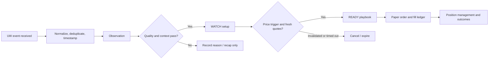

# Alert Email Accuracy and Unusual Whales Playbook Audit

**Date:** September 18, 2026, America/Los_Angeles. Production reads occurred on September 19 UTC, while it was still September 18 in New York and California.  
**Scope:** AI Signal Alert, options plans embedded in those emails, Options Expiry Watch, Unusual Options Activity, Dark Pool Activity, and Flow Digest.  
**Source:** local `f92584c`; production checkout `2a185378`.  
**Method:** source inspection, actual template rendering with a local capture stub, read-only production queries with eight-second statement timeouts, runtime source comparisons, and official UW/OCC/FINRA documentation. No messages, trades, configuration changes, deployments, or production writes were made. `CLAUDE.md` and earlier audits were not modified.

This supplements [today's UW data strategy audit](2026-09-18-unusual-whales-data-strategy-audit.md). It does not re-certify every previous broker or portfolio finding. The findings below distinguish observed defects, measurement limitations, and proposed experiments.

## 1. Assessment and recommended direction

The alerts provide useful observations, but their current presentation and evaluation do **not establish profitable option-trading accuracy**. Some emails also contain reproducible factual errors.

The highest-value changes are:

1. Correct dark-pool prices/share counts, stale-plan handling, misleading accuracy labels, and delivery-state handling.
2. Separate an **observed event**, a **qualified setup**, and an **actionable trade plan**. A large sweep alone should not imply an entry.
3. Preserve UW event identity, timestamps, side ambiguity, and multi-leg/opening information before adding more scoring.
4. Combine quality-filtered flow with price confirmation, market/sector context, current option quotes, and defined-risk instrument selection.
5. Measure the exact emitted playbook and its executable paper P&L, including costs, missed fills, and expiry/assignment behavior.

My preferred first experiment is **fresh directional flow plus a pullback/reclaim or breakout/retest**, using stocks and liquid debit spreads as separately measured instruments. Add bearish equivalents. Keep dark-pool prints and estimated GEX as context until their incremental value is demonstrated. Start in shadow/paper mode.

A higher win rate alone is insufficient. For example, a strategy winning 80% of trades at $25 and losing 20% at $150 has expected gross P&L of **−$10 per trade**. Track average win/loss, net expectancy, drawdown, capital usage, and fill rate together. These recommendations are hypotheses to validate, not promises of returns.

## 2. Which emails actually exist

“Option Alert” currently spans multiple mechanisms; they should not share one accuracy claim.

| Email/component | Actual mechanism | What its present evidence can establish |
|---|---|---|
| AI Signal Alert / SELL Alert / Signal Weakening | Stored signal transitions, conviction gates, and a Decision Engine check on BUY; stock game plan included | Signal-state changes and rule confluence; not calibrated trade success |
| Options Game Plan inside a BUY email | Latest saved `OptionsGamePlanSnapshot`; protective put, covered call, IV context | Historical candidate contracts/marks; no current executable-plan guarantee |
| Options Expiry Watch | Near-expiry OI concentration, with optional nearby UW GEX corroboration | An expiry/positioning watch; dealer direction is not established by OI concentration |
| Unusual Options Activity | UW flow alerts, sweep filter, premium ≥$250,000, volume/OI ≥3, maximum DTE 45 | Qualifying provider events plus an inferred directional interpretation |
| Dark Pool Activity | Largest qualifying recent off-exchange print per symbol per cycle; absolute/relative size filters | A reported block and quote-location side estimate |
| Flow Digest | Persisted dark-pool and flow **candidate outcome rows**, with family-level historical rates | A candidate recap; it is not a complete ledger of delivered emails or executions |

Entry points: [email templates](../../services/market-data/src/services/email_service.py), functions at lines 112, 1640, 1755, and 1868; [scheduler](../../services/market-data/src/services/scheduler.py), functions at lines 4363, 4779, 5214, 6781, and 11981.

Useful safeguards already present include flow expiry filtering, capped email sizes, cooldowns, dark-pool print-age filtering, persistence of dark-pool execution/live prices, frozen first-actionable AI signals, and direction-aware outcome scoring. These are meaningful improvements. They do not resolve the specific gaps below.

## 3. Confirmed findings and solutions

### E01 — Dark-pool instant email uses the wrong execution price; digest derives the wrong size — P1

**Evidence:** `check_dark_pool_alerts()` constructs `price = live_price or execution_price`, while also supplying the correct separate `exec_price`. `send_dark_pool_alert_email()` reads `price`, not `exec_price`, for “shares @ price” and the comparison with live. With a live quote, both prices become identical.

The digest uses `exec_price` for its execution-price column, but `_shares()` still divides premium by `alert_price`, which can be the live price. Its fallback to legacy `alert_price` also cannot establish a historical execution price when the original live quote existed.

**Actual source-rendering reproduction**, with synthetic execution $100, live $105, size 10,000, premium $1,000,000:

```text
Instant email: 10,000 shares @ $105.00 = $1,000,000 ... +0.00% vs live
Flow digest:  Exec $100.00, live $105.00, -4.76%, 9,524 shares
Correct:      10,000 shares @ $100.00; -4.76% versus the later $105 quote
```

Recent production rows contained **121 cases with execution/live prices differing by more than one cent**. This establishes that the problematic input condition occurs; it does not prove 121 erroneous emails were delivered.

**Solution:** render `exec_price`; persist exact original `size`, event ID, execution timestamp, and live-quote timestamp on the event. Derive size only from the same print's premium/execution price, label rounding, and leave unknown legacy values unknown. The cached live quote is sampled when the job processes the print, not necessarily when the block executed; label both times.

**Acceptance:** reproduce the example correctly in HTML and text; cover missing live quote, missing execution price, and legacy rows. Source: scheduler lines 5318–5389 and 12130–12179; email service lines 1892–1946.

### E02 — A BUY email can attach an old options plan without checking eligibility — P1

**Evidence:** `get_latest_options_game_plan()` selects the latest snapshot of any date. The email caller does not check quote age, snapshot age, or contract expiry. The template calls the marks “real, currently-listed contract prices.” Its text-only version omits the as-of footer entirely.

Production latest-snapshot coverage:

| Latest snapshot date | Symbols |
|---|---:|
| September 18 | 38 |
| September 14 | 4 |
| September 11 | 3 |
| September 10 | 1 |
| September 9 | 1 |
| September 8 | 2 |
| September 4 | 15 |

Thus **26/64 latest snapshots predate September 18**. A separate expiry check found **zero** latest snapshots with a leg already expired before September 18. The confirmed problem is missing freshness enforcement and old marks, not evidence that expired contracts were sent.

**Solution:** separate a dated research plan from a current actionable plan. Check the underlying timestamp, individual leg quote timestamps, bid/ask validity, expiry/session status, corporate-action deliverables, and liquidity. If current quotes are unavailable, show “historical reference; refresh required” without an actionable price. A batch `as_of` date cannot replace a quote timestamp. Put identical provenance in text and HTML.

A protective put presupposes stock exposure; a covered call requires the corresponding deliverable shares and sufficient available coverage. Without holdings context, call them conditional strategy illustrations. Do not silently turn either into a recommendation for a user with no stock position.

**Acceptance:** stale snapshot and expired-leg fixtures cannot become READY plans; ownership/coverage checks precede order preparation. Source: [snapshot getter](../../services/market-data/src/services/options_game_plan_snapshot.py), line 353; scheduler lines 7206–7243; email service lines 479–551.

### E03 — Options “historical win rate” is not option P&L and is dominated by older observations — P1

**Evidence:** `_build_options_flow_alert_calibration()` aggregates all available `is_correct_10d` outcomes by bullish/bearish direction. It requires 30 resolved rows and five fired dates, but has no version/cohort cutoff. The email omits the ten-day horizon, 0.5% hurdle, next-session close entry, calendar-day convention, and the fact that it scores the **underlying stock**.

At this audit snapshot:

| Display-calibration bucket | Resolved 10-day rows | Historical directional hit rate | Rows before September 5 | Distinct fired dates |
|---|---:|---:|---:|---:|
| Bullish | 733 | 56.2% | 715 | 6 |
| Bearish | 819 | 46.0% | 796 | 6 |

Approximately **97–98%** of those resolved rows predate September 5. The six-date floor passes despite substantial clustering. These are the values the current calibration builder can supply, not a reconstruction of every email already sent.

**Solution:** label the existing statistic precisely: “Underlying directional hit rate, +10 calendar-day target after next-session close entry, >0.5% favorable move; n contracts, n sessions; version/date range.” Prefer suppressing the promotional percentage until a relevant, versioned cohort is adequate. Separately track real option returns and playbook success. Store the exact displayed calibration snapshot with each alert.

**Acceptance:** no generic “win rate” appears without instrument, entry convention, horizon, costs/hurdle, sample span, and strategy version. Source: scheduler lines 4746–4776 and 6091–6180; email service lines 1805–1820.

### E04 — US flow alerts can run during HK hours; “right now” can describe an old event — P1

**Evidence:** the options-flow job returns only when **both US and HK markets are closed**, despite a US-only universe. `get_flow_alerts()` uses a 48-hour lookback and 150-second cache. Although the adapter retains `created_at`, the email candidate discards it. The template says “detected right now.”

Of 247 candidate rows dated September 5 onward, **97 were recorded outside 09:30–16:15 New York time**. This is a broad screening interval, not a product-specific exchange calendar. The issue persists in the newest dates: September 15: 1/9; September 16: 3/20; September 17: 8/32; September 18: **16/49**. These are candidate creation times, not provider execution times or verified send times.

US-only alert recorders also use `date.today()` in a UTC environment. The earlier audit's trading-date concern remains applicable. Dark-pool polling has a 15-minute cache and a 90-minute print-age ceiling; those settings do not justify a sub-minute promise.

**Solution:** gate new entry alerts against the actual US product/session calendar, including early closes and product-specific 16:00/16:15 endpoints. Keep explicitly labelled after-hours recaps separate. Preserve `executed_at`, provider-created time, first-seen time, evaluated time, and sent time; enforce an event-age budget after cache retrieval. Use New York session IDs for grouping and UTC timestamps for ordering. Retain the 48-hour window only for reconciliation/backfill, not live-entry eligibility.

**Acceptance:** a US alert cannot become READY merely because HK is open; delayed/replayed events never say “right now.” Test UTC midnight, holidays, early closes, and delayed provider reports. Source: scheduler lines 4831–4849, 4691–4723, 5147 onward; UW adapter lines 1174–1290 and 1459.

### E05 — Quote-side information is interpreted too confidently — P1 for trade selection

**Evidence:** `ask >= bid` becomes ask-side dominance; ties and near-ties receive a firm direction. Missing side premium becomes zero, unless both sides are zero. The normalized `FlowAlert` omits event ID, multi-leg/opening fields, and much of the ambiguity information. Contract-keyed candidates overwrite earlier candidates for the same contract without an explicit event-time selection rule.

UW defines ask-side premium by executions **closer to ask than bid**, not exclusively executions at the ask. Its documented stream schema also exposes event identity, timing, multi-leg indicators, opening classification, trade IDs, side volumes, IV changes, and Greeks. A false `all_opening_trades` value means unknown opening/closing status, not proof of closing. Verify actual REST field availability before relying on streaming schema fields in the current REST adapter. [UW FlowAlert schema](https://api.unusualwhales.com/docs/kafka/types/FlowAlert).

**Solution:** retain ambiguous/unknown states, side-coverage fraction, and dominance magnitude. Say “ask-side dominated; bullish interpretation” rather than presenting intent as measured fact. Separate raw observations from inference. De-duplicate related trade IDs before aggregating overlapping provider alerts; select/aggregate same-contract events explicitly by timestamp and rule. Classify likely opening single-leg activity separately from spreads, rolls, hedges, and ambiguous flow.

Dark-pool BUY/SELL is likewise an **inferred aggressor-side classification**, not verified institutional intent or actual buyer identity. Agreement with another NBBO-based classifier is not ground-truth accuracy. Also distinguish verified ATS prints from broader off-exchange reporting when venue metadata permits; “off-exchange” does not alone identify an institutional dark-pool buyer. [FINRA trading-venue explanation](https://www.finra.org/investors/insights/where-do-stocks-trade).

**Clarification to the earlier UW audit:** references to “measured direction” should be read as measured quote-side inputs plus inferred interpretation. The distinction matters before turning observations into trades.

### E06 — AI email still presents a conviction score as percentage confidence — P1

**Evidence:** the generator computes `confidence = abs(fused - 0.5) * 200`. This is distance from a neutral fused score, not observed trade-win probability. The generator's own comment warns against interpreting it as accuracy, but the email subject/body still say “% conf” and “Confidence …%.” The fused bullish probability also needs cohort-specific calibration before it can represent a validated probability.

**Solution:** render “Signal strength: 0–100,” “Fused bullish score,” and, only when independently supported, “Calibrated probability of [precisely defined outcome].” Treat TA/ML contribution and data quality separately. Do not increase size just because the score is further from 50. Validate any confidence threshold against current versioned outcomes.

**Acceptance:** a score of 80 never appears as an 80% chance of profit. Calibration evaluation reports reliability, Brier score, cohort/date coverage, and out-of-sample performance. Source: [signal generator](../../services/signal-engine/src/generators/signals.py), line 2729; email service lines 561–574 and 626.

### E07 — AI email's 90-day accuracy badge mixes horizons and directions — P1

**Evidence:** the scheduler requests `/signals/outcomes/summary?days=90` without a horizon filter, reads `by_symbol`, accepts as few as three outcomes, and attaches that number to a specific horizon's email. The summary groups a symbol's outcomes across directions and primary holding windows. A SWING BUY therefore need not be represented by the displayed sample. None of this identifies the subset that passed the email's conviction and DE gates.

**Solution:** measure the exact alert population and label market, horizon, direction, rule/model version, entry convention, and resolved dates. Suppress a rate based on three correlated rows. Use a minimum effective sample and confidence interval, not a count-only badge. Until an immutable emitted-alert history exists, label model-wide statistics as such.

Source: scheduler lines 6990–7004 and 7260; [summary endpoint](../../services/signal-engine/src/api/analytics.py), lines 1378 onward and 1670 onward.

### E08 — AI freshness and Decision Engine checks can fail open without showing degraded status — P1

**Evidence:** after excluding stale symbols, `if not fresh_symbols and symbols` allows all symbols again. Thus “all bars stale” and “no prices found” are treated alike. Database exceptions also allow all symbols. The coarse four-calendar-day bar gate does not verify the age of the stored signal or proposed entry quote.

The BUY path admits DE `HOLD` as well as `BUY`; a non-200 response or request exception also permits the email. The message does not disclose the DE verdict/status. This audit is about alert eligibility; it does not establish that this path submits orders.

**Solution:** represent `fresh`, `stale`, `missing`, and `unavailable` explicitly. Require complete fresh evidence for READY entry plans. DE `HOLD` should produce a watch/setup state; an unavailable DE should produce a degraded informational state. Preserve separately labelled position-risk warnings so a data outage does not suppress risk communication.

**Acceptance:** all-stale inputs cannot become a fresh BUY plan; a DE timeout is visible and cannot create executable approval. Source: scheduler lines 6880–6916 and 7164–7199.

### E09 — Failed emails can be consumed by cooldown/seen state — P1

**Evidence:** options-flow and dark-pool cooldown keys are acquired **before** sending and are not released on failure. For options flow: the first send fails; the next cycle is blocked by cooldown; `send_ok` remains true because no send was attempted; the resync then marks the current contracts seen. This can consume the retry without delivering it. Dark-pool failure can remain suppressed until cooldown/age conditions expire.

Signal alerts do persist their last successful send, but this is still mutable state, not a full delivery history. Provider acceptance, inbox delivery, and user action are distinct outcomes.

**Solution:** use a transactional outbox with a stable logical delivery ID and explicit `pending → attempted → accepted → delivered/failed` states where provider events are available. Reserve, then finalize dedup/cooldown after successful acceptance; release/retry failures. Handle an ambiguous timeout without assuming either success or failure. Preserve suppression reasons separately. Do not promise exactly-once external email delivery without provider support.

**Acceptance:** forced SMTP/provider failure retries without losing the event; crash-after-send scenarios are reconciled; capped/suppressed candidates are not marked delivered. Source: scheduler lines 4940–4989 and 5360–5404.

### E10 — Cooldown order can choose a smaller flow before the “largest premium” ranking — P2

**Evidence:** `newly_seen` is sorted by contract string. The first contract for a symbol/direction claims that pair's cooldown. Larger-premium contracts in the same pair are rejected before the remaining candidates are ranked by premium. Thus the later ranking cannot guarantee that the most relevant or largest event was selected.

**Solution:** form a symbol/direction episode, de-duplicate constituent trades, rank/aggregate the episode, select its representative contract, then reserve delivery state. Preserve material updates and reversals without spamming repeated copies. Keep raw premium separate from a normalized quality score.

**Acceptance:** a later-sorting $5 million event is not displaced by an earlier-sorting $250,000 event solely due to contract text. Source: scheduler lines 4933–4970.

### E11 — Recipient selection does not match the “your watched symbols” description — P2

**Evidence:** flow/dark-pool recipients are users with any untriggered `PriceAlert`. Candidate symbols are the globally bounded watched/top-ranked universe, and the candidate set is not intersected with each recipient's symbols. The dark-pool email says “your watched symbols.” The digest separately selects all users with an email address rather than consulting an explicit flow-digest subscription in that function.

**Solution:** create explicit per-family preferences: own watchlist, portfolio, or market-wide discovery; US/HK scope; cadence; severity; quiet hours; timezone; and opt-out. Share ingestion globally, then filter delivery per recipient. If market-wide discovery is intentional, label it that way.

**Acceptance:** one user's watchlist does not silently determine another user's personalised email scope. Source: scheduler lines 2286 onward, 4854–4868, 5260–5279, and 12036–12056.

### E12 — Signal explanations contain smaller but actionable inconsistencies — P2

**Evidence:** actual rendering of `None → BUY` produces “unchanged” because the direction map lacks that transition. The market-regime template recognizes only `bull`/`bear`; valid `neutral`, `choppy`, and `risk_off` values become “Unknown.” It hardcodes an S&P explanation even though signal subscriptions include HK. Missing booleans can render as “No.” The stock plan lists Entry 1 50%, Entry 2 50%, and Breakout 50% without making their mutual exclusivity explicit.

**Solution:** use complete typed transition/regime vocabularies and market-specific benchmark metadata. Render missing measurements as unknown. Describe the stock plan as two alternative entry routes, with one common position-risk budget and explicit cancellation rules, rather than three apparently additive 50% allocations. This is a presentation/plan-specification issue, not evidence the engine placed a 150% order.

**Acceptance:** initial BUY says “initial BUY”; risk-off remains risk-off; a HK regime does not automatically refer to S&P; all entry branches respect one budget. Source: email service lines 124–135, 155–156, 237–241, and 400–466.

### E13 — Outcome records cannot establish emitted-email or executable-playbook accuracy — P1 measurement gap

**Evidence:** flow candidates are recorded before recipient filtering/capping/delivery, once per contract/date. Dark-pool outcomes are once per symbol/date, even though different prints can generate later emails. These keys cannot preserve every intraday event, opposing thesis, displayed quote, or playbook revision. Daily underlying-close outcomes do not model the option contract's entry, exits, spread, theta, volatility changes, or actual trigger.

The digest calls both families' statistics “next-day hit rate,” although dark-pool success means an absolute underlying move exceeding 2% in either direction, while flow success means a directionally favorable move exceeding 0.5%. Moreover, a one-day window starts after the next-session entry close; it is not simply the next day after the alert.

**Solution:** add immutable event → setup → playbook → delivery → order/fill → outcome relationships. Keep present daily studies as research outcomes with explicit definitions. Give dark-pool statistics their actual name: “frequency of >2% absolute endpoint movement,” not trade-win accuracy. Evaluate positions from fresh executable quotes and preserve unfilled/expired/no-trade outcomes.

Source: [models](../../shared/db/models.py), lines 1449 and 2505; scheduler lines 4691, 5147, 6091, 6202, 11959, and 12070.

### E14 — Options Expiry Watch mixes a cautious watch with a directional win statistic — P2

The email correctly says OI concentration does not determine the unwind direction. However, its calibration uses directional underlying outcomes: calls-dominant as bullish and puts-dominant as bearish. “Historical win rate” therefore needs that hypothesis stated explicitly. Nearby UW GEX is called “corroboration,” but proximity is not an independent validation that price will move in the desired direction.

The candidate's option chain/OI still comes from `yfinance.Ticker(...).option_chain(...)`; UW GEX is an enrichment, not the underlying selector. Its ten-day calibration buckets require 30 rows but, unlike the flow calibration, have no distinct-date floor. Label the mixed provenance and add session-diversity/version checks. Migrating the OI source to UW should be a separately measured change, not assumed to improve prediction automatically.

**Solution:** measure separate expiry hypotheses: pin/mean reversion, breakout/continuation, and magnitude of movement, each with a price trigger and suitable horizon. Show estimated gamma context and timestamp, not verified dealer inventory. A near-expiry watch should not use an unexplained ten-day outcome as evidence that a same-day option trade would win. Exclude 0DTE from the first automated playbook until the data, fill, and exit infrastructure can support it.

Source: email service lines 1640–1752; scheduler `check_gamma_unwind_alerts()` at 4363 and squeeze outcome evaluator around 5897–5965.

## 4. Accuracy measured from current production

### 4.1 AI signal outcomes after September 3

These are **existing evaluated signal-outcome rows**, with `signal_date >= 2026-09-03`; all counted rows have a frozen first-actionable signal. This cutoff identifies a recent cohort around the freeze-related work, not an experimentally isolated treatment group or exact deployment boundary.

“5-day” below means entry at the next available session's close, then a **five-calendar-day target**, using the evaluator's permitted daily-bar lookup. A hit requires a favorable underlying move exceeding 0.5%. Mean directional return negates raw stock return for SELL; it is gross price movement, not net stock execution P&L or option P&L.

| Market | Style | Direction | Resolved 5d rows | Distinct signal dates | Symbols | Hit rate | Mean directional return |
|---|---|---|---:|---:|---:|---:|---:|
| US | SHORT | BUY | 291 | 6 | 90 | 24.7% | −2.62% |
| US | SHORT | SELL | 103 | 6 | 47 | 61.2% | +0.48% |
| US | SWING | BUY | 49 | 1 | 49 | 36.7% | −0.23% |
| US | SWING | SELL | 87 | 6 | 43 | 63.2% | +0.86% |
| US | LONG | SELL | 73 | 3 | 41 | 65.8% | +1.36% |
| US | GROWTH | BUY | 55 | 1 | 55 | 30.9% | −0.68% |
| US | GROWTH | SELL | 51 | 6 | 28 | 60.8% | +1.23% |
| HK | SHORT | BUY | 87 | 7 | 22 | 26.4% | −4.45% |
| HK | SWING | BUY | 4 | 1 | 4 | 0.0% | −4.63% |
| HK | SWING | SELL | 50 | 7 | 15 | 68.0% | +1.88% |
| HK | LONG | SELL | 43 | 4 | 19 | 62.8% | +1.89% |
| HK | GROWTH | BUY | 8 | 1 | 8 | 0.0% | −3.73% |
| HK | GROWTH | SELL | 45 | 7 | 16 | 57.8% | +1.58% |

**Interpretation:** recent BUY outcomes are weak in the evaluated sample. This warrants testing entry timing and market-context filters, but it does not prove the narrower emailed BUY subset has these exact rates. Likewise, stronger SELL rows do not prove profitable put purchases or an edge over a matched bearish benchmark.

**Maturity limitation remains material:** outcome creation waits for the style's primary holding window before filling the additional windows. BUY primary targets are 7/14/28/14 calendar days for SHORT/SWING/LONG/GROWTH; SELL uses 5/7/10/7. Consequently, recent SWING/GROWTH BUY five-day figures here represent just one signal date, and LONG BUY is absent. Production had **780 US and 181 HK frozen LONG BUY signal rows since September 3, with zero corresponding outcome rows**.

**Required correction:** create pending outcome records when the immutable signal event is captured; mature each horizon independently. Report all eligible/matured/pending/missing cohorts. Do not interpret missing LONG outcomes as zero wins or compare unequal maturity populations as if they were the same experiment.

### 4.2 Recent UW unusual-options candidates

Descriptive cohort: `fired_date >= 2026-09-05`. This is a recent window, not proof every row used the latest fixes.

| Direction | Candidates | Resolved 1d / hit rate | Resolved 5d / hit rate | Mature 5d entry dates / symbols | Mean directional 5d move | Resolved 10d / hit rate |
|---|---:|---|---|---|---:|---|
| Bullish | 131 | 85 / 34.1% | 59 / 3.4% | 4 / 10 | −5.71% | 18 / 88.9% |
| Bearish | 116 | 81 / 30.9% | 51 / 94.1% | 4 / 10 | +4.89% | 23 / 4.3% |

The five- and ten-day columns contain **different matured subsets**. Their opposite results do not establish that the same trades reliably reverse after five days. There are only four matured entry dates behind the five-day result. Multiple contracts can share exactly the same underlying return path.

This is insufficient evidence to buy every bearish option alert, invert bullish alerts, or advertise a 94% option win rate. Recompute matched cohorts by entry session, underlying, event episode, and version, and compare with same-date market/sector baselines before claiming incremental prediction skill.

### 4.3 Dark-pool candidates

For rows dated September 5 onward:

| Stored side estimate | Candidates | Resolved 1d | Frequency of >2% absolute endpoint move | Resolved 5d |
|---|---:|---:|---:|---:|
| Buy | 95 | 54 | 27.8% | 0 |
| Sell | 97 | 64 | 37.5% | 1 |
| Unknown/legacy | 260 | 249 | 44.2% | 227 |

This measures endpoint movement in either direction, not whether the side estimate was correct, whether price touched 2% intraday, or whether an option made money. The newer side-labelled cohorts have essentially no five-day evidence. Compare them with matched ordinary prints and no-print controls before assigning directional weight.

### 4.4 Options Expiry Watch

The separate expiry-watch outcome table also has recent observations, dated September 5 onward:

| OI-dominant watch | Candidates | Resolved 5d / directional hit rate | Mature 5d fired dates | Resolved 10d / directional hit rate | Mature 10d fired dates |
|---|---:|---|---:|---|---:|
| Calls | 29 | 13 / 15.4% | 5 | 7 / 57.1% | 3 |
| Puts | 38 | 25 / 32.0% | 5 | 11 / 27.3% | 3 |

These underlying-direction outcomes use the evaluator's calls-up/puts-down hypothesis and 0.5% hurdle. They are not option returns or a test of pinning. They pool the recent OI-concentration bands for this diagnostic table, whereas the email calibration selects an all-history band. Samples are too small to establish a dependable expiry strategy, and the five-/ten-day subsets are different. A timestamped intraday scenario evaluator is needed for an expiry-day playbook.

### 4.5 What this audit cannot certify

No recipient inbox or supplied `.eml` message was inspected. Template correctness was tested by capturing actual renderer output locally. Production queries verified candidate/outcome data and mutable last-send timestamps, not inbox delivery or user execution.

The reviewed paths do not provide an immutable ledger sufficient to reconstruct all emitted email recommendations and their displayed state. Therefore **exact AI-email accuracy, exact option-email accuracy, and net returns from following those emails remain unestablished**. This is a measurement gap, not a claim they are zero.

## 5. Mechanism for better UW option alerts

### 5.1 Use three clear message classes

| Class | Meaning | Necessary information |
|---|---|---|
| Observation | A qualifying event was reported | Actual event time, first-seen time, contract/print, measured fields, uncertainty |
| Setup / WATCH | The event supports a testable hypothesis | Direction/horizon, regime, levels, trigger, invalidation, missing evidence |
| READY playbook | Current entry/risk requirements pass | Fresh quotes, valid legs, entry limit, risk budget, trigger state, exits, expiry and data validity |

After READY, distinguish paper/broker order states from alert states. A notification is not a fill. Use a lifecycle such as:



Email should be a readable summary and durable record. Use the authenticated app/stream for fast state changes; revalidate before any order because email arrival can lag. A clicked old email must display current state and whether the original setup has expired.

### 5.2 Ingest once, preserve evidence, then derive features

Extend `unusual_whales.py` and dedicated alert services rather than adding another large block to the scheduler. Retain raw events and normalized schema versions. Preserve provider IDs, source timestamps, ingestion timestamps, contract identity, observed side/ambiguity, trade-condition and correction information, and provenance for each enrichment.

The official streaming catalogue exposes flow, option trades, option state/quotes, Greek flow, GEX, and trade-cancel topics. This establishes available product capabilities, **not this subscription's entitlement or latency guarantee**. Confirm access and terms before depending on a stream. A bounded REST poller with a cursor/overlap window and deduplication is a valid first implementation. [UW streaming overview](https://api.unusualwhales.com/docs/kafka).

For replay/corrections, use source identifiers and conditions, not just `(symbol, timestamp)`. Keep execution time distinct from reporting/receipt time. UW's report schema supplies identifiers and condition metadata useful for this design. [UW TradeReport schema](https://api.unusualwhales.com/docs/kafka/types/TradeReport).

Proposed features to test independently:

| Feature | Purpose | Important constraint |
|---|---|---|
| Signed premium imbalance and known-side coverage | Distinguish decisive from mixed flow | Unknown premium must not become a sell or buy vote |
| Unique trade/episode persistence | Detect repeat participation | Overlapping alerts on the same trades are not independent confirmation |
| Flow percentile vs symbol/time-of-day baseline | Avoid rewarding large caps merely for size | Baseline must use only history available at decision time |
| Delta-weighted directional exposure | Compare economic scale across strikes | Use signed option delta plus inferred trade side; do not equate premium with exposure |
| Vega/IV change, term structure and skew | Separate directional and volatility hypotheses | Buying an expensive option can lose despite a correct stock direction |
| Price response, VWAP/level reclaim, relative strength | Test whether price accepts the flow thesis | A setup becomes tradable only after a timestamped trigger |
| Market/sector context and liquidity | Reduce unsuitable regime and execution exposure | Do not double-count correlated AI/K-Score/TA inputs as independent votes |
| Repeated off-exchange price/size clusters | Generate potential support/resistance zones | Prints alone do not prove accumulation; require subsequent price confirmation |

UW documents option-trade Greeks/side-related fields and aggregate Greek flow, which can support exposure features after field units and sign conventions are validated. [OptionTrade](https://api.unusualwhales.com/docs/kafka/types/OptionTrade), [GreekFlow](https://api.unusualwhales.com/docs/kafka/types/GreekFlow).

Next-day OI change can corroborate a later setup, but cannot be used to validate yesterday's intraday entry without look-ahead. Provider histories first fetched after the event must not be treated as contemporaneously available features.

### 5.3 Candidate eligibility before scoring

Start with transparent rules and an explicit unknown state. The following are **experimental starting points**, not optimized production thresholds:

| Check | Initial experiment |
|---|---|
| Event freshness | For an intraday READY setup, require event age ≤3 minutes; retain older events as context. Measure attainable latency first. |
| Side clarity | Require ≥70% dominance among known-side premium and ≥80% coverage of total premium; otherwise mixed/unknown. Validate denominators from provider semantics. |
| Structural clarity | Prioritize likely opening, single-leg episodes; segregate multi-leg/roll/hedge ambiguity. Missing fields cannot silently pass. |
| DTE | Begin with liquid 14–45 DTE directional candidates; test holding periods separately; exclude 0DTE initially. |
| Option liquidity | Positive non-crossed bid/ask, sufficient size for proposed quantity, and a configurable spread ceiling; trial both ≤$0.10 and ≤10% of mid, then tune by product. |
| Quotes | Use timestamped current NBBO/executable broker quotes for every leg; initial target quote age ≤15 seconds where available. If the provider cannot support that, keep WATCH status. |
| Event risk | Separate scheduled earnings/dividend/corporate-action playbooks; do not mix them with ordinary continuation evidence. |
| Underlying confirmation | One explicit price/volume trigger, no excessive extension from the entry level, and enough room to invalidation/target. |
| Portfolio fit | Shared risk budget across correlated underlyings, contracts, and stock/option exposure; no averaging down outside the tested rules. |

Each failure should explain why the alert stayed WATCH or became NO TRADE. Measure how many opportunities each filter rejects and its incremental effect on net P&L; otherwise strict-looking filters can merely shrink the sample without improving decisions.

### 5.4 Playbooks worth implementing

| Playbook | Setup and trigger | Instrument choice to test | Invalidation / exit | Priority |
|---|---|---|---|---|
| Bullish pullback/reclaim | Fresh, credible bullish episode; market/sector supportive; pullback holds a predefined support/VWAP zone, then reclaims with volume | Stock versus liquid call debit spread, tested separately | Break of setup low; no trigger by deadline; fixed time exit | First |
| Bearish breakdown/retest | Credible bearish episode; weak relative strength; support breaks and retest fails | Put debit spread versus separately costed stock-short benchmark | Reclaim of failed level; bullish reversal; time exit | First |
| Breakout continuation | Persistent independent episodes; compression/level break, then retest holds; no chase beyond entry band | Stock, long option, or debit spread selected from net scenario economics | Failed breakout; deteriorating flow/price; time stop | Second |
| Range/income setup | Range thesis, elevated IV relative to forecast realized risk, no unmanaged catalyst | Defined-risk credit spread; CSP only with cash/allocation intent; CC only against verified shares | Range violation; risk/assignment limits; planned exit before expiry | Later, after option ledger |
| Dark-pool zone reclaim/reject | Multiple distinct prints create a historical zone; subsequent lit price/volume confirms acceptance or rejection | Stock first; option overlay only if liquidity/risk pass | Zone failure; stale zone; invalidated catalyst | Shadow study first |
| Expiry/GEX scenario watch | Estimated gamma/strike context plus an independently observed price trigger | Initially observation only; later a separately validated expiry strategy | Gamma/price context changes; freshness/session cutoff | Last for automation |

Do not copy the whale's exact contract automatically. Its trade may be a hedge, and the original price may no longer be available. Select a contract or spread for **our** forecast horizon, liquidity, downside, and current price.

Option profitability depends on more than direction: time and volatility affect value. Model them explicitly rather than translating stock hit rate into option-win probability. [OCC/OIC option pricing](https://prd-web.optionseducation.org/optionsoverview/options-pricing), [OCC/OIC theta](https://www.optionseducation.org/advancedconcepts/theta).

For instrument selection, compare conservative net P&L across price/time/IV scenarios, including no move and adverse move. Reject a trade if its estimated advantage disappears under modest spread/slippage stress. IV Rank alone does not prove options are economically cheap or expensive relative to future realized movement; delta is not a validated physical probability of profit.

### 5.5 Make the playbook executable and reviewable

Persist a versioned plan containing:

- Setup/event IDs, creation time, source/quote timestamps, strategy/model/data versions, and valid-until time.
- Measured facts, inferred thesis, uncertainty, current market/sector state, and all gate results.
- Underlying trigger, allowable entry range, mutually exclusive entry branches, and invalidation level.
- Exact OCC contracts, side/quantity/multiplier/deliverable, bid/ask/size, expiry, Greeks/IV units, and strategy type.
- Net debit/credit limit, conservative fill assumptions, maximum contractual loss/gain, break-even, commissions, and risk budget.
- Profit-taking rule, underlying invalidation, option risk/time exit, no-fill timeout, and expiry/assignment handling.
- Current lifecycle state and a link to a live status page; later revisions cannot overwrite the original evidence.

Use one structured payload for app, text email, HTML email, paper engine, and evaluator. The LLM can explain this validated object. It should not invent strikes, quotes, probabilities, or risk limits.

**Synthetic email example—not an actual recommendation or market quote:**

```text
WATCH → READY | TEST bullish reclaim | Playbook UW-PULLBACK-v1
Observed 10:02:10 ET; received 10:02:12; evaluated 10:03:00.
Option quotes 10:02:58. Plan expires 10:08 or on invalidation.

Evidence: bullish interpreted flow; 82% known-side ask dominance;
91% side coverage; provider multi-leg flag explicitly false.
Price reclaimed $100.00; entry allowed only while underlying is $100.00–100.30.
No confirmed option-profit probability yet. Paper experiment only.

Illustrative same-expiry 100/105 call debit spread, 28 DTE:
Buy 100C: bid 3.00 / ask 3.10; sell 105C: bid 1.10 / ask 1.20.
Natural debit $2.00; midpoint $1.90 is not an assumed fill.
Maximum debit limit $2.00, one standard 100-share spread.
Contractual max loss $200; max gain $300; expiry break-even $102.00,
all before fees and assuming both legs remain correctly paired.

Cancel unfilled order after 2 minutes or on loss of the $100 reclaim.
After fill: request close on underlying break below $99.00;
profit-taking limit at spread value $3.00; time exit after 3 sessions.
These exits are instructions, not guaranteed fills or a guaranteed $100 loss cap.
Close before the strategy's expiry cutoff; monitor assignment of either leg.
```

For the standard debit spread, maximum payoff calculations and expiration/assignment caveats follow the contractual structure; these figures do not predict the chance of reaching the target. Operationally broken or assigned legs require reconciliation. [OCC/OIC bull call spread](https://www.optionseducation.org/strategies/all-strategies/bull-call-spread-debit-call-spread).

## 6. Validation that can establish whether UW adds value

### 6.1 Maintain separate scorecards

| Scorecard | Question | Metrics |
|---|---|---|
| Data correctness | Was the event/quote represented correctly? | Schema/units, missingness, correction handling, duplication, execution/report/ingestion age |
| Delivery | Did the intended user receive the intended version promptly? | Outbox status, provider acceptance/delivery, p50/p95 latency, retries, suppression reasons |
| Forecast | Did the stated hypothesis happen within its horizon? | Direction/magnitude/trigger outcomes, calibration, date-clustered uncertainty, benchmark excess |
| Paper execution | Could the plan realistically fill and be managed? | Fill/reject rate, spread/slippage, stale-quote blocks, partial-leg/assignment handling |
| Portfolio result | Did it improve returns for the risk/capital used? | Net expectancy, profit factor, drawdown, tail loss, turnover, exposure, return on allocated capital |

Define both “win after actual fees” and “exceeds strategy hurdle” explicitly; do not silently switch between them. A 0.5% underlying hurdle is not a measured option cost model.

### 6.2 Run controlled, chronological comparisons

Freeze a liquid US evaluation universe and compare:

1. Existing AI/TA rules alone.
2. Quality-filtered UW flow alone.
3. AI/TA plus UW confirmation.
4. The same rules plus market/sector context.
5. The same rules plus dark-pool/GEX context, added separately.

Use identical as-of data, candidate opportunities, costs, capital/risk limits, and entry/exit conventions. Report both per-opportunity and portfolio results, including cash when filters abstain. A filtered arm cannot claim superiority only by omitting its no-trade periods. Compare with matched same-date market/sector and simple price-trigger baselines.

Split chronologically and purge/embargo overlapping holding windows. Keep every symbol/day/flow episode together across folds where leakage would otherwise occur. Cluster uncertainty by trading date and underlying episode; dozens of contracts on one stock-day are not dozens of independent bets. Tune rules on training data, select on validation data, and report an untouched forward test with all attempted variants logged.

When contrasting pre/post fixes, record exact deployment and rule versions. Compare matched populations and similar regimes; do not attribute a market-wide decline to the alert changes. Unknown historical ingestion time should disqualify a feature from a claimed point-in-time backtest.

### 6.3 Record option outcomes that match the plan

Capture the quote at first eligible action time, not the earlier whale fill. Buy at available ask/sell at available bid as a conservative baseline; model complex-order improvement only when supported by evidence. Record size/depth limits and unfilled orders. For exit marking use the executable liquidation side and fees, not automatically midpoint or an archived bid.

Store fixed-time returns, trigger/stop/target outcomes, maximum favorable/adverse excursion, IV/Greek changes, and final net P&L. Use time-series data sufficient to order intraday stop/target hits; daily OHLC cannot tell which came first. Handle missing prices and halted/delisted contracts explicitly rather than silently excluding losses or carrying stale winners.

Proposed evidence checkpoint: at least 30 distinct trading sessions and roughly 100 independent filled episodes per playbook before considering promotion, with multiple market conditions and a confidence interval on net expectancy. These are review floors, **not statistical proof**; correlated or low-frequency strategies may require much longer. No fixed calendar date or raw 70% win-rate threshold should automatically enable live trading.

## 7. Implementation order and acceptance gates

| Phase | Work | Completion evidence |
|---|---|---|
| 1 — Correct the messages | E01/E02/E03/E04/E06/E07/E12/E14; shared typed email payload and honest state labels | Synthetic rendering fixtures pass; no stale READY plan; HTML/text agree; provenance/metric definitions visible |
| 2 — Preserve events and delivery | E05/E09/E10/E11/E13; immutable events, setup versions, outbox, recipient preferences | Replay is idempotent; failed sends retry; correct episode is ranked; every sent plan links to its original evidence |
| 3 — Repair outcome maturity | Independently mature all windows; versioned cohort/calibration reporting | Eligible/pending/matured/missing counts reconcile; recent LONG five-day outcomes no longer wait for 28-day primary maturity |
| 4 — Shadow UW playbooks | Pullback/reclaim and bearish retest, with current quote and portfolio gates | End-to-end timestamped WATCH/READY/INVALIDATED histories; no send or trade side effects required for shadow evaluation |
| 5 — Execute in paper | Actual contract/complex-order ledger, conservative fills, costs, assignment/expiry and no-fill paths | Reproducible P&L from quotes/fills; cash/positions reconcile; baseline/ablation comparison completed |
| 6 — Consider limited live | Independently reverify prior broker findings, risk preflight, durable order lifecycle, reconciliation and kill switch | Fault-injection and restart tests pass; proven paper operations; explicitly bounded rollout approved separately |

Do not overwrite the old historical rates to make the new implementation appear better. Preserve old cohorts and their limitations. New field/rule versions should start explicit new cohorts, with fair comparisons where possible.

Suggested code boundaries: keep scheduling orchestration in `scheduler.py`; move event normalization, setup qualification, instrument selection, delivery/outbox, and outcome evaluation into independently testable modules. Reuse existing quote adapters, signal objects, portfolio risk controls, and playbook patterns after verifying their data contracts. An alerts fix should not introduce a second incompatible trading engine.

## 8. Evidence and verification notes

- `email_service.py` SHA-256 matched local and running market-data: `e05653c7111ba7a27c8fbf781318e4f3d03aec1ac7d87b6570c132567cbacc84`.
- `unusual_whales.py` SHA-256 also matched: `a2c597f0e476c93c70896a8db2a701754c405ad704b446a5fd164ca3889bc380`.
- The full scheduler differs between checkout versions. AST hashes nevertheless matched for all nine checked functions: the three principal alert checks, flow calibration, flow outcome recorder, both flow/dark-pool evaluators, digest renderer, and digest hit-rate aggregator. This supports applicability of the inspected paths without claiming every production service matches local.
- The local reproduction extracted actual template functions with Python AST and replaced `send_email` with a capture function. It reproduced E01's instant-price error, E01's digest-share error, and E12's initial-BUY wording. No provider API call or email was made.
- Production queries were SELECT-only inside read-only transactions, limited to signal/alert outcomes, frozen signals, subscriptions, and small option-plan snapshots. No scan of the large historical option-chain table was needed.
- One initial expiry query encountered the schema's string/date type mismatch. It was rerun with an explicit date cast and completed: 64 latest plans, zero with a leg expired before September 18. A query error is not evidence of expired plans.
- The existing UI improvement records and prior audit fixes were treated as context; source/runtime/data evidence determines the findings above. No application test suite was run because no application code was changed.

Representative SQL definitions for reproducing the reported cohorts:

```sql
-- Execute in a read-only transaction with a bounded statement timeout.
-- Signal table: o.signal_date >= DATE '2026-09-03', join signals/stocks.
SELECT st.market, o.horizon, o.signal_direction,
       count(o.is_correct_5d) AS resolved_5d,
       count(DISTINCT o.signal_date)
         FILTER (WHERE o.is_correct_5d IS NOT NULL) AS signal_dates,
       round(100 * avg(o.is_correct_5d::int), 1) AS hit_rate_pct,
       round((100 * avg(CASE WHEN o.signal_direction = 'BUY'
                            THEN o.return_5d ELSE -o.return_5d END))::numeric, 2)
         AS mean_directional_move_pct
FROM signal_outcomes o
JOIN stocks st ON st.id = o.stock_id
JOIN signals s ON s.id = o.signal_id
WHERE o.signal_date >= DATE '2026-09-03'
GROUP BY 1, 2, 3;

-- Flow table: the calendar target/0.5% hurdle is defined by the evaluator.
SELECT direction, count(*) AS candidates,
       count(is_correct_5d) AS resolved_5d,
       round(100 * avg(is_correct_5d::int), 1) AS hit_rate_pct,
       count(DISTINCT entry_date)
         FILTER (WHERE is_correct_5d IS NOT NULL) AS entry_dates,
       count(DISTINCT symbol)
         FILTER (WHERE is_correct_5d IS NOT NULL) AS symbols
FROM options_flow_alert_outcomes
WHERE fired_date >= DATE '2026-09-05'
GROUP BY direction;

-- Reproduce the actual all-history calibration population used by flow email.
SELECT direction, count(is_correct_10d) AS resolved_10d,
       round(100 * avg(is_correct_10d::int), 1) AS hit_rate_pct,
       count(is_correct_10d) FILTER (WHERE fired_date < DATE '2026-09-05') AS older_rows,
       count(DISTINCT fired_date)
         FILTER (WHERE is_correct_10d IS NOT NULL) AS fired_dates
FROM options_flow_alert_outcomes
GROUP BY direction;
```

The immediate product goal should be **fewer misleading alerts and a fully auditable path from observation to net paper P&L**. Only then can the system demonstrate whether additional UW data improves decisions and returns.
