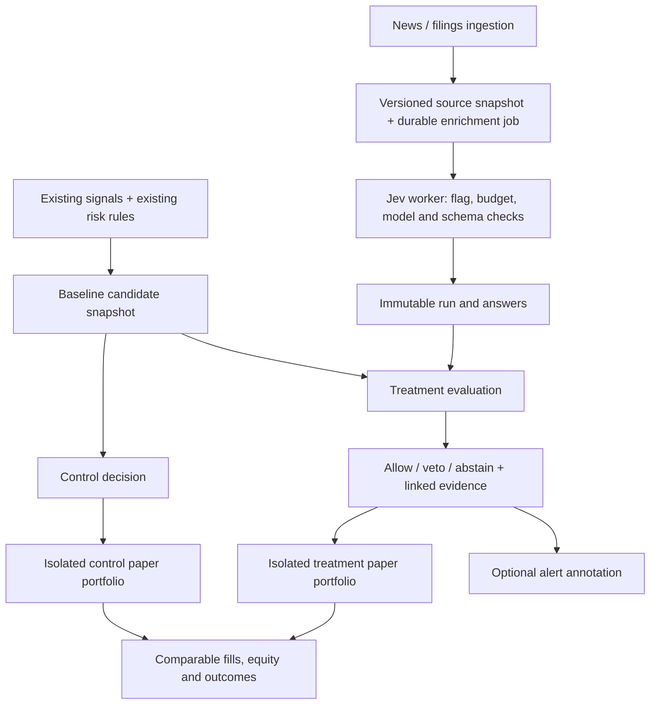

# Jev integration and experiment design

**Date:** 2026-09-29  
**Status:** proposed integration; admin preference implemented locally, default OFF.  
**Review baseline:** `adc65cd8` plus the configuration changes described below. No deployment, paid provider requests, or trading changes were performed for this design.

## 1. Recommendation and scope

Integrate Jev as an asynchronous, versioned text-classification service. Start with US company news: materiality, catalyst category and ticker-specific sentiment. Test whether an additional adverse-news veto improves the **existing platform strategy**, after costs and missed opportunities. Do not treat a text-classification probability as a probability of a profitable trade.

Keep existing news protections, technical signals, deterministic risk checks and broker controls. A Jev experiment may reject an otherwise eligible entry; it must never reinstate a baseline rejection, create a trade, enlarge a position or delay protective exits. Stocks and options require separate evidence. Better news classification alone does not establish better investment returns.

This design builds on the [original proposal](../../Improvements/Jev%20Integration%20Design%20%E2%80%94%20AI%20Stock%20Trading%20Platform.md) and the [signal/alert reliability roadmap](../2026-09-28-signal-alert-reliability-and-automated-trading-roadmap.md). The latter's immutable decisions, delivery outbox, execution lifecycle and outcome separation remain prerequisites for trusted automation; Jev does not close those gaps.

**Implemented in this change:** `jev_enabled` can be saved through the existing admin API and toggled at `/admin-ai-features`. The UI explicitly labels it a configuration preview. **Not implemented:** Jev credentials/client, ingestion worker, schemas, risk integration, experiment runner, results dashboard or live execution. Enabling the preference today has no provider or trading effect.

## 2. What to retain and correct in the proposal

| Proposal | Assessment and design decision |
|---|---|
| Typed enrichment; deterministic trading | Retain. Store raw answers and apply a separately versioned policy. |
| Every Jev failure blocks new positions | Scope to treatment strategies that require Jev. Shadow failures must not affect baseline trading. An outage is recorded as an abstention, not neutral sentiment. Exits remain independent. |
| Join the latest answer for a ticker | Unsafe without availability, revision and event checks. Link the exact answers available at decision time, including all active relevant adverse events. |
| Backfill with publication timestamps | Insufficient. Retain ingestion/receipt times and revisions; actual inference completion also matters. Historical replay using a later model is exploratory, not prospective evidence. |
| Reuse a hash of text/questions/model | Include normalized state, ticker, market, language, input revision, preprocessing version and question schema. Identical text about two companies may have opposite implications. |
| New generic `signals` table and `VARIANT` columns | Reuse existing signal identities and add immutable decision snapshots. This repository uses PostgreSQL/SQLAlchemy; use JSONB for structured payloads. |
| Cost on each answer | Cost belongs to a provider request/attempt. Three answers from one request must not count the same bill three times. |
| Congressional “meaningful new position” | Disclosure alone may not establish motive or whether a holding is new. Prefer reported facts, trade/report dates and explicit unknowns. Do not market inferred intent as fact. |
| Journal tags from P&L | Separate post-trade analysis. Include unknown/multiple tags; distinguish plan compliance from profitability. Never feed future P&L into entry features. |
| 300–500 labels and 2–4 weeks | Useful pilot scales, not evidence of a profitable strategy or rare-event recall. Size confirmatory work from observed dependence and the minimum worthwhile effect. |

The original “price-only” comparison would be misleading here: existing signals already depend on more than prices. The control must preserve the current strategy, including existing news and UW behavior, with only the Jev intervention differing.

## 3. Provider contract and feasibility

OpenRouter documents Jev `typesafe/jev-1.13`, typed Choice/Noul/Score questions, a 32,000-token context and no explanatory prose. Use the named model rather than a moving latest alias for an experiment. The application must produce reason codes from its policy and evidence, not invent a model explanation. [OpenRouter Jev guide](https://openrouter.ai/docs/guides/community/jev)

The alpha Decisions endpoint is `POST https://openrouter.ai/api/alpha/decisions`, authenticated with a server-side bearer key. Requests carry `model`, `state` and named `questions`. Responses contain `answers`, provider/model identity and usage. Noul exposes `noul`; Choice exposes `choice` and `probabilities`; Score exposes `score`, `legend` and `probabilities`. Parse each separately. Treat missing questions, unknown categories, non-finite/out-of-range numbers, inconsistent probability distributions or incompatible model snapshots as invalid results. Store the dated response model rather than assuming the request name guarantees immutable behavior. Transient failures need bounded retries; authentication, exhausted credit and schema failures need distinct operational states. [Decisions API reference](https://openrouter.ai/docs/api/api-reference/alphadecisions/submit-a-decisions-request)

Jev's `confidence` summarizes the distribution; it is not necessarily the winning category's probability. Use the relevant probabilities for a defined policy. Neither field measures stock-return odds. [TypeSafe confidence documentation](https://docs.typesafe.ai/confidence)

Pricing checked on 2026-09-29: $0.042 per million input tokens, $0 per output token. At 500 total input tokens per request, 10,000 requests/day for 30 days is **$6.30** before extra attempts or longer inputs. Budget includes question text, repeated ticker contexts and filing sections. This is an estimate, not a platform usage forecast; record actual provider charges and enforce a configurable budget. [OpenRouter model pricing](https://openrouter.ai/typesafe/jev-1.13)

Use a worker-only `OPENROUTER_API_KEY` secret. Do not put keys in browser storage, public feature flags, task payloads or logs. Verify source licensing and provider data-retention settings before forwarding article bodies or private journal notes. No credential was configured during this task.

## 4. Integration with the existing repository

| Existing location | Proposed responsibility |
|---|---|
| `services/news-intelligence/src/services/storage.py::persist_news_items` | Current shared ingestion path for RSS, EDGAR and Alpaca news. Add an enrichment work item after durable source persistence; do not block ingestion on Jev. Current classification occurs before the final commit, so preserve raw input durably before adding another external dependency. |
| `services/news-intelligence/src/services/classify.py` | Keep baseline classification unchanged in the first experiment; new Jev answers are independent evidence. |
| `services/news-intelligence/src/scheduler.py` | Schedule durable queue consumption, bounded retries, freshness and source-health checks. |
| `shared/db/models.py` | Existing `RealtimeNewsItem`, `SecFiling`, `CongressTrade`, `Signal` and `PaperTradeDecisionLog` provide identities. Add versioned enrichment and experiment records through a migration. |
| `services/decision-engine/src/api/core/hard_rejects.py` and `routes.py` | Integrate a shared deterministic Jev policy after baseline eligibility. Current hard rejects are BUY-oriented; do not assume this automatically supports shorts or all options strategies. |
| `services/market-data/src/services/paper_trading_engine.py` | Consume an immutable evaluation and execute paired portfolio experiments through normal sizing/fill/risk logic. |
| `services/market-data/src/services/options_income_engine.py` | Separate integration for income option entries; do not assume the stock decision-engine route covers this engine. |
| `services/market-data/src/services/scheduler.py` and email rendering | Display observation/decision evidence; email delivery must not be the trade trigger. |
| `services/market-data/src/api/admin.py`, `frontend/src/pages/admin-ai-features.tsx` | Implemented preference; future readiness, experiment and budget administration. |

A future shared `JevPolicyEvaluator` should be a pure function over validated snapshots. The decision service, stock engine and options engine use the same policy contract. No synchronous provider request belongs inside an order transaction. The execution layer rechecks decision expiry, account/risk state and active adverse events immediately before submission.

### Component boundary and separate-service decision

**Recommendation: a separate enrichment component within `news-intelligence` first; a separately deployed engine only when measurements justify it.** This is an architectural plan, not an implemented worker or new service.

Keep the provider client, response validation, durable-job processor and enrichment persistence behind a clear module boundary, for example `services/news-intelligence/src/services/jev/`. Give the worker bounded concurrency, timeouts and its own queue so provider delays do not occupy ingestion handlers. The scheduler should dispatch or consume durable work without synchronously enriching each article on the ingestion path.

| Component | Owns | Boundary |
|---|---|---|
| Jev enrichment worker | Provider calls, schema validation, retries, budget checks, model provenance and stored answers | No trade authorization, position sizing or broker calls. |
| Shared deterministic policy / decision engine | Calibrated interpretation of evidence alongside baseline strategy and risk rules | Reads stored, point-in-time evidence; never waits on a synchronous Jev request. |
| Trading engines | Execution checks, orders, positions and protective exits | Remain independent of enrichment availability for necessary exits. |
| Experiment framework | Assignment, paired evaluations, portfolio comparison and outcome analysis | Preserves control behavior and includes treatment failures/abstentions. |

The shared policy contract described above also serves stock and options paths that do not all traverse the same decision-service endpoint. Keep trading policy outside the provider-specific package: changing text-classification providers should not require rewriting execution logic.

**Extract a separately deployed worker/service when evidence shows one or more of these needs:**

- Queue age or throughput requires scaling enrichment independently of ingestion.
- Provider/client failures or resource use affect news ingestion despite bounded concurrency and timeouts.
- Filings, disclosures or journal workloads need materially different resource limits, credentials or release schedules.
- Operational ownership or security isolation warrants a separate process/container.

Track queue age, ingestion latency, worker CPU/memory and provider failures before deciding. Module separation alone does not isolate process crashes; if ingestion reliability is affected, move the worker into a separate process/container earlier. Start by running the same worker package independently, retaining durable job IDs and the versioned evidence contract; a new synchronous HTTP dependency is not required. Preserve lease ownership, deduplication, feature-flag checks and budget accounting across old/new workers during migration.

A new deployed service brings monitoring, health/readiness, deployment and schema-compatibility obligations. Begin with modular enrichment, shadow evaluation and paired paper trials; use measured operating needs to choose the deployment boundary. No separate Jev service is created by this document update.

### Processing contract

1. Persist original source identity, text revision, UTC publication and receipt timestamps. Store a typed source reference; preserve documents even if today's baseline classifier calls them irrelevant.
2. Resolve ticker/market context and duplicate-story/event clusters. One article can create multiple contexts; low-confidence entity mapping stays unresolved.
3. Transactionally insert a job with a unique context/version key. Use PostgreSQL as the durable ledger; Redis is a coordination/cache layer, not the only record of work.
4. Claim using a lease/token and bounded attempts. Check enablement, mode, model allowlist and budget immediately before each paid attempt. Reserve budget atomically across workers and reconcile actual usage.
5. Send only relevant untrusted document text and explicit criteria. No tools or order actions are exposed to the model. Enforce request size; long documents need identified sections and a tested aggregation policy, not arbitrary truncation that drops adverse clauses.
6. Validate and append the response. Record receipt time and the durable `available_at` time at which consumers could actually read it. Preserve failures, timing and uncertain billing after timeouts. Local deduplication cannot guarantee the provider did not charge a timed-out request twice.
7. At decision time select only source revisions and answers known then. Attach explicit IDs, policy version, freshness reasons and the allow/veto/abstain verdict. A late answer may support a new decision, never rewrite an old one.

## 5. Data model and event safety

Proposed tables below are **not yet created**. Use the migration ledger pattern already present in the project; do not attach schema/data rewrites to admin seeding or unconditional startup jobs.

| Record | Grain and essential fields |
|---|---|
| `jev_input_revision` | Source reference + revision + ticker/market context; original/normalized hashes, publication/receipt timestamps, language, preprocessing version, section identity, source-health evidence. |
| `jev_run` | One attempt: input ID, requested/returned model, provider request ID, question-set version, request hash, status, attempt, lease token, requested/completed/available timestamps, input tokens, actual/unknown cost, latency and error class. |
| `jev_answer` | One named question per successful run; unique `(run_id, question_name)`, answer type, scalar/category, raw probability JSONB, schema version. No duplicated request cost. |
| `news_risk_event` | Ticker + event identity, evidence links, opened/expiry/resolution times and explicit supersession relationship. Expiry is distinct from verified resolution. |
| `jev_policy_version` | Immutable question/model allowlist, thresholds, horizons/markets, freshness/coverage policy, event aggregation and cost-sensitive calibration provenance. |
| `experiment_definition` | Frozen hypothesis, version hashes, eligibility, start/end, arms, units, primary metric, economic target, risk limits, analysis/stopping plan and approving admin. |
| `experiment_exposure` | Candidate/decision identity, experiment/arm or paired evaluation, assignment seed/version, eligibility snapshot, required evidence IDs and availability/failure states. Unique per experiment/candidate/arm. |
| `decision_evaluation` | Immutable baseline and treatment decisions with reasons, plan snapshot, policy/config versions and references to signal, exposure and account snapshot. Extend the reliability-roadmap decision schema rather than inventing a competing identity. |
| Outcome links | Separate candidate counterfactual, notification delivery and executed paper/broker outcomes. Link fills/fees/marks to the evaluation; never reuse a delivered-alert count as a trade count. |

Use UTC instants plus exchange-session identifiers. Foreign keys/constraints must reject orphan evidence and duplicate accepted results. Paper outcomes include entry/exit execution, open-position marks, dividends/corporate actions where applicable and options assignment/expiry/collateral—not only closed winners.

**Do not repeat the news-resolution bug.** `storage.py::_mark_hot` currently documents that an unrelated newer positive story can still clear a negative flag. Jev must not feed another ticker-level overwrite into that path. Preserve independent adverse events; a newer positive article cannot resolve an unrelated lawsuit or guidance cut. Require event-linked evidence or explicit policy expiry/manual resolution. Resolve and test this event model before promoting a Jev veto to execution authority.

### Time and coverage rules

A valid answer requires its input receipt and answer availability to precede the decision cutoff; the source revision must be the one known then. A newly fetched quote cannot refresh an old signal or an old article. Replay stores what was knowable rather than joining today's latest records.

Distinguish `no_relevant_news_with_healthy_coverage`, `pending`, `failed`, `stale`, `source_unhealthy` and `valid`. An empty result set does not prove a quiet market. A treatment portfolio requiring Jev abstains on incomplete required coverage. Persist that abstention so the experiment includes its opportunity cost.

Lookback windows, answer freshness and event expiry are different controls. Start with one named US strategy/horizon and freeze its candidate values in shadow evaluation. Do not impose one untested 24-hour TTL across intraday, SWING, GROWTH and options expiry. Persistent adverse events may outlive a news lookback. Expired decisions cannot be backdated or executed when a late answer arrives.

## 6. Feature flag and operational state

**Implemented API contract:**

- Redis key: `stockai:admin:feature:jev_enabled`.
- `POST /admin/config` accepts `{"jev_enabled": true}` or `false` through the existing `get_admin_user` dependency. Omitted/null leaves it unchanged.
- Admin and public feature-flag responses include `jev_enabled`; only stored `"1"` is on. No key defaults off.
- `/admin-ai-features` loads the saved preference, disables the switch while unavailable/saving, and shows save/load errors. Unsupported older backends do not produce a silently usable toggle.
- There is no worker consumer yet. The UI says enabling the preference currently changes no alerts/trades and makes no model requests.

**Required future controls:** a master enable flag alone is insufficient. Add independently authorized mode (`shadow` by default), policy version, experiment binding, market/horizon allowlist, daily budget and readiness. A true preference must never silently activate live execution when the worker is deployed. Existing saved preferences require explicit enrollment/readiness before processing.

| State | Calls and decisions |
|---|---|
| OFF | No new Jev calls. Ordinary baseline portfolios retain existing behavior and protections. |
| Enabled + shadow | Enrich and evaluate; no Jev veto changes baseline trades or actionable alert wording. |
| Enabled + paired paper | Only enrolled treatment paper portfolios consume Jev verdicts; paired control stays on baseline. |
| Enabled + unavailable/invalid evidence | Required treatment entries abstain; baseline/control is unaffected. Existing positions remain monitored and exits work. |
| OFF during a treatment experiment | Stop new requests; pause new treatment entries and record interruption. Do not silently turn treatment into control. |
| Redis/config unavailable | Unknown configuration is not an explicit OFF. Stop paid dispatch and required treatment entries; preserve exits and baseline operations. |
| Live | Deferred; separate authorization/capability and promotion gate, never implied by the master flag. |

On disable, stop claiming work and recheck configuration before applying a result. An already dispatched provider call may still finish/be billed; retain it for audit, but it cannot authorize a new treatment entry. Use a configuration generation to detect changes in flight. Do not delete previously recorded adverse events when disabling enrichment. Future admin controls need actor/time/old/new audit records, including operational pauses and model/policy changes.

## 7. Question and policy design

Start with three US-news questions sharing the same immutable input context:

| Question | Criteria and use |
|---|---|
| Materiality (Noul) | Evidence of a company-specific change in outlook/exposure, conditioned on ticker and stated horizon. Missing article content is not “immaterial.” |
| Catalyst (Choice) | Earnings, guidance, regulation, corporate action, analyst action, other/unclear. A forced choice needs an explicit unknown category; evaluate multi-event articles separately. |
| Sentiment (Score) | Five ordered levels relative to the company, with clear neutral/ambiguous criteria. Adverse news does not mean the price must fall. |

Example policy shape: a baseline-eligible long setup is vetoed when a relevant unresolved event meets a calibrated materiality threshold and sufficient probability lies in adverse sentiment levels. The evaluator returns named reason codes and evidence IDs. **No numeric trading thresholds are recommended as “best” without labels and forward evidence.** Do not multiply materiality and sentiment marginals and claim the result is a joint probability without a validated dependence model.

A negative underlying event is not automatically a suitable short, put purchase, covered call or cash-secured put. Initial scope is long-stock entry vetoes. For options, retain contract liquidity, spread, Greeks, earnings timing, IV/theta, position coverage and assignment constraints. Validate each strategy separately; a stock-direction hit rate is not an options return metric. Jev should annotate UW observations only as additional company context, not infer trade intent from a dark-pool print or missing option bid/ask data.

Defer filing aggregation, congressional classification and journal tagging until the first news experiment is interpretable. Each adds different labels, availability rules and potential leakage. HK and Chinese-language inputs remain research-only until independently evaluated.

### Buy, sell and hold decision support

Jev can provide evidence for buy/sell decisions, but its classifications do not themselves authorize orders. The initial entry-veto design above remains the implementation scope; sell/reduce policies below are a proposed extension requiring separate evaluation and authorization. The current admin preference activates neither.

| Decision | Proposed Jev contribution | Authority and limits |
|---|---|---|
| Buy | Delay or veto an otherwise eligible long entry when material adverse news contradicts the setup. | Technical eligibility, price/plan freshness, sizing and risk rules still decide entry. Positive news cannot create a trade or reverse a baseline rejection. |
| Sell / reduce | Flag material deterioration for position review, supported by ticker-specific event evidence. | Initially review-only. A separately versioned deterministic policy could later authorize reductions/exits after paper validation. A news classification alone is not a sell order. |
| Hold | Help distinguish routine headlines from substantive changes to the investment thesis. | Never override a stop, postpone a required exit or treat missing/failed enrichment as evidence that holding is safe. |
| Options | Supply underlying-company context for entry or position review. | Keep contract liquidity, spread, volatility, Greeks, expiry, coverage and assignment checks. Validate each options strategy independently. |

A positive classification is not automatically a buy, and a negative classification is not automatically a sell. Price may already reflect the information. Evaluate incremental benefit relative to the existing strategy; do not interpret materiality, sentiment or model confidence as the probability of a profitable trade.

**Separate sell/reduce experiment:** start with identical entry decisions and position snapshots in both arms, preserving baseline exits. Add only the proposed Jev-based exit policy in treatment. Freeze event relevance, action thresholds, reduction sizes, repeat-action deduplication and re-entry rules before evaluation. Track net return, drawdown, turnover/slippage, avoided losses and upside lost through premature exits. Maintain independent portfolio accounting after paths diverge; compare additional exit effects without also changing entry policy. Missing Jev evidence must never block a baseline protective exit or manufacture an automatic liquidation.

Roll out entry vetoes first, then sell/reduce review annotations and a separate shadow/paper exit experiment. Combining entry and exit interventions is a later experiment, after their individual effects are understood. No sell/reduce implementation, threshold approval or deployment is included in this document update.

## 8. Experiment framework: is Jev actually better?

### Phase A — classification and contract validation

Use roughly 300–500 independently labeled items as an initial pilot per question, with deliberate adverse/ambiguous examples. Labels need ticker, horizon, source revision and adjudication notes. Have reviewers label without knowing subsequent returns; double-review a subset and measure disagreement. Separate duplicate stories and the same underlying event across train/validation/test boundaries; use chronological holdouts. Report precision/recall, confusion, calibration/reliability and performance by source/language/category, including rare material negatives.

Freeze criteria, model allowlist and policy before the holdout. Tune on training/validation only. Human materiality labels answer a classification question; economic outcomes answer whether a policy is useful. Retrospective model inference may benefit from later knowledge and lacks real-time latency/coverage, so report historical replay separately from the prospective trial.

### Phase B — paired prospective shadow, then paper

Run both arms on the **same frozen baseline candidate stream**:

- **Control:** existing strategy, all existing news/UW/risk rules, no Jev intervention.
- **Treatment:** identical strategy plus one frozen Jev policy, with recorded veto/abstain reasons.

Shadow first computes would-have decisions without affecting trades. Paper then uses isolated accounts with equal initial capital, configuration, fees, calendars and fill/mark models. No sharing available cash, position limits, cooldowns or mutable decision state between arms. Portfolio paths will diverge; that is part of the strategy effect. Apply identical realistic liquidity assumptions, and record unfilled/partial orders. Avoid giving both arms impossible independent fills if simulated volume participation would exceed available liquidity.

Persist each baseline opportunity **before** Jev filtering and pair evaluations by immutable candidate ID. Treatment-allowed candidates must be a subset of baseline-eligible candidates. Vetoed and failed/pending cases stay in the denominator. Candidate counterfactual returns describe skipped opportunities; they are not executed trades. Reinvestments, released capital and cash balances belong to portfolio accounting, not a sum of hand-picked trade returns.

This paired simulation is a controlled comparison, **not a randomized live A/B trial**. Its main limitation is the fill/market-impact model. Sample units are correlated by symbol, event and market session; 100 repeated alerts about one event are not 100 independent observations.

### Phase C — randomized allocation, only if warranted

Keep the experiment interfaces capable of stable, persisted assignment. Use a versioned hash/HMAC of experiment ID, predeclared cluster identity and seed; assign before seeing Jev availability or outcomes. Cluster related ticker/event decisions to avoid repeated alerts entering both arms inconsistently. Freeze allocation and stratification rules; never reshuffle because an answer arrives late.

For real strategy-return inference, allocate independent portfolio sleeves/accounts with separate capital and risk budgets. Persistent portfolio assignment avoids mixing treatment-dependent cash/cooldown effects inside a nominal control portfolio. Per-event randomization can answer a marginal decision question, but cannot by itself identify whole-portfolio returns. If there are too few independent portfolios/clusters, retain the paired paper comparison and label the limitation instead of claiming a well-powered randomized trial.

### Metrics and analysis

| Area | Required measures |
|---|---|
| Primary economic outcome | Treatment minus control net portfolio return on equal initial capital over the same fixed window; include trading costs, provider cost allocation, open-position marks and cash. |
| Risk constraints | Maximum drawdown, tail loss, exposure/concentration, leverage/collateral utilization, turnover and risk-limit breaches. |
| Decision quality | Adverse-event precision/recall, veto rate, abstention rate, coverage, late/stale answers and unchanged/changed baseline decisions. |
| Trading diagnostics | Net expectancy, profit factor, hit rate, fill rate, holding time, costs, missed winners and avoided losers; split by horizon/regime/strategy with uncertainty. |
| Operations | Queue age, end-to-end p50/p95, schema errors, retries, model changes, actual spend and disable behavior. |

Use intention-to-treat accounting: outages and required-evidence abstentions count as treatment behavior. An additional diagnostic may condition on valid answers, but it must not replace the primary result. Charge deployment-equivalent Jev cost to treatment; report research/control-shadow infrastructure cost separately and include unbilled/unknown-cost attempts in spend uncertainty.

Pre-register one primary hypothesis, an economically worthwhile return improvement, risk ceilings, horizon, minimum coverage and stopping rule. Estimate sample size from pilot return variability and clustering. For the paired experiment, analyze paired session-level return differences with time blocks long enough to reflect overlapping holding periods; show uncertainty and sensitivity to block length. Do not run an IID trade t-test or stop as soon as one p-value looks favorable. Secondary slices need multiplicity control or explicit exploratory labels.

A provisional **60 market sessions and 100 resolved treatment trades** can be an operational screening floor, not a statistical promotion criterion. GROWTH and sparse vetoes can require much longer. Do not force liquidations just to finish the sample; include marked open risk and continue enough follow-up to assess intended holding periods. State the achieved precision/power, not just the count.

Promotion requires reproducible positive economic evidence under the frozen analysis plan (including a predeclared confidence bound against the chosen minimum benefit), acceptable risk, adequate data and reliable operation. If uncertain, continue or reject; do not lower standards after seeing results. A policy/model/criteria change starts a new version/cohort rather than pooling incompatible results.

### Proposed experiment dashboard

Add an admin Jev page with: readiness and model snapshot; mode/budget; frozen experiment definition; paired equity/drawdown; net-return difference with uncertainty; exposure/turnover; candidate→allowed→filled funnel; veto/abstention and missed-opportunity breakdown; evidence drill-down; provider/source outages; classification calibration and spend. Show “insufficient evidence” when appropriate. Do not headline a single blended win rate across horizons or options/stocks.

## 9. Delivery plan and acceptance gates

| Step | Deliverable | Gate |
|---|---|---|
| JEV-01 — implemented locally | Admin default-off preference, API types, preview UI and configuration tests | Round-trip on/off, omitted fields preserved, unavailable save not reported as success. |
| JEV-02 | Versioned input/run/answer schema, durable queue, strict client, server secret and budget accounting | Real PostgreSQL migration tests, recorded-response contract tests, restart/duplicate/timeout/disable tests. |
| JEV-03 | Event-linked risk ledger, pure policy evaluator and immutable evaluation IDs | No unrelated positive clears a brake; no future/late answer enters a past decision; baseline veto cannot be reversed. |
| JEV-04 | Labeled US pilot and prospective shadow dashboard | Frozen criteria, measured classification/freshness/coverage; no trade/alert authority changes. |
| JEV-05 | Paired stock paper runner and analysis | Same candidate snapshots, isolated capital, realistic fills; vetoes/outages remain counted; pre-registered economic test. |
| JEV-06 | Separate options paper experiments | Contract-level P&L, costs, assignment/collateral and risk evidence; no inheritance of stock approval. |
| JEV-07 | Controlled live proposal | Prior automation roadmap operational gates satisfied, independent review and explicit authorization; persistent rollback/kill controls. |

Do not bundle a classifier replacement, new scoring weights and Jev veto into one trial; their effects would be inseparable. First implement JEV-02/03, then the US-news shadow trial. No assumed profitable threshold, automated live action or additional provider subscription is needed for this configuration/design milestone.

## 10. Verification for this change

The local code change is limited to the admin configuration endpoint, frontend API typing, the admin features page and focused backend tests. The flag does not claim an enforcement path exists before the worker is built. Existing admin authorization is retained; no authentication code or CLAUDE.md was changed.

Validation:

- `PYTHONPATH=services/market-data python -m pytest services/market-data/tests/test_jev_admin_flag.py services/market-data/tests/test_theme_forecast_admin_flag.py -q`: **16 passed** (9 new Jev cases, 7 existing flag cases). These execute the real admin handlers using an in-memory Redis substitute; they do not establish production persistence or HTTP authorization behavior.
- `cd frontend && npm run typecheck`: passed.
- `git diff --check`: passed.
- Browser rendering/interaction was not verified; no browser automation tooling is installed in this environment. No production verification was performed.

Browser acceptance before deployment: sign in as admin, open `/admin-ai-features`, verify default OFF, enable and reload, disable and reload; simulate load/save errors and an older backend missing the field; verify unavailable/saving controls and error messages. Confirm an ordinary user cannot write `/admin/config`. This task does not authorize sending emails or changing broker/production state.
