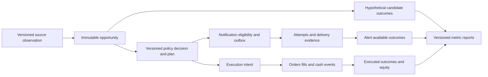

# Measurement framework, improvement roadmap and pending decisions

As of: **2026-09-30**. Status: **proposed design and consolidated work register**, not an implemented metrics service or a new production verification. This document records the recommended next steps across signals, UW, news/earnings, notifications, stock/options paper execution and eventual automation. Latest deployment claims are attributed to the user's Claude reports unless explicitly linked to independent evidence. No production changes, emails, recovery-key deletions or strategy promotions are authorized by this document.

## 1. Objective and decisions

**October 3 proposed extension — report narration evaluation:** see [the LLM report design](2026-10-03-evidence-grounded-report-narration-design.md). Engineering status `proposed`; research status `not_measurable`; activation `no_action`. Reuse the experiment registry for paired same-snapshot deterministic-versus-narrated report review. Measure factual support, numeric/period/basis correctness, contradiction retention, reviewer usefulness, abstention, cost and latency. Do not pool these with directional accuracy or trade returns, and do not imply M22/Jev or broker activation. This extension does not mark any existing M-item complete.

Build a reproducible answer to: **does a change improve timely, executable, net portfolio outcomes within the same risk budget, and why?** More alerts, higher raw confidence, more trades and passing tests are useful diagnostics, not that answer.

The operating rule is: **match population, decision authority, time window, outcome definition and weighting before reporting a rate.** Every metric must disclose these five dimensions. Separate operational correctness, prediction quality, execution quality and investment outcomes; one cannot certify the others.

Recommended order:

1. Verify the shipped recovery/conviction fixes behaviorally and resolve historical recovery markers individually.
2. Complete small instrumentation gaps in existing scan logs; make successful and unsuccessful scans observable.
3. Establish immutable links between opportunity, decision, alert, order and outcome, reusing the existing reliability-roadmap entities.
4. Fix the earnings event-phase/delivery gaps and implement reliable notification delivery.
5. Freeze a baseline and run one bounded prospective shadow/paper comparison at a time.
6. Promote only against preregistered evidence and risk criteria. Keep unsupported calibration, GEX and flow-direction changes unpromoted.

**September is the historical reporting cohort, not an untouched future holdout.** New instrumentation cannot reconstruct observations it never collected. Forward evaluation starts after the relevant version and instrumentation are deployed; its dates must be shown separately.

## 2. Evidence and status vocabulary

Use separate engineering and research status fields:

- Engineering: `proposed`, `implemented`, `tested`, `reported_deployed`, `independently_verified`, `regressed`.
- Research: `not_measurable`, `collecting`, `inconclusive`, `rejected`, `supported_for_defined_scope`.
- Decision: `no_action`, `approval_pending`, `approved_for_scope`, `activated`, `rolled_back`.

A deployed counter can still have insufficient outcomes. A correct lifecycle can still execute a losing strategy. A source-text presence check establishes neither end-to-end behavior nor deployment-wide consistency.

Source documents:

- [Signal/alert automation roadmap](../2026-09-28-signal-alert-reliability-and-automated-trading-roadmap.md): durable entities, execution lifecycle and release gates.
- [September production verification](../audits/2026-09-29-september-only-production-verification.md) and [corrected checkpoint](../audits/2026-09-30-three-week-deferred-checkpoint.md): corrected populations and open studies. Its correction block supersedes conflicting original prose below it.
- [Confidence, timing and paper activity review](../audits/2026-09-30-confidence-alert-timing-and-paper-activity-review.md): historical defects and measured telemetry limitations; original defect witnesses are not acceptance tests for repaired code.
- [Dark-pool threshold study](../audits/2026-09-30-darkpool-relative-threshold-effectiveness.md) and [probe](../audits/evidence/2026-09-30-darkpool-relative-threshold-probe.py).
- [MU event-latency audit](../audits/2026-09-30-mu-earnings-latency-and-event-intelligence-review.md).
- [Outage recovery manifest](../audits/2026-09-30-signal-outage-recovery-manifest.md).
- [Jev design and experiments](2026-09-29-jev-integration-and-ab-testing-design.md).

No source's “current” count should silently update this document. Each refreshed scorecard needs its own extraction time and cohort/version.

## 3. Consolidated pending-work register

Owners below are proposed responsible components/roles, not assignments to named people. “Exit” is the evidence needed to close or advance the item.

| ID / priority | Current state | Next action and exit evidence | Owner / dependency |
|---|---|---|---|
| M01 / P0 | Recovery reserve→consume lifecycle reported deployed | Test reservation expiry during a slow worker, crashes before/after durable entry, unknown broker submission, concurrent workers and owner-checked release. Reconcile against unique execution intent/trade; no duplicate grant use or phantom consumption. | market-data / execution |
| M02 / decision | Old portfolio 2 and 5 recovery markers reportedly remain | Prepare refreshed read-only trade/order evidence. Recommend clearing only portfolio 2 if no corresponding entry or pending/unknown order exists, with explicit approval and compare-and-delete against inspected value. Record old value/TTL and action. Leave portfolio 5 unchanged pending recovery-strategy review. | operator + risk owner; no deletion performed |
| M03 / P0 | Conviction bound to `sig.ts`; `gate_passed` producer reported deployed | Verify symbol, market, horizon, input/policy version, TTL and missing/stale behavior in every consumer. Missing evidence is not a positive decision: recompute required policy or explicitly abstain. Email delivery status cannot authorize trading. | signal / decision / market-data |
| M04 / P1 | Authoritative anti-chase counters reported deployed | Verify reached/rejected/survived counts by authoritative decision source; retain separate shadow results. Cover successful scans, repeated opportunities and skips before this gate. Accumulate forward results before effectiveness claims. | market-data analytics |
| M05 / P1 | Dark-pool relative threshold rarely binds in current snapshot | Reconcile denominators; implement point-in-time baseline replay or forward baseline capture. Compare absolute-only, relative-only and combined filters without changing production thresholds. Exit: incremental unique-event selection and held-out economic/load comparison. | news/UW + research |
| M06 / hold | Confidence feedback: do not promote | Evaluate consumer-matched market/horizon/direction slices and primary outcome; probability calibration separate from strength score. Sparse September high bands cannot justify activation. | signal / ML |
| M07 / hold | Options-flow row-count gate met; anti-predictive claim withdrawn | Match production 10-session outcome; equal-weight independent symbol/session events and resolve mixed-direction groups explicitly. Compare benchmark-relative and actual options outcomes separately. No automatic bearish inversion. | UW / research |
| M08 / collecting | Prebreakout concentrated in few names | Broad report: 8 names, AI 42%; September report: 6 names, AI 50%. Proposed revisit at ~20 names, none >15%, plus mature outcomes and leave-one-name-out sensitivity. Diversity floors are screening rules, not proof. Keep deferred live-bar refactor separate. | research |
| M09 / hold | GEX control small; signed result differs from raw-return claim | Keep gate off; compare baseline versus gated portfolios, with thesis-signed outcomes and adequate non-corroborated support. A ~30-event control is a review trigger, not a promotion threshold. | UW / research |
| M10 / collecting | Squeeze ignition: 6 reported events, mean about −5.3% | Retain configuration; collect independent events and losses, assess concentration/coverage. Do not loosen just to create more observations. | research |
| M11 / collecting | Short-squeeze corroboration: 16 overall, only 5 September | Count the actual short-squeeze family member, not 481 mostly gamma-unwind events. Revisit with target-specific diversity/maturity. | UW / research |
| M12 / collecting | Regime robustness: only one reported bear sample | Separate regime coverage from average performance; restrict conclusions to observed regimes. Historical stress/replay can complement, not substitute for forward coverage. | research / risk |
| M13 / P1 | ML `n_outcome_rows` attrition unresolved | Record rows at join, feature availability, label maturity, dedup, purge, calibration and promotion stages. Each exclusion needs a reason and reconciliation. | ML |
| M14 / pending verification | OOS-suppression rollout not independently settled here | Inventory active artifacts/consumers; verify invalid models cannot publish or be unsuppressed by resweeps. Preserve valid incumbents; record versioned suppression reasons and coverage effects. | ML / operations |
| M15 / collecting | Portfolio concentration real-world sample limited | Test limits now with synthetic positions; measure realized symbol/sector/factor concentration as exposure accumulates. Do not wait for trades to test a hard limit. | portfolio / risk |
| M16 / occurrence-gated | Broker fill re-poll needs multi-cycle observation | Sandbox partial/pending fill across cycles, restart and reconciliation; distinguish accepted order from fill, avoid duplicate trades/cash. Record actual broker events. | broker adapter |
| M17 / deferred | Eight-cell ablation awaits simpler comparison and absent margin features | Finish one two-arm study first. No factorial expansion until inputs and independent sample support it. | research |
| M18 / deferred | Watchlist/style rerun remains open | Review intentional exclusions versus stale membership; shadow a mandate-consistent alternative. Report incremental outcomes, not hypothetical conversion of all rejected checks. | ranking / research |
| M19 / P0–P1 | MU earnings facts arrived rapidly; result pipeline blocked in audited snapshot | Verify phase-aware preview/results/guidance delivery, investigate structured NULL EPS mapping/provider response, add scheduled opted-in briefing and stale-forecast guard. Local work in progress is not independently verified remediation. | event / news / market-data |
| M20 / P1 | Outbox, technical-alert retries, immutable event IDs and separate outcome cohorts remain pending in reports | Implement reliable delivery lifecycle, preferences, lease ownership, expiry and meaningful retry content; measure provider acceptance separately from delivery. | market-data / notifications |
| M21 / approval pending | Old “69” outage count does not reproduce; manifest supports 65 actionable, 18 inferred consumed/current SELL events across 15 symbols | Refresh signal state and recipients; prepare exact digest for review. Do not reset `last_signal` or send without explicit instruction. SELL signal is not necessarily an exit for an account without holdings; never manufacture a short-entry instruction. | notifications / operator |
| M22 / design | Jev engine/flag and A/B plan documented | Validate provider contract, costs, classification and failure behavior; begin shadow only under reviewed implementation. Reuse this experiment registry. | Jev adapter / admin / research |
| M23 / open design | Event-linked resolution of material negative news and meta-model blend | Link resolutions to originating events; unrelated positive news must not clear unresolved risk. Keep meta blend disabled until feature parity and promotion evidence satisfy its separate design. | news / ML |
| M24 / follow-up scope | Per-job migration readiness improved, not universal | Inventory prerequisites for outbox, intent uniqueness, mark evidence and new metrics workers; missing/unknown prerequisites block dependent work precisely. Keep liveness distinct from capability readiness. | platform |
| M25 / release prerequisite | Other previously deferred broker/order and options-accounting items | Reconcile prior A01–A03 lifecycle scope and research-vs-executable options marks against current code before any live-capital proposal; historical fix claims do not close this gate. | execution / options / risk |

### Recovery decision specifics

Reported marker TTLs (~6 days) are historical observations, not live countdowns. Portfolio 2's zero-candidate scan/no September entries makes phantom consumption plausible; zero open positions alone does not exclude closed trades or outstanding orders. Portfolio 5 reportedly had seven losing recovery trades totaling −$452.92 in an E*Trade sandbox; leave its marker until the policy is reviewed. Marker deletion would restore an exception to a breaker, not guarantee a trade. With no open positions, a positive close is not an available escape unless an outstanding order/other entry path exists. Operator approval remains outstanding.

### Dark-pool evidence qualification

The study reports 9,710 prints above the absolute floor, 9,692 above both and 15 rejected by the relative bar. The remaining **3** are the no-baseline category in the probe, so relative rejection among evaluable prints is **15 / 9,707**, approximately 0.1545% (rounded 0.2%); among all absolute-pass prints it is 15 / 9,710. Always show missing-baseline policy separately.

The probe computes one trailing-14-day median per symbol **at extraction time**, then applies it to all historical prints in that window. This supports the current-baseline structural finding (55 of 57 baselines below the absolute floor after multiplication), but does **not** establish exactly how often production rejected prints at their original decision times. That needs the historical baseline available then, including source arrival time and revisions. Do not use this snapshot as leakage-safe backtest evidence or pick a new multiplier from it alone.

## 4. Measurement contract

Each metric definition is versioned and stored with:

| Field | Required meaning |
|---|---|
| `metric_id`, definition/query version, owner | Reproducible formula and responsible component |
| Cohort and grain | Candidate, event, scan, symbol/session, recipient-delivery, intent, fill, trade or portfolio/session |
| Numerator / denominator / unit | Exact inclusion and exclusion rules, currency, bars versus sessions versus clock time |
| Time window and timezone | Inclusive start, exclusive end, exchange-session mapping and extraction cutoff |
| Decision authority | Legacy policy, decision engine, risk veto, shadow-only result, recovery policy |
| Versions | Code/artifact/config/feature flags, input snapshot, strategy, cost/fill/mark model |
| Outcome | Target definition, direction convention, maturity/availability, entry/exit timing and benchmark |
| Weighting and dependence | Row/event/symbol/session weights; repeated contracts and overlapping windows |
| Quality and uncertainty | Missing, unresolved, censored, stale and excluded counts; interval method and effective support |

Use September event/entry cohorts `[2026-09-01, 2026-10-01)` in the appropriate exchange-session calendar. Separately report September portfolio performance, which includes positions entered earlier. For September-origin signals resolving in October, label both cohort month and outcome cutoff; do not treat their unavailable labels as known in September. Persist UTC instants and exchange session IDs; naive database UTC values must be interpreted explicitly.

Keep broad historical, September-only, before-fix and after-fix panels separate. Do not pool US/HK P&L without a stated base currency and timestamped FX conversion. Distinguish backtest, forward shadow, internal paper, broker sandbox and real-money execution.

## 5. Durable architecture and incremental delivery

Reuse the entities proposed in the reliability roadmap rather than inventing a competing ledger. Existing `paper_entry_scan_logs.skip_tally` remains useful for operational counts; add structured records alongside it incrementally.

Minimum extensions to the existing contracts:

- **Opportunity identity:** source event/revision, symbol or option legs, horizon, baseline eligibility and snapshot captured before experimental filtering. Separate signal generation identity from repeated scan attempts and recipient delivery identity.
- **Decision record:** `decision_id`, opportunity/plan revision, portfolio if applicable, evaluated time, input ages, authoritative source, each evaluated gate's status/reason, first binding rejection, raw strength, optional calibrated probability, expiry, config hash and experiment assignment. Unevaluated gates are `not_evaluated`, not passed. Diagnostic evaluation of later gates is explicitly shadow-only.
- **Execution lineage:** stable intent/client order IDs, reserved/consumed grant ownership, broker/simulator mode, submissions including unknown responses, partial fills, fees, cash/collateral and mark provenance. Notifications and protective execution remain independent consumers.
- **Outcome record:** cohort kind (`candidate_hypothetical`, `alert_available`, `executed`), target definition/version, start availability, entry/exit policy, benchmark, gross/net economics, maturity and exclusion reasons. Never overwrite candidate outcomes with trade outcomes.
- **Experiment/run registry:** hypothesis, arms, assignment unit/seed, start/end/as-of, required sample precision, primary metric, effect threshold, risk budget, costs, stopping rule, hashes and release decision.

Persist decisions/outbox before asynchronous work; enforce unique business keys and idempotent reconciliation. Historical backfills must be labeled reconstructed with uncertainty, never given invented send/fill timestamps. Aggregations should run from a bounded read replica/export or controlled read-only snapshots; do not burden live execution with large research queries. Analytics failure must be visible, not silently reported as zero performance. Restrict recipient-level records; publish aggregate dashboards without emails/secrets.

## 6. Metric dictionary and dashboard

Every tile shows window, version, units, denominator, last successful refresh and quality/maturity counts. Missing telemetry displays **unknown**, never zero. Drill-through stops at authorized evidence.

| Panel | Metrics / definition | Interpretation guard |
|---|---|---|
| Source health | Coverage = fresh expected instruments/events observed / expected set; missing sources; p50/p95 publication→receipt lag; revisions and missing fields | Show source and exchange session; a healthy job does not prove coverage |
| Signal quality | Mature target precision by direction/horizon, recall where a complete labeled universe exists, PR/ROC diagnostics, abstention and score distributions | No pooled opposite-thesis raw returns; labels and production horizon must match |
| Probability quality | Brier mean `(p−y)^2`, log loss, reliability plot, calibration error and base-rate comparison by supported slice | Apply only to defined probabilities in [0,1]; raw strength is not probability; show bin counts/uncertainty |
| Entry funnel | All scans, unique opportunities, pre-gate exclusions, gate reached/rejected/survived, approved intents, actual entries | Existing no-entry-only logs are incomplete denominators; repeated checks are not unique bets |
| Anti-chase | Authoritative rejected / authoritative reached, by decision source; separate shadow rejected; unique-event version alongside attempt counts | Do not divide by all BUY signals or sum overlapping shadow rejections |
| Gate effectiveness | Paired net outcome difference with/without one policy; avoided losers, missed winners and released-capital effects | Gate reject count does not establish benefit; hypothetical trades remain hypothetical |
| Notifications | Eligible recipient-events, queued, accepted within deadline, expired, retried, bounced/delivered where observable, duplicate rate | Accepted / eligible includes outages and failures; opted-out/not-eligible recorded separately; acceptance is not inbox arrival |
| Timeliness | Source→decision→queue→acceptance/delivery p50/p95; signal/input age; expired-before-send; plan/quote drift at availability | Separate market-closed waiting and processing delay; distribution excludes failures only with explicit failure counts |
| Execution | Submitted intents, fill/partial/reject/unknown rates, decision→fill lag, signed arrival-price slippage, spread, reconciliation age | Stable intent denominator; no invented fills at favorable historical midpoints |
| Trade economics | Win/loss/breakeven counts, net expectancy, profit factor, R multiples, costs, duration, MAE/MFE, open/censored trades | Win rate = positive-net closed trades / all closed trades including breakeven; unresolved shown separately |
| Portfolio | Net equity return, benchmark/exposure comparison, drawdown, gross/net exposure, cash, turnover, concentration, stale-mark fraction | Include marked open positions, losses, fees and cash; don't sum average trade returns |
| Options | Real contract/leg P&L, executable spread/cost, IV/Greeks exposure, assignment/exercise, collateral usage and tail loss | Underlying direction is not option return; keep legacy premium yield and return-on-collateral distinctly named |
| Experiment | Treatment−control equity return, risk differences, uncertainty, coverage, costs and subgroup stability | Count treatment outages/abstentions; a completed count floor alone cannot promote |
| Operations | Model suppression reasons, migration capability readiness, drift, lock/lease loss, job failure, provider/model spend | Engineering health is separate from strategy return |

Net trade expectancy is mean realized **net** P&L per closed trade, reported in account currency and optionally per initial risk; never subtract costs twice. Profit factor is positive net P&L divided by absolute negative net P&L; if no losses, display undefined/insufficient evidence rather than an impressive infinity. Maximum drawdown is the largest decline from the preceding marked-equity peak; disclose valuation frequency and stale marks.

For a no-external-cash-flow trial, return is `(ending marked equity − starting equity) / starting equity`. With deposits/withdrawals, use documented time-weighted subperiod returns; separately show cash flows and money-weighted results if useful. Report provider/LLM costs separately and an all-in strategy result with a frozen allocation rule. Options assignment must reconcile both option settlement and resulting stock/cash positions without double counting premium.

Probability calibration does not create predictive information. Reliability plots and proper scoring metrics complement discrimination measures; Brier/log loss reflect more than calibration alone. [Scikit-learn calibration documentation](https://scikit-learn.org/stable/modules/calibration.html).

### Six user-facing dashboard pages

1. **System today:** source gaps, stale decisions, pending alerts/orders, freshness and current risk.
2. **Why no trade / no alert:** portfolio/session funnel with binding reasons and links to a decision trace.
3. **Signal scorecard:** independent cohort outcomes and probability reliability by horizon/market/direction.
4. **Execution and portfolio:** fills, costs, marked equity, options collateral and broker reconciliation.
5. **Experiments:** frozen arms, effect/risk intervals, sample diversity/maturity, verdict and rollback version.
6. **Pending work:** the register above, evidence links, owner, next measurable trigger, last checked time and approvals.

## 7. Experiment protocol

Start with prospective **paired shadow**, then isolated paired paper portfolios. This is a simulation comparison, not a randomized live trial.

1. Preregister one policy change and primary target; freeze code, thresholds, input eligibility, execution costs, evaluation windows and decision authority.
2. Capture every baseline opportunity before the treatment gate; both arms receive the same point-in-time input snapshots. Preserve treatment timeout/abstention cases in the primary comparison.
3. Give paper arms equal initial capital and separate cash, grants, cooldowns and position limits. Apply identical fill/mark assumptions and liquidity capacity; do not simulate impossible combined participation. Do not let treatment positions alter the control's candidate stream.
4. Report both opportunity-level hypothetical differences and whole-portfolio equity differences. The latter includes altered exposure, reinvestment, missed fills and time in cash.
5. Use chronological train/calibration/validation/final holdout periods with actual label-availability purging at every boundary. A simple row-count gap is insufficient for irregular multi-symbol trading calendars and overlapping horizons. [TimeSeriesSplit's documented gap](https://scikit-learn.org/stable/modules/generated/sklearn.model_selection.TimeSeriesSplit.html) is a tool, not a substitute for this availability check.
6. Estimate uncertainty with paired session-return blocks reflecting holding-period overlap; assess symbol/event concentration and leave-one-symbol-out sensitivity. Do not treat thousands of contracts or scans as independent observations. State when support is too small for a credible interval.
7. Define minimum economically useful improvement, allowable risk deterioration, evaluation duration/sample precision and stopping rules **before** viewing forward outcomes. Do not keep tuning or stop on the first favorable significance result. Account for multiple searched policies; secondary slices remain exploratory.
8. A changed model, policy, fill assumption or material data fix starts a new version/cohort. A/B assignment is stable and persisted before outcomes; random portfolio/sleeve allocation is a separate later design if enough independent units exist.

Suggested initial studies, sequentially rather than all at once:

| Study | Control / treatment | Primary question |
|---|---|---|
| Anti-chase | Current authoritative policy / same policy with the specific anti-chase intervention changed in shadow | Does it improve net expectancy/risk, rather than merely reduce activity? |
| Dark pool | Existing policy / preselected point-in-time relative alternative | Does extra selectivity improve unique-event outcomes and recipient load at acceptable coverage? |
| Conviction/watchlist | Frozen current policy / one clearly specified gate alternative | Are valid opportunities being excluded, after holding other constraints constant? |
| Confidence | Raw-score baseline / separately calibrated decision policy | Does probability accuracy and resulting policy value improve on untouched future data? |
| Earnings timing | Current factual pipeline / phase-aware fast facts plus separately evaluated analysis | Are release updates delivered promptly and does later trade use add remaining executable value? |
| Jev | Baseline without Jev / one frozen Jev policy | Is incremental all-in value worth cost, latency, abstentions and changed exposure? |

Never remove hard safety/risk constraints to test activity. Bearish options flow is not automatically a short recommendation, and a dark-pool print alone does not establish buyer intent. Benchmarks include a base-rate forecast, simple mandate-consistent strategy, and cash/no-trade; show market/sector/exposure effects rather than attributing a broad rally to intelligence.

## 8. Promotion, rollback and review cadence

A release needs all four gates:

- **Correctness:** behavioral tests execute real consumers, realistic database schemas, failure/restart paths and ownership logic. Sabotage checks must actually execute and fail; zero collected tests is failure. No source-text assertion substitutes for behavior.
- **Measurement integrity:** linked and reconciled cohort counts, maturity, point-in-time inputs, costs and versions; unknown coverage blocks a performance verdict.
- **Economic evidence:** preregistered primary benefit/uncertainty criterion met, with acceptable drawdown, concentration, liquidity and cost sensitivity. Minimum row/name/session floors only allow review, never automatic promotion.
- **Operational readiness:** shadow→paper→broker sandbox validated; live capital requires separate explicit approval, limits and rollback. Feature flags separate collection, shadow evaluation, alert effects and execution effects. Disabling experimental entries must retain position management and reconciliation.

Immediate pause conditions: duplicate/unauthorized orders, stale input used as permission, unbounded missing marks, unreconciled broker exposure or breached risk limits. Statistical evidence of degradation follows the experiment's preregistered review rule; do not create an arbitrary daily p-value stop after launch.

Cadence: daily operational exception report; weekly metric/data-quality and experiment-support review; monthly fixed-cohort performance report after stated maturity cutoff; release review only when exit criteria are met. Daily monitoring may stop unsafe operation but does not retune a study. Each pending item records a concrete count/diversity/occurrence/implementation trigger instead of “check next month.”

## 9. Implementation milestones and definition of done

| Milestone | Deliverables | Exit check |
|---|---|---|
| A — contracts and baseline | Metric registry, status register, versioned September extract, known missingness, evidence hashes | Every published rate has an explicit denominator/window; counts reconcile; unknown fields remain visible |
| B — telemetry completion | Successful/no-entry scans, authoritative counters, unique decisions, timestamps and order links | Synthetic end-to-end opportunity reconciles through every eligible stage; retries do not inflate unique counts |
| C — delivery/event correctness | Outbox, technical retries, earnings phases, explicit subscriptions, capability readiness | Preview/result/guidance and outage recovery scenarios work without lost or duplicate phases; no premature send state |
| D — evaluation service | Mature outcomes, point-in-time features, cost/mark accounting, reproducible scheduled reports | Candidate/alert/trade cohorts stay separate; horizon/calendar/options fixtures pass; equity reconciles |
| E — forward studies | One frozen two-arm study, dashboard, review record | Reproducible result and supported/inconclusive/rejected verdict; no automatic threshold changes |
| F — controlled automation | Proven broker lifecycle, sandbox observation, risk controls and explicit release scope | All promotion gates passed; live approval remains separate |

Reconciliation acceptance cases: gate reached = passed + rejected + explicit error/abstention; cohort totals include unresolved/missing outcomes; delivery attempts can exceed unique notifications without duplicating them; submitted quantity = filled + working + cancelled/rejected remainder under the lifecycle; equity reconciles cash, positions and costs. Include zero-candidate recovery, expired worker reservations, missing quotes, mixed-direction contracts, exchange holidays, delayed labels, options assignment, and stale forecasts.

This documentation task is complete when these recommendations, metrics and pending decisions are recorded and linked. The framework itself is complete only when the production records, reproducible reports and forward review process exist. **Nothing in the current checkpoint establishes profitability.**
