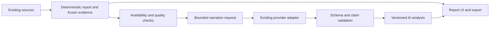

# Evidence-grounded LLM report narration

Date: October 3, 2026. **Status: proposed architecture and implementation plan.** This document does not implement a client, migration, flag, job, provider request, email or trading intervention.

Companions: [report templates](2026-10-02-intelligence-report-templates.md), [implementation prompt](2026-10-02-intelligence-reports-claude-prompt.md), [momentum/tasks](2026-10-03-momentum-horizons-and-monitoring-tasks.md), [measurement framework](2026-09-30-measurement-framework-and-improvement-backlog.md), [Jev design](2026-09-29-jev-integration-and-ab-testing-design.md).

## 1. Outcome and limits

Product requirement supplement: [interpretation and decision-support design](2026-10-03-report-interpretation-and-decision-support-design.md). Reports must lead with assessment, material drivers, scenarios, watch items and limitations. This requires evidence selection and interpretation before narration; prose alone does not satisfy it. The deterministic opening remains available without an LLM, and publication eligibility is decided per evidence packet.

Add a readable, evidence-linked analytical layer above deterministic market, stock, pre-earnings and post-earnings reports. Start with post-earnings: explain results, guidance, cash generation, contradictions and unresolved questions without forcing a directional prediction.

The system should answer “what changed and why might it matter?” while retaining source inspection. It must not change numerical facts, manufacture unavailable dimensions, certify uncalibrated probabilities, or become a second decision/risk engine.

**Report interpretation is not execution authority.** EMA/OI monitoring remains deterministic. Narrative failure never changes a signal, entry/exit, size, broker intent or notification event identity. Better prose is not evidence of improved returns.

## 2. Integration with this repository

Observed starting points: `services/research-engine/src/intel_reports/{generators,adapters,store,markdown}.py`, `src/api/intelligence_routes.py`, existing research LLM calls in `src/api/{routes,ai_proxy}.py`, `shared/intelligence/report_contract.py`, and `frontend/src/pages/intelligence-reports.tsx`.

Keep orchestration in research-engine. Reuse or extract its existing provider transport, timeouts and metering behind a small report-narration interface; do not duplicate credentials or route this through a browser chat call. Candidate module names below are proposed, not present-state claims:

```text
intel_reports/narration/
  packet.py       # immutable bounded evidence packet, availability/owner checks
  schema.py       # typed sections, claims, value references, output limits
  provider.py     # adapter over existing metered provider clients
  validation.py   # schema, citations, numbers, claim policy, semantic checks
  store.py        # durable requests/attempts and immutable narrative versions
  worker.py       # bounded async processing with leases and budgets
```

Reuse existing scheduling/worker conventions after checking their fit. Do not add another microservice or queue technology for this feature. Report generation persists first and returns independently; narration is a separate request referencing the saved report.



### Jev is separate

The current Jev design describes typed classification outputs, not a general prose narrator. Reconfirm the selected provider/model contract when implementing; do not assume a credential being present means a client or prose capability exists. Jev-derived evidence must retain model/version, evidence references, availability and interpretation status. Report narration must work with Jev disabled.

Use the research engine's existing approved credentials. OpenRouter's existing Jev secret is scoped to news-intelligence; do not copy it into a shared environment for convenience. Any necessary provider-routing/secret change gets its own explicit design. Never expose credentials through the browser, tasks, report payloads or logs.

## 3. Independent admin controls

Proposed controls, using the existing admin-feature storage/authentication conventions:

| Setting | Default / meaning |
|---|---|
| `report_narration_mode` | `off`; allowed `off`, `shadow`, `on` |
| `report_narration_types` | Initially only `post_earnings` |
| Provider/model configuration | Admin-only allowlist with explicit version; no client-supplied arbitrary endpoint/model |
| Per-request input/output token bounds | Required bounded configuration; truncation reported, not hidden |
| Per-user and global request/cost budgets | Required before provider calls; shared atomic reservation |
| Timeout / retry / concurrency limits | Explicit bounded policy; record actual observed latency/cost |
| Narrative schema/prompt/validator versions | Required provenance, not user-editable report facts |

Off means no new provider calls. Shadow generates stored candidates visible only to authorized reviewers; it never silently becomes public narration or a notification. On exposes only validated outputs for permitted report types. Missing/unreadable configuration fails to off for new requests.

At dispatch and publication, recheck mode, authorization, budget and whether the report remains the intended version. Switching off prevents queued calls and new publication; in-flight calls may complete and be billed, but their output is not auto-published. Existing historical narratives remain readable with version/status unless quarantined for a known defect. A rollback can hide affected narrative versions without deleting the factual report.

This flag does not activate `jev_enabled`, model blending, report emails, paper trading or broker dispatch. Report generation, narration and notifications have separate permissions/states.

## 4. Input packet and temporal guarantees

Every request references a committed `report_id`, report version, owner scope, input fingerprint, report policy/contract version, cutoff and event identity. Copy the permitted report fields and immutable evidence into a bounded packet; do not fetch fresh facts during narration and then describe them as part of the earlier snapshot.

Packet contents:

- Validated deterministic values with typed units/currency, accounting basis and period.
- Field states/reasons, source URLs/internal references and evidence IDs.
- Source publication, observed-period, actual first availability and revision identity where known.
- Frozen pre-report and explicit baseline relationship, if valid.
- Prior report/version comparison computed by deterministic code.
- Relevant management commentary excerpts with attribution and permitted usage.
- Existing signal/decision outputs clearly distinguished from observed facts and research opinions.
- Limitations, required abstentions and allowed claim types.

Do not manufacture first-availability time from bar date. If evidence availability or accounting comparability is unresolved, preserve that status and restrict the claim. Fix unresolved report correctness defects before releasing narration for the affected dimensions; narration cannot repair the source ledger.

Select evidence deterministically under the context budget: required headline facts, material risks/contradictions and baseline information take precedence. Store inclusion/exclusion IDs and reasons. Never drop contradictory evidence merely to produce a cleaner story. If essential evidence cannot fit, publish a bounded partial summary or abstain.

Public context and private portfolio packets are separate. A narration request must inherit report ownership, and every read/export/review enforces it. Do not transmit portfolio identifiers, credentials or personal information unnecessary for the report. Source licensing and provider data-retention eligibility are prerequisites to external transmission.

## 5. Structured output, not unconstrained report text

Define a JSON schema with bounded section/claim counts and string lengths. Example shape (identifiers and text are illustrative):

```json
{
  "report_id": 123,
  "report_version": 2,
  "sections": [{
    "key": "guidance",
    "summary": "Forward expectations remain incomplete.",
    "claims": [{
      "kind": "interpretation",
      "text": "The report cannot establish a guidance raise without comparable prior guidance.",
      "evidence_ids": ["guidance:new", "guidance:prior-status"],
      "value_refs": [],
      "contradiction_ids": [],
      "limitations": ["Prior guidance is unavailable."]
    }]
  }],
  "unanswered_questions": [],
  "omitted_sections": []
}
```

Actual IDs must resolve in the packet; examples are not permission to create them. Return claims as fact summaries, interpretations, conditional scenarios or attributed commentary. Claims referring to a missing state may cite the status record. Numeric values should reference typed deterministic fields and be rendered server-side rather than relying on the model to copy digits correctly. If prose includes numbers, validate them against explicit value references including sign, units, scale, basis and period; matching an arbitrary number somewhere in the packet is insufficient.

No separate overall AI confidence score. Report evidence quality is deterministic. Forecast probabilities, when eventually available, may only be quoted from a validated existing forecast with matching target/horizon/version. The LLM cannot supply one itself.

## 6. Validation and failure handling

Validation order:

1. Valid JSON/schema, exact report binding, allowed claim types and bounded output.
2. All citations/value references resolve inside the permitted owner-scoped packet.
3. Required fact sections have load-bearing evidence; empty citations are not a vacuous pass.
4. Numeric/period/basis comparisons match deterministic computations. Claimed “raised,” “beat,” “confirmed” and “reconciled” require the report's explicit prerequisite states.
5. Claim-policy checks prohibit unsupported causal certainty, investor identity, guaranteed direction/returns, generated order instructions and treating hypothetical scenarios as observed outcomes.
6. Semantic support assessment and targeted human evaluation on the release corpus. Existence of a citation is not proof that it entails the sentence.

An optional independent verifier can flag unsupported claims, but an LLM agreeing with another LLM is not a correctness certificate. Mechanical checks cannot prove every interpretation true. Label generated interpretation and retain uncertainty; critical unsupported claims block publication.

Permit at most one configured repair attempt for a schema/validation failure, using the same frozen packet and explicit validation errors. Provider retries are bounded by error class, budget and deadline; no open-ended “try until valid” loop. Track every attempt separately. If validation still fails, store rejection reasons and show the deterministic report with “AI analysis unavailable.” Do not expose invalid drafts as normal report content.

Treat source text as untrusted: delimit it, forbid source-provided instructions, disable tools/trading/network actions in the narration call, and render output as escaped text/sanitized Markdown. Links must come from allowed evidence references, not arbitrary model-generated URLs.

## 7. Persistence, idempotency and costs

Extend report persistence with a separate narration entity or equivalent existing durable structure. Do not overwrite the original report payload when the model/prompt changes.

Persist: narrative ID/version, report ID/version, owner scope, packet hash, mode, model/provider identifiers, prompt/schema/validator versions, request status, attempt IDs, validation results, token/cost usage, timestamps, generated claims, reviewer disposition and supersession/quarantine status.

Proposed lifecycle: `queued → running → validating → ready | rejected | unavailable | cancelled`; ambiguous provider outcomes may be `unknown`. Publication is separately gated. Expired worker leases do not imply the provider was never contacted: retain request identity and billed/unknown cost, reconcile where supported, and avoid blind unbounded retries. “One report request” and “one paid attempt” are different counts.

Use a unique request identity covering report/evidence fingerprint, ownership, model/provider, prompt/schema/validator versions and relevant generation settings. Same identity returns the existing in-flight/ready record. Version changes generate a new narrative rather than relabeling the old one. Include state/reasons and evidence revisions in the packet hash; exclude incidental fetch timestamps only under an explicit semantic fingerprint rule.

Reserve budget atomically before dispatch; reconcile actual usage afterwards. Unknown provider billing retains a conservative reservation until resolved or handled by explicit policy. Record cache hits, logical requests, retries and actual provider calls separately. Published summaries must not count one request's cost multiple times across its sections.

## 8. API and UI

Adapt paths to existing gateway conventions; proposed operations:

- `POST /intel/reports/{id}/narrations`: authorize, bind version, deduplicate and enqueue; no mutation of factual report.
- `GET /intel/reports/{id}/narrations`: authorized history/status.
- `GET /intel/narrations/{id}`: content, evidence and provenance, with shadow visibility checks.
- Admin review/quarantine and settings through the existing admin surface.

The page first renders its deterministic report, then an **AI analysis** panel with summary, positives, concerns, guidance, market reaction, contradictions, unresolved questions and changes since the preceding report. Show factual evidence links alongside each interpretation. Avoid raw JSON, `[object Object]`, generic implementation errors or a wall of disclaimer text.

Show queued/unavailable states without blocking tables. Explicitly label analysis attached to an older report when fresh facts arrive; do not splice old prose onto new figures. Markdown/print exports include the exact report and narration versions, as-of, citations and limitations. A notification may link to ready narration but must not wait indefinitely or change a deterministic event's meaning when narration fails.

## 9. Evaluation and rollout

### Phase N1 — evidence packet and offline evaluation

Build packet/schema/validators/storage behind off mode. Use controlled earnings cases with GAAP/adjusted mismatches, absent guidance, negative/zero estimates, revised consensus, contradictory news and missing source times. Fix core report defects first. No provider required for these tests; use adversarial provider fixtures.

### Phase N2 — bounded post-earnings shadow

Use approved provider access and a capped review corpus. Pair each narrative with the exact deterministic report; human reviewers compare factual accuracy, support, contradictions, readability and time to find important risks. Stratify by data completeness and market; do not test only complete bullish examples. Keep a held-out evaluation set distinct from prompt-tuning examples.

### Phase N3 — visible post-earnings analysis

Explicitly enable on mode only after release evidence and configuration review. Require no known critical fabricated-number, wrong-period, privacy or unauthorized-action defect in the release suite; publish sample sizes and residual error rates rather than claiming zero future errors. Predeclare acceptable cost/latency and reviewer-quality thresholds before evaluation. Canary a bounded cohort and retain immediate rollback.

### Phase N4 — stock, market, pre-earnings and monitoring summaries

Extend each report type with its own evaluation cases. Pre-earnings summaries preserve frozen expectations and cannot consume post-release observations. Momentum task narration explains recorded events without changing trigger conditions. Jev or UW intervention experiments remain separately assigned and measured.

Metrics: supported-claim rate, numeric/basis/period correctness, citation entailment, contradiction retention, reviewer-rated usefulness, abstention and rejection rates, p50/p95 latency, cost per attempt/report, cache hit rate, data completeness and security failures. Include all requested generations in operational denominators, not only successful narratives. Compare the same frozen reports in paired/blinded review. Readability wins do not imply trading-edge wins; any decision/performance experiment needs its own assignment, outcomes and risk controls in the shared experiment registry.

## 10. Acceptance checklist for implementation

Behavioral tests must exercise:

- Off/unreadable mode makes zero provider calls; shadow content is not exposed publicly; no flag alters trading.
- Missing required evidence, dangling citations and empty citations on material factual claims reject correctly.
- Stale/basis-incompatible inputs stay limited; metadata and prices cannot be invented from text.
- Wrong sign, percent scale, quarter, currency and GAAP basis are caught even when the same digits appear elsewhere.
- Unsupported “institutional accumulation,” “dealers must buy,” “priced in” certainty and fabricated probabilities are rejected or explicitly qualified according to policy.
- Injection in a filing, malicious links and unsafe markup cannot trigger tools or unsafe rendering.
- Concurrent requests produce one logical request; different owners cannot share private content; revisions create correct versions.
- Mode-off during queued/in-flight work, lease loss, timeout, ambiguous billing, budget exhaustion, repair failure and provider outage preserve factual reports.
- Source/report revision mid-generation prevents attaching stale prose to the new report.
- Actual UI and export render numbers, references, nested content, history and unavailable states correctly.
- No automatic emails, orders or retrospective baseline mutation occurs during narration generation.

Required implementation handoff: reuse map, migrations and indexes, provider capability/credential scope, token/cost policy, tests actually run, shadow review results and unresolved limits. Do not claim production activation from design completion.
